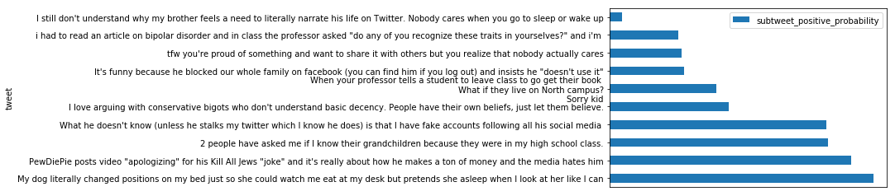
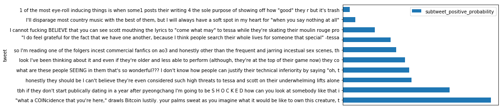
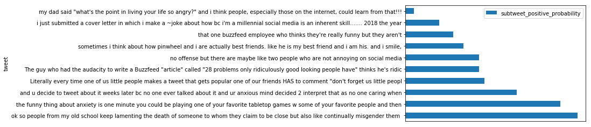

## Using Scikit-Learn and NLTK to build a Naive Bayes Classifier that identifies subtweets

### Goals:
#### Use Scikit-Learn pipelines to define special features to add to a Naive Bayes Classifier
#### Evaluate the accuracy of the classifier
#### Maybe do it live, on a Twitter API stream

### Methods:
#### Use the training set I made before

#### Import libraries


```python
%matplotlib inline
```


```python
from sklearn.base import TransformerMixin, BaseEstimator
from sklearn.feature_extraction import DictVectorizer
from sklearn.feature_extraction.text import CountVectorizer, TfidfTransformer
from sklearn.naive_bayes import MultinomialNB
from sklearn.pipeline import Pipeline, FeatureUnion
from sklearn.model_selection import train_test_split
from sklearn.metrics import classification_report, confusion_matrix
from sklearn.externals import joblib
from textblob import TextBlob
from time import time, sleep
import matplotlib.pyplot as plt
import pandas as pd
import numpy as np
import itertools
import datetime
import tweepy
import nltk
import json
import re
```

#### Set max column width for dataframes


```python
pd.set_option("max_colwidth", 280)
```

#### Load the CSV


```python
df = pd.read_csv("../data/data_for_training/final_training_data/Subtweets_Classifier_Training_Data.csv")
```

#### Create training and test sets from the single training set I made before


```python
text_train, text_test, class_train, class_test = train_test_split(df.alleged_subtweet.tolist(), 
                                                                  df.is_subtweet.tolist())
```

#### Use NLTK's tokenizer instead of Scikit's


```python
tokenizer = nltk.casual.TweetTokenizer(preserve_case=False, reduce_len=True)
```

#### Function for managing TextBlob polarities


```python
def simplify_polarity(polarity):
    if polarity >= 0:
        return 1
    return 0
```

#### Class for distinguishing polarizing parts of speech as features


```python
class TweetStats(BaseEstimator, TransformerMixin):
    def fit(self, x, y=None):
        return self

    def transform(self, posts):
        first_names = ["Aaliyah", "Aaron", "Abby", "Abigail", "Abraham", "Adam",
                       "Addison", "Adrian", "Adriana", "Adrianna", "Aidan", "Aiden",
                       "Alan", "Alana", "Alejandro", "Alex", "Alexa", "Alexander",
                       "Alexandra", "Alexandria", "Alexia", "Alexis", "Alicia", "Allison",
                       "Alondra", "Alyssa", "Amanda", "Amber", "Amelia", "Amy",
                       "Ana", "Andrea", "Andres", "Andrew", "Angel", "Angela",
                       "Angelica", "Angelina", "Anna", "Anthony", "Antonio", "Ariana",
                       "Arianna", "Ashley", "Ashlyn", "Ashton", "Aubrey", "Audrey",
                       "Austin", "Autumn", "Ava", "Avery", "Ayden", "Bailey",
                       "Benjamin", "Bianca", "Blake", "Braden", "Bradley", "Brady",
                       "Brandon", "Brayden", "Breanna", "Brendan", "Brian", "Briana",
                       "Brianna", "Brittany", "Brody", "Brooke", "Brooklyn", "Bryan",
                       "Bryce", "Bryson", "Caden", "Caitlin", "Caitlyn", "Caleb",
                       "Cameron", "Camila", "Carlos", "Caroline", "Carson", "Carter",
                       "Cassandra", "Cassidy", "Catherine", "Cesar", "Charles", "Charlotte",
                       "Chase", "Chelsea", "Cheyenne", "Chloe", "Christian", "Christina",
                       "Christopher", "Claire", "Cody", "Colby", "Cole", "Colin",
                       "Collin", "Colton", "Conner", "Connor", "Cooper", "Courtney",
                       "Cristian", "Crystal", "Daisy", "Dakota", "Dalton", "Damian",
                       "Daniel", "Daniela", "Danielle", "David", "Delaney", "Derek",
                       "Destiny", "Devin", "Devon", "Diana", "Diego", "Dominic",
                       "Donovan", "Dylan", "Edgar", "Eduardo", "Edward", "Edwin",
                       "Eli", "Elias", "Elijah", "Elizabeth", "Ella", "Ellie", 
                       "Emily", "Emma", "Emmanuel", "Eric", "Erica", "Erick",
                       "Erik", "Erin", "Ethan", "Eva", "Evan", "Evelyn",
                       "Faith", "Fernando", "Francisco", "Gabriel", "Gabriela", "Gabriella",
                       "Gabrielle", "Gage", "Garrett", "Gavin", "Genesis", "George",
                       "Gianna", "Giovanni", "Giselle", "Grace", "Gracie", "Grant",
                       "Gregory", "Hailey", "Haley", "Hannah", "Hayden", "Hector",
                       "Henry", "Hope", "Hunter", "Ian", "Isaac", "Isabel",
                       "Isabella", "Isabelle", "Isaiah", "Ivan", "Jack", "Jackson",
                       "Jacob", "Jacqueline", "Jada", "Jade", "Jaden", "Jake",
                       "Jalen", "James", "Jared", "Jasmin", "Jasmine", "Jason", 
                       "Javier", "Jayden", "Jayla", "Jazmin", "Jeffrey", "Jenna",
                       "Jennifer", "Jeremiah", "Jeremy", "Jesse", "Jessica", "Jesus",
                       "Jillian", "Jocelyn", "Joel", "John", "Johnathan", "Jonah",
                       "Jonathan", "Jordan", "Jordyn", "Jorge", "Jose", "Joseph",
                       "Joshua", "Josiah", "Juan", "Julia", "Julian", "Juliana",
                       "Justin", "Kaden", "Kaitlyn", "Kaleb", "Karen", "Karina",
                       "Kate", "Katelyn", "Katherine", "Kathryn", "Katie", "Kayla",
                       "Kaylee", "Kelly", "Kelsey", "Kendall", "Kennedy", "Kenneth",
                       "Kevin", "Kiara", "Kimberly", "Kyle", "Kylee", "Kylie",
                       "Landon", "Laura", "Lauren", "Layla", "Leah", "Leonardo",
                       "Leslie", "Levi", "Liam", "Liliana", "Lillian", "Lilly",
                       "Lily", "Lindsey", "Logan", "Lucas", "Lucy", "Luis",
                       "Luke", "Lydia", "Mackenzie", "Madeline", "Madelyn", "Madison",
                       "Makayla", "Makenzie", "Malachi", "Manuel", "Marco", "Marcus",
                       "Margaret", "Maria", "Mariah", "Mario", "Marissa", "Mark",
                       "Martin", "Mary", "Mason", "Matthew", "Max", "Maxwell",
                       "Maya", "Mckenzie", "Megan", "Melanie", "Melissa", "Mia",
                       "Micah", "Michael", "Michelle", "Miguel", "Mikayla", "Miranda",
                       "Molly", "Morgan", "Mya", "Naomi", "Natalia", "Natalie",
                       "Nathan", "Nathaniel", "Nevaeh", "Nicholas", "Nicolas", "Nicole",
                       "Noah", "Nolan", "Oliver", "Olivia", "Omar", "Oscar",
                       "Owen", "Paige", "Parker", "Patrick", "Paul", "Payton",
                       "Peter", "Peyton", "Preston", "Rachel", "Raymond", "Reagan",
                       "Rebecca", "Ricardo", "Richard", "Riley", "Robert", "Ruby",
                       "Ryan", "Rylee", "Sabrina", "Sadie", "Samantha", "Samuel",
                       "Sara", "Sarah", "Savannah", "Sean", "Sebastian", "Serenity",
                       "Sergio", "Seth", "Shane", "Shawn", "Shelby", "Sierra",
                       "Skylar", "Sofia", "Sophia", "Sophie", "Spencer", "Stephanie",
                       "Stephen", "Steven", "Summer", "Sydney", "Tanner", "Taylor", 
                       "Thomas", "Tiffany", "Timothy", "Travis", "Trenton", "Trevor",
                       "Trinity", "Tristan", "Tyler", "Valeria", "Valerie", "Vanessa",
                       "Veronica", "Victor", "Victoria", "Vincent", "Wesley", "William",
                       "Wyatt", "Xavier", "Zachary", "Zoe", "Zoey"]
        first_names_lower = set([name.lower() for name in first_names])

        pronouns = ["You", "You're", "Your", 
                    "She", "She's", "Her", "Hers", 
                    "He", "He's", "Him", "His", 
                    "They", "They're", "Them", "Their", "Theirs"]
        prounouns_lower = set([pronoun.lower() for pronoun in pronouns])
        
        first_person_pronouns = ["I", "I'm", "We", "We're", "Our", "My", "Us"]
        first_person_pronouns_lower = set([pronoun.lower() for pronoun in first_person_pronouns])
        
        pattern = "(?:http|ftp|https)://(?:[\w_-]+(?:(?:\.[\w_-]+)+))(?:[\w.,@?^=%&:/~+#-]*[\w@?^=%&/~+#-])?"
        
        final_output = []
        for text in posts:
            tokenized_text = tokenizer.tokenize(text)
            
            num_pronouns = len(prounouns_lower.intersection(tokenized_text))
            num_names = len(first_names_lower.intersection(tokenized_text))
            num_first_person = len(first_person_pronouns_lower.intersection(tokenized_text))
            num_at_symbols = text.count("@")
            num_subtweet = text.count("subtweet") + text.count("Subtweet")
            num_urls = len(re.findall(pattern, text))
            
            weighted_dict = {"sentiment": simplify_polarity(TextBlob(text).sentiment.polarity), 
                             "num_subtweet": num_subtweet,
                             "num_at_symbols": num_at_symbols, 
                             "num_urls": num_urls,
                             "num_pronouns": num_pronouns,
                             "num_names": num_names, 
                             "num_first_person": num_first_person, 
                             "num_at_symbols": num_at_symbols,
                             "num_subtweet": num_subtweet,
                             "num_urls": num_urls}
            final_output.append(weighted_dict)
        return final_output
```

#### Build the pipeline


```python
sentiment_pipeline = Pipeline([
    ("features", FeatureUnion([
        ("ngram_tf_idf", Pipeline([
            ("counts", CountVectorizer(tokenizer=tokenizer.tokenize)),
            ("tf_idf", TfidfTransformer())
        ])),
        ("stats_vect", Pipeline([
            ("tweet_stats", TweetStats()),
            ("vect", DictVectorizer())
        ]))
    ])),
    ("classifier", MultinomialNB())
])
```

#### Show the results


```python
sentiment_pipeline.fit(text_train, class_train)
predictions = sentiment_pipeline.predict(text_test)
```


```python
print(classification_report(class_test, predictions))
```

                 precision    recall  f1-score   support
    
       negative       0.97      0.86      0.91      1397
       positive       0.87      0.97      0.92      1381
    
    avg / total       0.92      0.91      0.91      2778
    


#### Define function for visualizing confusion matrices


```python
def plot_confusion_matrix(cm, classes, normalize=False,
                          title='Confusion matrix', cmap=plt.cm.Blues):
    if normalize:
        cm = cm.astype('float') / cm.sum(axis=1)[:, np.newaxis]

    plt.imshow(cm, interpolation='nearest', cmap=cmap)
    plt.title(title)
    plt.colorbar()
    tick_marks = np.arange(len(classes))
    plt.xticks(tick_marks, classes, rotation=45)
    plt.yticks(tick_marks, classes)

    fmt = '.2f' if normalize else 'd'
    thresh = cm.max() / 2.
    for i, j in itertools.product(range(cm.shape[0]), range(cm.shape[1])):
        plt.text(j, i, format(cm[i, j], fmt),
                 horizontalalignment="center",
                 color="white" if cm[i, j] > thresh else "black")

    plt.tight_layout()
    plt.ylabel('True label')
    plt.xlabel('Predicted label')
```

#### Show the matrices


```python
class_names = ["negative", "positive"]

cnf_matrix = confusion_matrix(class_test, predictions)
np.set_printoptions(precision=2)

plt.figure()
plot_confusion_matrix(cnf_matrix, classes=class_names,
                      title='Confusion matrix, without normalization')

plt.figure()
plot_confusion_matrix(cnf_matrix, classes=class_names, normalize=True,
                      title='Normalized confusion matrix')

plt.show()
```


#### Save the classifier for another time


```python
joblib.dump(sentiment_pipeline, "../data/other_data/subtweets_classifier.pkl") 
```


    ['../data/other_data/subtweets_classifier.pkl']


#### Print tests for the classifier


```python
def tests_dataframe(tweets_dataframe, text_column="SentimentText", sentiment_column="Sentiment"):
    predictions = sentiment_pipeline.predict_proba(tweets_dataframe[text_column])
    negative_probability = predictions[:, 0].tolist()
    positive_probability = predictions[:, 1].tolist()
    return pd.DataFrame({"tweet": tweets_dataframe[text_column], 
                         "sentiment_score": tweets_dataframe[sentiment_column], 
                         "subtweet_negative_probability": negative_probability, 
                         "subtweet_positive_probability": positive_probability}).sort_values(by="subtweet_positive_probability", 
                                                                                             ascending=False)
```

#### Make up some tweets


```python
test_tweets = ["Some people don't know their place.", 
               "Isn't it funny how some people don't know their place?", 
               "How come you people act like this?", 
               "You're such a nerd.",
               "I love Noah, he's so cool.",
               "Who the heck is Noah?",
               "This is a @NoahSegalGould subtweet. Go check out https://segal-gould.com.", 
               "This is a subtweet.", 
               "Hey @jack!", 
               "Hey Jack!",
               "http://www.google.com"]
```

#### Make a dataframe from the list


```python
test_tweets_df = pd.DataFrame({"Tweet": test_tweets, "Sentiment": [None]*len(test_tweets)})
```

#### Print the tests


```python
tests_dataframe(test_tweets_df, text_column="Tweet", sentiment_column="Sentiment").head()
```


<div>
<table border="1" class="dataframe">
  <thead>
    <tr style="text-align: right;">
      <th></th>
      <th>sentiment_score</th>
      <th>subtweet_negative_probability</th>
      <th>subtweet_positive_probability</th>
      <th>tweet</th>
    </tr>
  </thead>
  <tbody>
    <tr>
      <th>0</th>
      <td>None</td>
      <td>0.044404</td>
      <td>0.955596</td>
      <td>Some people don't know their place.</td>
    </tr>
    <tr>
      <th>1</th>
      <td>None</td>
      <td>0.052663</td>
      <td>0.947337</td>
      <td>Isn't it funny how some people don't know their place?</td>
    </tr>
    <tr>
      <th>2</th>
      <td>None</td>
      <td>0.108819</td>
      <td>0.891181</td>
      <td>How come you people act like this?</td>
    </tr>
    <tr>
      <th>3</th>
      <td>None</td>
      <td>0.176988</td>
      <td>0.823012</td>
      <td>You're such a nerd.</td>
    </tr>
    <tr>
      <th>4</th>
      <td>None</td>
      <td>0.251143</td>
      <td>0.748857</td>
      <td>I love Noah, he's so cool.</td>
    </tr>
  </tbody>
</table>
</div>


#### Test on actual tweets


```python
naji_df = pd.read_csv("../data/data_for_testing/other_data/naji_data.csv", error_bad_lines=False)
```

    b'Skipping line 8836: expected 4 fields, saw 5\n'
    b'Skipping line 535882: expected 4 fields, saw 7\n'


#### Repair some leftover HTML


```python
naji_df["SentimentText"] = naji_df["SentimentText"].str.replace("&quot;", "\"")
naji_df["SentimentText"] = naji_df["SentimentText"].str.replace("&amp;", "&")
naji_df["SentimentText"] = naji_df["SentimentText"].str.replace("&gt;", ">")
naji_df["SentimentText"] = naji_df["SentimentText"].str.replace("&lt;", "<")
```

#### Remove rows with non-English


```python
def is_english(s):
    return all(ord(char) < 128 for char in s)
```


```python
naji_df = naji_df[naji_df["SentimentText"].map(is_english)]
```

#### Show the length of the dataset


```python
print("Length of dataset: {}".format(len(naji_df)))
```

    Length of dataset: 1564156


#### Use randomly selected 50K rows from dataset


```python
naji_df = naji_df.sample(n=50000).reset_index(drop=True)
```

#### Print and time the tests


```python
%%time
naji_df = tests_dataframe(naji_df)
```

    CPU times: user 45.1 s, sys: 746 ms, total: 45.8 s
    Wall time: 53 s


```python
naji_df.to_csv("../data/data_from_testing/other_data/naji_tests.csv")
```


```python
naji_df.head()
```


<div>
<table border="1" class="dataframe">
  <thead>
    <tr style="text-align: right;">
      <th></th>
      <th>sentiment_score</th>
      <th>subtweet_negative_probability</th>
      <th>subtweet_positive_probability</th>
      <th>tweet</th>
    </tr>
  </thead>
  <tbody>
    <tr>
      <th>13817</th>
      <td>0</td>
      <td>0.003028</td>
      <td>0.996972</td>
      <td>You never really realize how much of an impact someone has on your daily life until all their stuff is packed and they are gone.</td>
    </tr>
    <tr>
      <th>38866</th>
      <td>0</td>
      <td>0.005830</td>
      <td>0.994170</td>
      <td>how do you remove followers from your actual followers list? blocked them but they ARE STILL THERE</td>
    </tr>
    <tr>
      <th>41007</th>
      <td>0</td>
      <td>0.006756</td>
      <td>0.993244</td>
      <td>I hate how you can't hang around your 'guy friends' cuz they always want a guys night together, minus you. Cuz you're not a guy</td>
    </tr>
    <tr>
      <th>23775</th>
      <td>0</td>
      <td>0.007760</td>
      <td>0.992240</td>
      <td>i guess its true- once your dating someone then all the guys ask you out and flirt- but when you are single they all STOP</td>
    </tr>
    <tr>
      <th>40976</th>
      <td>0</td>
      <td>0.008600</td>
      <td>0.991400</td>
      <td>Why when your anticipating something the weeks drag on so slow?&amp; when you want them to go slow they fly by</td>
    </tr>
  </tbody>
</table>
</div>


#### Plot the results


```python
naji_df_columns = ["sentiment_score", "subtweet_negative_probability"]
```


```python
naji_df = naji_df.set_index("tweet").drop(naji_df_columns, axis=1).head(10)
```


```python
naji_df.plot.barh(logx=True);
```


#### Tests on friends' tweets


```python
aaron_df = pd.read_csv("../data/data_for_testing/friends_data/akrapf96_tweets.csv").dropna()
aaron_df["Sentiment"] = None
```


```python
%%time
aaron_df = tests_dataframe(aaron_df, text_column="Text", sentiment_column="Sentiment")
```

    CPU times: user 3.17 s, sys: 53.7 ms, total: 3.22 s
    Wall time: 3.65 s


```python
aaron_df.to_csv("../data/data_from_testing/friends_data/akrapf96_tests.csv")
```


```python
aaron_df["tweet"] = aaron_df["tweet"].str[:140]
```


```python
aaron_df.head()
```


<div>
<table border="1" class="dataframe">
  <thead>
    <tr style="text-align: right;">
      <th></th>
      <th>sentiment_score</th>
      <th>subtweet_negative_probability</th>
      <th>subtweet_positive_probability</th>
      <th>tweet</th>
    </tr>
  </thead>
  <tbody>
    <tr>
      <th>1722</th>
      <td>None</td>
      <td>0.006081</td>
      <td>0.993919</td>
      <td>PewDiePie posts video "apologizing" for his Kill All Jews "joke" and it's really about how he makes a ton of money and the media hates him</td>
    </tr>
    <tr>
      <th>3283</th>
      <td>None</td>
      <td>0.006190</td>
      <td>0.993810</td>
      <td>It's funny because he blocked our whole family on facebook (you can find him if you log out) and insists he "doesn't use it"</td>
    </tr>
    <tr>
      <th>3281</th>
      <td>None</td>
      <td>0.007563</td>
      <td>0.992437</td>
      <td>What he doesn't know (unless he stalks my twitter which I know he does) is that I have fake accounts following all his social media</td>
    </tr>
    <tr>
      <th>2893</th>
      <td>None</td>
      <td>0.007570</td>
      <td>0.992430</td>
      <td>I love arguing with conservative bigots who don't understand basic decency. People have their own beliefs, just let them believe.</td>
    </tr>
    <tr>
      <th>3236</th>
      <td>None</td>
      <td>0.008416</td>
      <td>0.991584</td>
      <td>What will straight cis people do now with their "legalize gay" shirts? Frame them, probably</td>
    </tr>
  </tbody>
</table>
</div>


#### Plot the results


```python
aaron_df_columns = ["sentiment_score", "subtweet_negative_probability"]
```


```python
aaron_df = aaron_df.set_index("tweet").drop(aaron_df_columns, axis=1).head(10)
```


```python
aaron_df.plot.barh(logx=True);
```





```python
julia_df = pd.read_csv("../data/data_for_testing/friends_data/juliaeberry_tweets.csv").dropna()
julia_df["Sentiment"] = None
```


```python
%%time
julia_df = tests_dataframe(julia_df, text_column="Text", sentiment_column="Sentiment")
```

    CPU times: user 6.04 s, sys: 91.4 ms, total: 6.13 s
    Wall time: 6.88 s


```python
julia_df.to_csv("../data/data_from_testing/friends_data/juliaeberry_tests.csv")
```


```python
julia_df["tweet"] = julia_df["tweet"].str[:140]
```


```python
julia_df.head()
```


<div>
<table border="1" class="dataframe">
  <thead>
    <tr style="text-align: right;">
      <th></th>
      <th>sentiment_score</th>
      <th>subtweet_negative_probability</th>
      <th>subtweet_positive_probability</th>
      <th>tweet</th>
    </tr>
  </thead>
  <tbody>
    <tr>
      <th>1138</th>
      <td>None</td>
      <td>0.002422</td>
      <td>0.997578</td>
      <td>"what a COINcidence that you're here," drawls Bitcoin lustily. your palms sweat as you imagine what it would be like to own this creature, t</td>
    </tr>
    <tr>
      <th>902</th>
      <td>None</td>
      <td>0.004004</td>
      <td>0.995996</td>
      <td>tbh if they don't start publically dating in a year after pyeongchang I'm going to be S H O C K E D how can you look at somebody like that i</td>
    </tr>
    <tr>
      <th>850</th>
      <td>None</td>
      <td>0.005445</td>
      <td>0.994555</td>
      <td>honestly they should be I can't believe they're even considered such high threats to tessa and scott on their underwhelming lifts alone</td>
    </tr>
    <tr>
      <th>770</th>
      <td>None</td>
      <td>0.005526</td>
      <td>0.994474</td>
      <td>what are these people SEEING in them that's so wonderful??? I don't know how people can justify their technical inferiority by saying "oh, t</td>
    </tr>
    <tr>
      <th>236</th>
      <td>None</td>
      <td>0.005698</td>
      <td>0.994302</td>
      <td>look I've been thinking about it and even if they're older and less able to perform (although, they're at the top of their game now) they co</td>
    </tr>
  </tbody>
</table>
</div>


#### Plot the results


```python
julia_df_columns = ["sentiment_score", "subtweet_negative_probability"]
```


```python
julia_df = julia_df.set_index("tweet").drop(julia_df_columns, axis=1).head(10)
```


```python
julia_df.plot.barh(logx=True);
```





```python
zoe_df = pd.read_csv("../data/data_for_testing/friends_data/zoeterhune_tweets.csv").dropna()
zoe_df["Sentiment"] = None
```


```python
%%time
zoe_df = tests_dataframe(zoe_df, text_column="Text", sentiment_column="Sentiment")
```

    CPU times: user 1.16 s, sys: 20.9 ms, total: 1.18 s
    Wall time: 1.37 s


```python
zoe_df.to_csv("../data/data_from_testing/friends_data/zoeterhune_tests.csv")
```


```python
zoe_df["tweet"] = zoe_df["tweet"].str[:140]
```


```python
zoe_df.head()
```


<div>
<table border="1" class="dataframe">
  <thead>
    <tr style="text-align: right;">
      <th></th>
      <th>sentiment_score</th>
      <th>subtweet_negative_probability</th>
      <th>subtweet_positive_probability</th>
      <th>tweet</th>
    </tr>
  </thead>
  <tbody>
    <tr>
      <th>277</th>
      <td>None</td>
      <td>0.005355</td>
      <td>0.994645</td>
      <td>ok so people from my old school keep lamenting the death of someone to whom they claim to be close but also like continually misgender them</td>
    </tr>
    <tr>
      <th>584</th>
      <td>None</td>
      <td>0.007600</td>
      <td>0.992400</td>
      <td>the funny thing about anxiety is one minute you could be playing one of your favorite tabletop games w some of your favorite people and then</td>
    </tr>
    <tr>
      <th>583</th>
      <td>None</td>
      <td>0.013254</td>
      <td>0.986746</td>
      <td>and u decide to tweet about it weeks later bc no one ever talked about it and ur anxious mind decided 2 interpret that as no one caring when</td>
    </tr>
    <tr>
      <th>334</th>
      <td>None</td>
      <td>0.017399</td>
      <td>0.982601</td>
      <td>Literally every time one of us little people makes a tweet that gets popular one of our friends HAS to comment "don't forget us little peopl</td>
    </tr>
    <tr>
      <th>1105</th>
      <td>None</td>
      <td>0.018083</td>
      <td>0.981917</td>
      <td>The guy who had the audacity to write a Buzzfeed "article" called "28 problems only ridiculously good looking people have" thinks he's ridic</td>
    </tr>
  </tbody>
</table>
</div>


#### Plot the results


```python
zoe_df_columns = ["sentiment_score", "subtweet_negative_probability"]
```


```python
zoe_df = zoe_df.set_index("tweet").drop(zoe_df_columns, axis=1).head(10)
```


```python
zoe_df.plot.barh(logx=True);
```





```python
noah_df = pd.read_csv("../data/data_for_testing/friends_data/noahsegalgould_tweets.csv").dropna()
noah_df["Sentiment"] = None
```


```python
%%time
noah_df = tests_dataframe(noah_df, text_column="Text", sentiment_column="Sentiment")
```

    CPU times: user 3.92 s, sys: 66.5 ms, total: 3.99 s
    Wall time: 4.63 s


```python
noah_df.to_csv("../data/data_from_testing/friends_data/noahsegalgould_tests.csv")
```


```python
noah_df["tweet"] = noah_df["tweet"].str[:140]
```


```python
noah_df.head()
```


<div>
<table border="1" class="dataframe">
  <thead>
    <tr style="text-align: right;">
      <th></th>
      <th>sentiment_score</th>
      <th>subtweet_negative_probability</th>
      <th>subtweet_positive_probability</th>
      <th>tweet</th>
    </tr>
  </thead>
  <tbody>
    <tr>
      <th>877</th>
      <td>None</td>
      <td>0.003053</td>
      <td>0.996947</td>
      <td>I guess I think it’s foolish to rely on any website for being your source of personal fulfillment and especially as your only source for pol</td>
    </tr>
    <tr>
      <th>3525</th>
      <td>None</td>
      <td>0.004462</td>
      <td>0.995538</td>
      <td>some people want their kids to take care of them when they are elderly but I plan to enslave sentient AI to do that for me until the end.</td>
    </tr>
    <tr>
      <th>845</th>
      <td>None</td>
      <td>0.005960</td>
      <td>0.994040</td>
      <td>my plan to watch list has 224 entires! that is one of them! I treat all my children equally and fairly, and they will each be given their du</td>
    </tr>
    <tr>
      <th>379</th>
      <td>None</td>
      <td>0.008052</td>
      <td>0.991948</td>
      <td>The washer on the far left of the Robbins laundry room won’t start unless you press the start button really hard and someone forgot to start</td>
    </tr>
    <tr>
      <th>1777</th>
      <td>None</td>
      <td>0.008098</td>
      <td>0.991902</td>
      <td>I feel like being able to tweet twice as many characters is a nice addition but I wonder about the priorities of the platforms we use. The w</td>
    </tr>
  </tbody>
</table>
</div>


#### Plot the results


```python
noah_df_columns = ["sentiment_score", "subtweet_negative_probability"]
```


```python
noah_df = noah_df.set_index("tweet").drop(noah_df_columns, axis=1).head(10)
```


```python
noah_df.plot.barh(logx=True);
```


#### Test it in realtime
#### Define some useful variables for later


```python
THRESHOLD = 0.925 # 92.5% positives and higher, only
DURATION = 60*60*12 # 12 hours
```

#### Load Twitter API credentials


```python
consumer_key, consumer_secret, access_token, access_token_secret = open("../../credentials.txt").read().split("\n")
```

#### Use the API credentials to connect to the API


```python
auth = tweepy.OAuthHandler(consumer_key, consumer_secret)
auth.set_access_token(access_token, access_token_secret)
api = tweepy.API(auth, retry_delay=1, timeout=120, # 2 minutes
                 compression=True, wait_on_rate_limit=True, wait_on_rate_limit_notify=True)
```

#### Prepare the final dataframe


```python
subtweets_live_list = []
non_subtweets_live_list = []
```

#### Create a custom class for streaming subtweets


```python
class StreamListener(tweepy.StreamListener):
    def on_status(self, status):
        text = status.text
        text = text.replace("&quot;", "\"").replace("&amp;", "&").replace("&gt;", ">").replace("&lt;", "<")
        
        # negative_probability = sentiment_pipeline.predict_proba([text]).tolist()[0][0]
        positive_probability = sentiment_pipeline.predict_proba([text]).tolist()[0][1]
        
        screen_name = status.user.screen_name
        created_at = status.created_at
        
        sentiment = TextBlob(text).sentiment
        
        sentiment_polarity = sentiment.polarity
        sentiment_subjectivity = sentiment.subjectivity
        
        row = {"tweet": text, 
               "screen_name": screen_name, 
               "time": created_at, 
               "subtweet_probability": positive_probability, 
               "sentiment_polarity": sentiment_polarity, 
               "sentiment_subjectivity": sentiment_subjectivity}
        print_list = pd.DataFrame([row]).values.tolist()[0]
        
        if all([positive_probability >= THRESHOLD,
                not status.retweeted,
                "RT @" not in text, 
                not status.in_reply_to_status_id]):
            
            api.update_status("{:.1%} \nhttps://twitter.com/{}/status/{}".format(positive_probability, 
                                                                                 screen_name, 
                                                                                 status.id))
            
            subtweets_live_list.append(row)
            subtweets_df = pd.DataFrame(subtweets_live_list).sort_values(by="subtweet_probability", 
                                                                         ascending=False)
            subtweets_df.to_csv("../data/data_from_testing/live_downloaded_data/subtweets_live_data.csv")
            
            print("Subtweet:\n{}\nGeographical Bounding Box: {}\nTotal tweets acquired: {}\n".format(str(print_list)[1:-1],
                                                                                                     None,
                                                                                                     # status.place.bounding_box.coordinates, 
                                                                                                     (len(subtweets_live_list) + len(non_subtweets_live_list))))
            
            return row
        else:
            non_subtweets_live_list.append(row)
            non_subtweets_df = pd.DataFrame(non_subtweets_live_list).sort_values(by="subtweet_probability", 
                                                                                 ascending=False)
            non_subtweets_df.to_csv("../data/data_from_testing/live_downloaded_data/non_subtweets_live_data.csv")
            
            # print("Not a Subtweet:\n{}\nTotal tweets acquired: {}\n".format(print_list, len(subtweets_live_list) + len(non_subtweets_live_list)))
            return row
```

#### Get a list of the IDs of all my mutuals and my mutuals' followers


```python
%%time
my_followers = [str(user_id) for ids_list in 
                tweepy.Cursor(api.followers_ids, 
                              screen_name="NoahSegalGould").pages() 
                for user_id in ids_list]
users_i_follow = [str(user_id) for ids_list in 
                  tweepy.Cursor(api.friends_ids, 
                                screen_name="NoahSegalGould").pages() 
                  for user_id in ids_list]

mutuals = list(set(my_followers) & set(users_i_follow))

my_mutuals = mutuals[:]
for i, mutual in enumerate(mutuals):
    start_time = time()
    user = api.get_user(user_id=mutual)
    if not user.protected:
        individual_mutuals_followers = []
        c = tweepy.Cursor(api.followers_ids, user_id=mutual).items()
        while True:
            try:
                individual_mutuals_follower = c.next()
                individual_mutuals_followers.append(str(individual_mutuals_follower))
            except tweepy.TweepError:
                sleep(600) # 10 minutes
                continue
            except StopIteration:
                break
        total = len(individual_mutuals_followers)
        name = user.screen_name
        print("{} followers for mutual {}: {}".format(total, i+1, name))
        if total <= 2500:
            my_mutuals.extend(individual_mutuals_followers)
        else:
            print("\tMutual {0}: {1} has too many followers: {2}".format(i+1, name, total))
    else:
        continue
    end_time = time()
    with open("../data/other_data/NoahSegalGould_Mutuals_and_Mutuals_Followers_ids.json", "w") as outfile:
        json.dump(my_mutuals, outfile)
    print("{0:.2f} seconds for getting the followers' IDs of mutual {1}: {2}\n".format((end_time - start_time), 
                                                                                       i+1, user.screen_name))
    sleep(5)
my_mutuals = list(set(my_mutuals))
```

    77 followers for mutual 1: cleostaryeyed
    0.72 seconds for getting the followers' IDs of mutual 1: cleostaryeyed
    
    3 followers for mutual 2: 1017hokage
    0.74 seconds for getting the followers' IDs of mutual 2: 1017hokage
    
    25 followers for mutual 4: BardCourses
    0.75 seconds for getting the followers' IDs of mutual 4: BardCourses
    
    33 followers for mutual 5: beachaliens
    0.72 seconds for getting the followers' IDs of mutual 5: beachaliens
    
    45 followers for mutual 6: valunept
    0.80 seconds for getting the followers' IDs of mutual 6: valunept
    
    393 followers for mutual 7: bluhoopz
    0.78 seconds for getting the followers' IDs of mutual 7: bluhoopz
    
    34 followers for mutual 9: plurell
    0.70 seconds for getting the followers' IDs of mutual 9: plurell
    
    14 followers for mutual 10: zozotherobo
    2.71 seconds for getting the followers' IDs of mutual 10: zozotherobo
    
    66 followers for mutual 11: katie_burke_
    0.77 seconds for getting the followers' IDs of mutual 11: katie_burke_
    
    128 followers for mutual 13: evaanderson33
    0.72 seconds for getting the followers' IDs of mutual 13: evaanderson33
    
    140 followers for mutual 14: jizzyjtiz
    0.77 seconds for getting the followers' IDs of mutual 14: jizzyjtiz
    
    8 followers for mutual 16: OfLatvia
    0.73 seconds for getting the followers' IDs of mutual 16: OfLatvia
    
    31 followers for mutual 17: nanabee807
    1.73 seconds for getting the followers' IDs of mutual 17: nanabee807
    
    468 followers for mutual 18: john__wick__3
    0.74 seconds for getting the followers' IDs of mutual 18: john__wick__3
    


    Rate limit reached. Sleeping for: 813


    153 followers for mutual 19: Garrettisajoke
    1476.71 seconds for getting the followers' IDs of mutual 19: Garrettisajoke
    
    50 followers for mutual 20: andrewdjang
    0.69 seconds for getting the followers' IDs of mutual 20: andrewdjang
    
    228 followers for mutual 21: Pumpkinheadgal
    0.74 seconds for getting the followers' IDs of mutual 21: Pumpkinheadgal
    
    180 followers for mutual 22: Tageist97
    0.71 seconds for getting the followers' IDs of mutual 22: Tageist97
    
    45 followers for mutual 23: itsnemily
    0.75 seconds for getting the followers' IDs of mutual 23: itsnemily
    
    92 followers for mutual 25: UpToneMusic
    0.69 seconds for getting the followers' IDs of mutual 25: UpToneMusic
    
    204 followers for mutual 26: sycamorethrone
    0.75 seconds for getting the followers' IDs of mutual 26: sycamorethrone
    
    332 followers for mutual 29: real_john_wilks
    0.68 seconds for getting the followers' IDs of mutual 29: real_john_wilks
    
    31055 followers for mutual 30: extrafabulous
    	Mutual 30: extrafabulous has too many followers: 31055
    1.72 seconds for getting the followers' IDs of mutual 30: extrafabulous
    


    Rate limit reached. Sleeping for: 845


    172 followers for mutual 31: Meg_Murph26
    1501.64 seconds for getting the followers' IDs of mutual 31: Meg_Murph26
    
    152 followers for mutual 32: dramallama_x3
    0.74 seconds for getting the followers' IDs of mutual 32: dramallama_x3
    
    140 followers for mutual 33: akrapf96
    0.69 seconds for getting the followers' IDs of mutual 33: akrapf96
    
    27 followers for mutual 34: TannerCohan
    0.70 seconds for getting the followers' IDs of mutual 34: TannerCohan
    
    174 followers for mutual 36: FearlessFierlit
    0.71 seconds for getting the followers' IDs of mutual 36: FearlessFierlit
    
    16 followers for mutual 38: ARKB0T
    0.70 seconds for getting the followers' IDs of mutual 38: ARKB0T
    
    345 followers for mutual 39: KayleeSue
    0.69 seconds for getting the followers' IDs of mutual 39: KayleeSue
    
    90 followers for mutual 40: christinabeenas
    0.71 seconds for getting the followers' IDs of mutual 40: christinabeenas
    
    182 followers for mutual 41: Momose_13
    0.68 seconds for getting the followers' IDs of mutual 41: Momose_13
    
    63 followers for mutual 42: QuailSpotting
    0.71 seconds for getting the followers' IDs of mutual 42: QuailSpotting
    
    90 followers for mutual 43: generatedtext
    0.69 seconds for getting the followers' IDs of mutual 43: generatedtext
    
    19 followers for mutual 44: PetrovFireBuild
    0.80 seconds for getting the followers' IDs of mutual 44: PetrovFireBuild
    
    463 followers for mutual 45: laurensofar
    0.73 seconds for getting the followers' IDs of mutual 45: laurensofar
    
    1115 followers for mutual 46: paul_hembree
    0.71 seconds for getting the followers' IDs of mutual 46: paul_hembree
    
    59 followers for mutual 47: Garage_Grrl
    0.73 seconds for getting the followers' IDs of mutual 47: Garage_Grrl
    


    Rate limit reached. Sleeping for: 813


    25 followers for mutual 48: motherbored3017
    1472.43 seconds for getting the followers' IDs of mutual 48: motherbored3017
    
    289 followers for mutual 49: jaypatricksmith
    0.72 seconds for getting the followers' IDs of mutual 49: jaypatricksmith
    
    116 followers for mutual 50: Oblivion_Mag
    0.77 seconds for getting the followers' IDs of mutual 50: Oblivion_Mag
    
    347 followers for mutual 51: graysonjmorley
    0.72 seconds for getting the followers' IDs of mutual 51: graysonjmorley
    
    45 followers for mutual 52: jmzaccagnino
    1.34 seconds for getting the followers' IDs of mutual 52: jmzaccagnino
    
    29 followers for mutual 53: wdya0
    1.73 seconds for getting the followers' IDs of mutual 53: wdya0
    
    53 followers for mutual 54: KaiMalowany
    0.74 seconds for getting the followers' IDs of mutual 54: KaiMalowany
    
    20 followers for mutual 55: Terrible_Goose
    0.74 seconds for getting the followers' IDs of mutual 55: Terrible_Goose
    
    52 followers for mutual 56: level99andahalf
    1.40 seconds for getting the followers' IDs of mutual 56: level99andahalf
    
    159 followers for mutual 57: QKlauren
    0.73 seconds for getting the followers' IDs of mutual 57: QKlauren
    
    99 followers for mutual 58: minorsuspect
    0.82 seconds for getting the followers' IDs of mutual 58: minorsuspect
    
    18 followers for mutual 59: GayPatSmith
    1.76 seconds for getting the followers' IDs of mutual 59: GayPatSmith
    
    58 followers for mutual 60: steflamethrower
    0.81 seconds for getting the followers' IDs of mutual 60: steflamethrower
    
    14 followers for mutual 61: nora_cady
    0.77 seconds for getting the followers' IDs of mutual 61: nora_cady
    
    256 followers for mutual 62: sarahisharsh
    0.71 seconds for getting the followers' IDs of mutual 62: sarahisharsh
    


    Rate limit reached. Sleeping for: 810


    163 followers for mutual 63: duheiii
    1478.33 seconds for getting the followers' IDs of mutual 63: duheiii
    
    218 followers for mutual 64: forgotlogininfo
    0.75 seconds for getting the followers' IDs of mutual 64: forgotlogininfo
    
    406 followers for mutual 65: keithohara
    0.85 seconds for getting the followers' IDs of mutual 65: keithohara
    
    28 followers for mutual 66: PieterFildes
    0.76 seconds for getting the followers' IDs of mutual 66: PieterFildes
    
    6 followers for mutual 67: KenCooperBot
    0.76 seconds for getting the followers' IDs of mutual 67: KenCooperBot
    
    154 followers for mutual 68: Maxiscoffee
    0.81 seconds for getting the followers' IDs of mutual 68: Maxiscoffee
    
    17 followers for mutual 69: hydrothermal_
    0.98 seconds for getting the followers' IDs of mutual 69: hydrothermal_
    
    192 followers for mutual 70: ahung23
    0.71 seconds for getting the followers' IDs of mutual 70: ahung23
    
    2 followers for mutual 71: nedcoz
    0.75 seconds for getting the followers' IDs of mutual 71: nedcoz
    
    34 followers for mutual 72: Mattlarsony
    1.55 seconds for getting the followers' IDs of mutual 72: Mattlarsony
    
    13 followers for mutual 74: jossislost
    0.75 seconds for getting the followers' IDs of mutual 74: jossislost
    
    453 followers for mutual 75: akkobbi
    0.75 seconds for getting the followers' IDs of mutual 75: akkobbi
    
    56 followers for mutual 76: futchaIex
    0.73 seconds for getting the followers' IDs of mutual 76: futchaIex
    
    210 followers for mutual 77: AndalusianDoge
    0.76 seconds for getting the followers' IDs of mutual 77: AndalusianDoge
    
    41 followers for mutual 78: starblasters_
    0.76 seconds for getting the followers' IDs of mutual 78: starblasters_
    


    Rate limit reached. Sleeping for: 812


    387 followers for mutual 79: whoisleormiller
    1471.52 seconds for getting the followers' IDs of mutual 79: whoisleormiller
    
    157 followers for mutual 80: por_eleanor
    0.76 seconds for getting the followers' IDs of mutual 80: por_eleanor
    
    1 followers for mutual 81: anaturalnumber
    0.79 seconds for getting the followers' IDs of mutual 81: anaturalnumber
    
    75 followers for mutual 82: h0tsccrgirl1996
    0.73 seconds for getting the followers' IDs of mutual 82: h0tsccrgirl1996
    
    33 followers for mutual 83: UpToneOfficial
    0.81 seconds for getting the followers' IDs of mutual 83: UpToneOfficial
    
    71 followers for mutual 84: AdamMuhsin
    0.79 seconds for getting the followers' IDs of mutual 84: AdamMuhsin
    
    81 followers for mutual 85: metalgarurumonz
    0.81 seconds for getting the followers' IDs of mutual 85: metalgarurumonz
    
    98 followers for mutual 86: lisasimpsonstan
    0.74 seconds for getting the followers' IDs of mutual 86: lisasimpsonstan
    
    499 followers for mutual 87: cmands
    0.76 seconds for getting the followers' IDs of mutual 87: cmands
    
    18 followers for mutual 88: N04H5G
    0.73 seconds for getting the followers' IDs of mutual 88: N04H5G
    
    234 followers for mutual 89: strawBERRYsmooh
    0.76 seconds for getting the followers' IDs of mutual 89: strawBERRYsmooh
    
    268 followers for mutual 90: __tackle
    0.79 seconds for getting the followers' IDs of mutual 90: __tackle
    
    258 followers for mutual 91: two_shanezz
    0.69 seconds for getting the followers' IDs of mutual 91: two_shanezz
    
    15 followers for mutual 92: S1m0ntr0n
    0.75 seconds for getting the followers' IDs of mutual 92: S1m0ntr0n
    
    12 followers for mutual 93: 10_furlongs
    0.76 seconds for getting the followers' IDs of mutual 93: 10_furlongs
    


    Rate limit reached. Sleeping for: 813


    5 followers for mutual 94: jeffdaugherty15
    1486.74 seconds for getting the followers' IDs of mutual 94: jeffdaugherty15
    
    2 followers for mutual 95: RogerAlmonds
    0.77 seconds for getting the followers' IDs of mutual 95: RogerAlmonds
    
    252 followers for mutual 96: cassy_savs
    0.80 seconds for getting the followers' IDs of mutual 96: cassy_savs
    
    36 followers for mutual 97: TheCzarchitect
    0.73 seconds for getting the followers' IDs of mutual 97: TheCzarchitect
    
    163 followers for mutual 98: carsonscabinet
    0.74 seconds for getting the followers' IDs of mutual 98: carsonscabinet
    
    218 followers for mutual 99: zoeterhune
    0.76 seconds for getting the followers' IDs of mutual 99: zoeterhune
    
    435 followers for mutual 100: stfwlkr
    0.72 seconds for getting the followers' IDs of mutual 100: stfwlkr
    
    325 followers for mutual 101: scorpiodisaster
    0.81 seconds for getting the followers' IDs of mutual 101: scorpiodisaster
    
    15 followers for mutual 102: maggersmay
    0.75 seconds for getting the followers' IDs of mutual 102: maggersmay
    
    72 followers for mutual 103: twelveangrybens
    0.77 seconds for getting the followers' IDs of mutual 103: twelveangrybens
    
    262 followers for mutual 104: gothodile
    0.80 seconds for getting the followers' IDs of mutual 104: gothodile
    
    428 followers for mutual 105: rosettabones
    0.74 seconds for getting the followers' IDs of mutual 105: rosettabones
    
    601 followers for mutual 106: BardCollegeCDO
    0.77 seconds for getting the followers' IDs of mutual 106: BardCollegeCDO
    
    124 followers for mutual 107: ninanet23
    0.72 seconds for getting the followers' IDs of mutual 107: ninanet23
    
    474 followers for mutual 108: juliaeberry
    0.72 seconds for getting the followers' IDs of mutual 108: juliaeberry
    


    Rate limit reached. Sleeping for: 812


    1 followers for mutual 109: robyn53966273
    1539.18 seconds for getting the followers' IDs of mutual 109: robyn53966273
    
    CPU times: user 5.91 s, sys: 1.38 s, total: 7.29 s
    Wall time: 3h 3min 26s


```python
print("Total number of my mutuals: {}".format(len(mutuals)))
```

    Total number of my mutuals: 109


```python
print("Total number of my mutuals' followers: {}".format(len(my_mutuals) - len(mutuals)))
```

    Total number of my mutuals' followers: 11682


#### Instantiate the listener


```python
stream_listener = StreamListener()
stream = tweepy.Stream(auth=api.auth, listener=stream_listener)
```

#### Start the stream asynchronously, and stop it after some duration of seconds


```python
%%time
# bounding_box = [-73.920176, 42.009637,
#                 -73.899739, 42.033421]http://localhost:8888/notebooks/development/classifier_creator.ipynb#
# stream.filter(locations=bounding_box, async=True) # Bard College
stream.filter(follow=my_mutuals, async=True)
print("Columns:")
print("screen_name, sentiment_polarity, sentiment_subjectivity, subtweet_probability, time, text")
sleep(DURATION)
stream.disconnect()
```

    Columns:
    screen_name, sentiment_polarity, sentiment_subjectivity, subtweet_probability, time, text


#### Plot the results


```python
subtweets_df = pd.read_csv("../data/data_from_testing/live_downloaded_data/subtweets_live_data.csv", index_col=0)
```


```python
subtweets_df["tweet"] = subtweets_df["tweet"].str[:140]
```


```python
subtweets_df_columns = ["screen_name", "time"]
```


```python
subtweets_df = subtweets_df.set_index("tweet").drop(subtweets_df_columns, axis=1).head(10)
```


```python
subtweets_df.plot.barh(logx=True);
```
