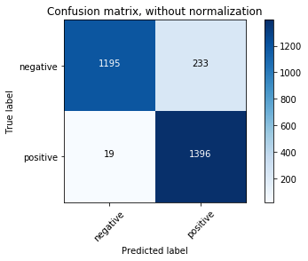
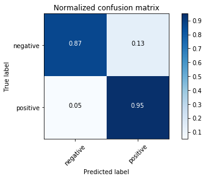
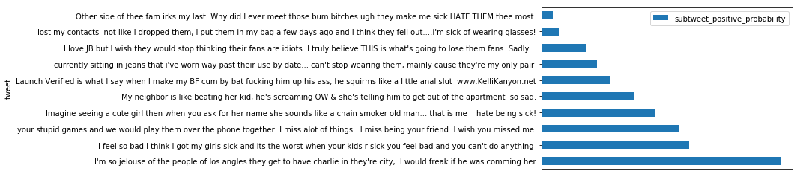
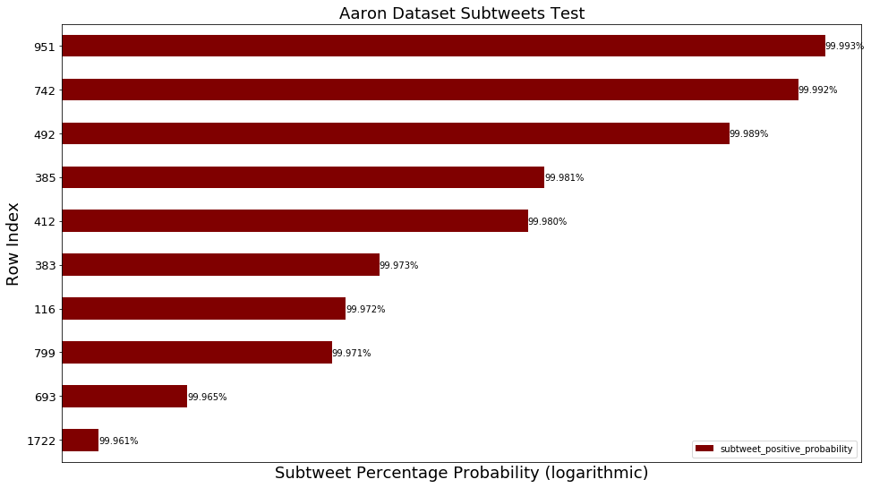
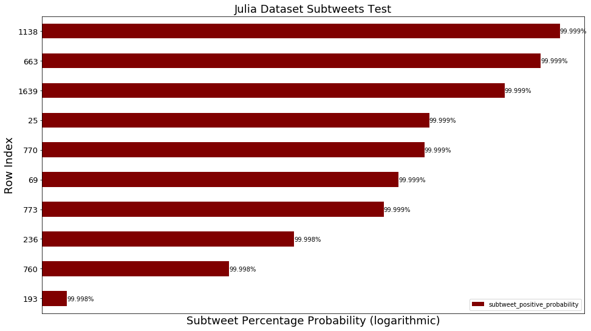
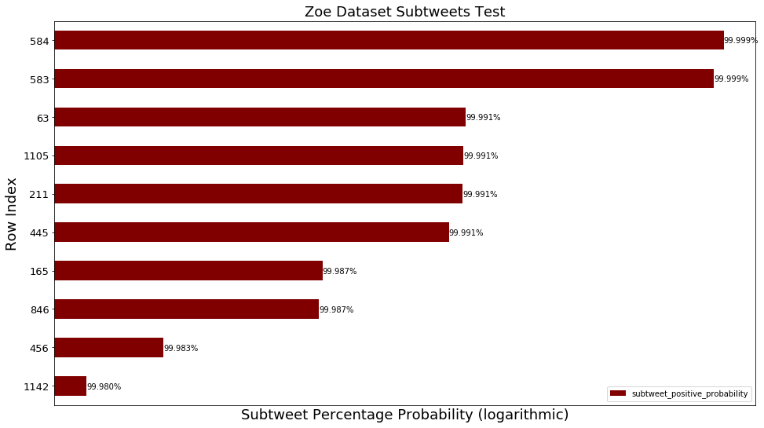
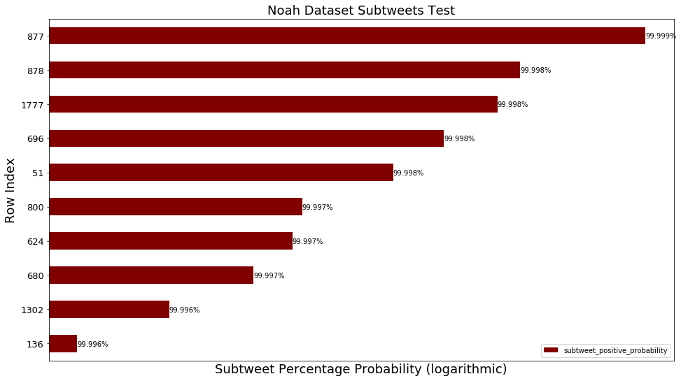
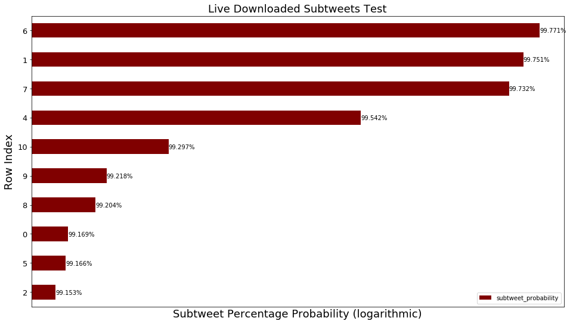

## Using Scikit-Learn and NLTK to build a Naive Bayes Classifier that identifies subtweets

### Goals:
#### Use Scikit-Learn pipelines to define special features to add to a Naive Bayes Classifier
#### Evaluate the accuracy of the classifier
#### Maybe do it live, on a Twitter API stream

### Methods:
#### Use the training set I made before

#### Import libraries


```python
%matplotlib inline
```


```python
from sklearn.base import TransformerMixin, BaseEstimator
from sklearn.feature_extraction import DictVectorizer
from sklearn.feature_extraction.text import CountVectorizer, TfidfTransformer
from sklearn.naive_bayes import MultinomialNB
from sklearn.pipeline import Pipeline, FeatureUnion
from sklearn.model_selection import train_test_split
from sklearn.metrics import classification_report, confusion_matrix
from sklearn.externals import joblib
from textblob import TextBlob
from time import time, sleep
import matplotlib.pyplot as plt
import pandas as pd
import numpy as np
import itertools
import datetime
import tweepy
import nltk
import json
import re
```

#### Set max column width for dataframes


```python
pd.set_option("max_colwidth", 280)
```

#### Load the CSV


```python
df = pd.read_csv("../data/data_for_training/final_training_data/Subtweets_Classifier_Training_Data.csv")
```

#### Create training and test sets from the single training set I made before


```python
text_train, text_test, class_train, class_test = train_test_split(df.alleged_subtweet.tolist(), 
                                                                  df.is_subtweet.tolist())
```

#### Use NLTK's tokenizer instead of Scikit's


```python
tokenizer = nltk.casual.TweetTokenizer(preserve_case=False, reduce_len=True)
```

#### Function for managing TextBlob polarities


```python
def simplify_polarity(polarity):
    if polarity >= 0:
        return 1
    return 0
```

#### Class for distinguishing polarizing parts of speech as features


```python
class TweetStats(BaseEstimator, TransformerMixin):
    def fit(self, x, y=None):
        return self

    def transform(self, posts):
        first_names = ["Aaliyah", "Aaron", "Abby", "Abigail", "Abraham", "Adam",
                       "Addison", "Adrian", "Adriana", "Adrianna", "Aidan", "Aiden",
                       "Alan", "Alana", "Alejandro", "Alex", "Alexa", "Alexander",
                       "Alexandra", "Alexandria", "Alexia", "Alexis", "Alicia", "Allison",
                       "Alondra", "Alyssa", "Amanda", "Amber", "Amelia", "Amy",
                       "Ana", "Andrea", "Andres", "Andrew", "Angel", "Angela",
                       "Angelica", "Angelina", "Anna", "Anthony", "Antonio", "Ariana",
                       "Arianna", "Ashley", "Ashlyn", "Ashton", "Aubrey", "Audrey",
                       "Austin", "Autumn", "Ava", "Avery", "Ayden", "Bailey",
                       "Benjamin", "Bianca", "Blake", "Braden", "Bradley", "Brady",
                       "Brandon", "Brayden", "Breanna", "Brendan", "Brian", "Briana",
                       "Brianna", "Brittany", "Brody", "Brooke", "Brooklyn", "Bryan",
                       "Bryce", "Bryson", "Caden", "Caitlin", "Caitlyn", "Caleb",
                       "Cameron", "Camila", "Carlos", "Caroline", "Carson", "Carter",
                       "Cassandra", "Cassidy", "Catherine", "Cesar", "Charles", "Charlotte",
                       "Chase", "Chelsea", "Cheyenne", "Chloe", "Christian", "Christina",
                       "Christopher", "Claire", "Cody", "Colby", "Cole", "Colin",
                       "Collin", "Colton", "Conner", "Connor", "Cooper", "Courtney",
                       "Cristian", "Crystal", "Daisy", "Dakota", "Dalton", "Damian",
                       "Daniel", "Daniela", "Danielle", "David", "Delaney", "Derek",
                       "Destiny", "Devin", "Devon", "Diana", "Diego", "Dominic",
                       "Donovan", "Dylan", "Edgar", "Eduardo", "Edward", "Edwin",
                       "Eli", "Elias", "Elijah", "Elizabeth", "Ella", "Ellie", 
                       "Emily", "Emma", "Emmanuel", "Eric", "Erica", "Erick",
                       "Erik", "Erin", "Ethan", "Eva", "Evan", "Evelyn",
                       "Faith", "Fernando", "Francisco", "Gabriel", "Gabriela", "Gabriella",
                       "Gabrielle", "Gage", "Garrett", "Gavin", "Genesis", "George",
                       "Gianna", "Giovanni", "Giselle", "Grace", "Gracie", "Grant",
                       "Gregory", "Hailey", "Haley", "Hannah", "Hayden", "Hector",
                       "Henry", "Hope", "Hunter", "Ian", "Isaac", "Isabel",
                       "Isabella", "Isabelle", "Isaiah", "Ivan", "Jack", "Jackson",
                       "Jacob", "Jacqueline", "Jada", "Jade", "Jaden", "Jake",
                       "Jalen", "James", "Jared", "Jasmin", "Jasmine", "Jason", 
                       "Javier", "Jayden", "Jayla", "Jazmin", "Jeffrey", "Jenna",
                       "Jennifer", "Jeremiah", "Jeremy", "Jesse", "Jessica", "Jesus",
                       "Jillian", "Jocelyn", "Joel", "John", "Johnathan", "Jonah",
                       "Jonathan", "Jordan", "Jordyn", "Jorge", "Jose", "Joseph",
                       "Joshua", "Josiah", "Juan", "Julia", "Julian", "Juliana",
                       "Justin", "Kaden", "Kaitlyn", "Kaleb", "Karen", "Karina",
                       "Kate", "Katelyn", "Katherine", "Kathryn", "Katie", "Kayla",
                       "Kaylee", "Kelly", "Kelsey", "Kendall", "Kennedy", "Kenneth",
                       "Kevin", "Kiara", "Kimberly", "Kyle", "Kylee", "Kylie",
                       "Landon", "Laura", "Lauren", "Layla", "Leah", "Leonardo",
                       "Leslie", "Levi", "Liam", "Liliana", "Lillian", "Lilly",
                       "Lily", "Lindsey", "Logan", "Lucas", "Lucy", "Luis",
                       "Luke", "Lydia", "Mackenzie", "Madeline", "Madelyn", "Madison",
                       "Makayla", "Makenzie", "Malachi", "Manuel", "Marco", "Marcus",
                       "Margaret", "Maria", "Mariah", "Mario", "Marissa", "Mark",
                       "Martin", "Mary", "Mason", "Matthew", "Max", "Maxwell",
                       "Maya", "Mckenzie", "Megan", "Melanie", "Melissa", "Mia",
                       "Micah", "Michael", "Michelle", "Miguel", "Mikayla", "Miranda",
                       "Molly", "Morgan", "Mya", "Naomi", "Natalia", "Natalie",
                       "Nathan", "Nathaniel", "Nevaeh", "Nicholas", "Nicolas", "Nicole",
                       "Noah", "Nolan", "Oliver", "Olivia", "Omar", "Oscar",
                       "Owen", "Paige", "Parker", "Patrick", "Paul", "Payton",
                       "Peter", "Peyton", "Preston", "Rachel", "Raymond", "Reagan",
                       "Rebecca", "Ricardo", "Richard", "Riley", "Robert", "Ruby",
                       "Ryan", "Rylee", "Sabrina", "Sadie", "Samantha", "Samuel",
                       "Sara", "Sarah", "Savannah", "Sean", "Sebastian", "Serenity",
                       "Sergio", "Seth", "Shane", "Shawn", "Shelby", "Sierra",
                       "Skylar", "Sofia", "Sophia", "Sophie", "Spencer", "Stephanie",
                       "Stephen", "Steven", "Summer", "Sydney", "Tanner", "Taylor", 
                       "Thomas", "Tiffany", "Timothy", "Travis", "Trenton", "Trevor",
                       "Trinity", "Tristan", "Tyler", "Valeria", "Valerie", "Vanessa",
                       "Veronica", "Victor", "Victoria", "Vincent", "Wesley", "William",
                       "Wyatt", "Xavier", "Zachary", "Zoe", "Zoey"]
        first_names_lower = set([name.lower() for name in first_names])

        pronouns = ["You", "You're", "Your", 
                    "She", "She's", "Her", "Hers", 
                    "He", "He's", "Him", "His", 
                    "They", "They're", "Them", "Their", "Theirs"]
        prounouns_lower = set([pronoun.lower() for pronoun in pronouns])
        
        first_person_pronouns = ["I", "I'm", "We", "We're", "Our", "My", "Us"]
        first_person_pronouns_lower = set([pronoun.lower() for pronoun in first_person_pronouns])
        
        pattern = "(?:http|ftp|https)://(?:[\w_-]+(?:(?:\.[\w_-]+)+))(?:[\w.,@?^=%&:/~+#-]*[\w@?^=%&/~+#-])?"
        
        final_output = []
        for text in posts:
            tokenized_text = tokenizer.tokenize(text)
            
            num_pronouns = len(prounouns_lower.intersection(tokenized_text))
            num_names = len(first_names_lower.intersection(tokenized_text))
            num_first_person = len(first_person_pronouns_lower.intersection(tokenized_text))
            num_at_symbols = text.count("@")
            num_subtweet = text.count("subtweet") + text.count("Subtweet")
            num_urls = len(re.findall(pattern, text))
            
            weighted_dict = {"length": len(text),
                             "sentiment": simplify_polarity(TextBlob(text).sentiment.polarity), 
                             "num_subtweet": num_subtweet,
                             "num_at_symbols": num_at_symbols, 
                             "num_urls": num_urls,
                             "num_pronouns": num_pronouns,
                             "num_names": num_names, 
                             "num_first_person": num_first_person, 
                             "num_at_symbols": num_at_symbols,
                             "num_subtweet": num_subtweet,
                             "num_urls": num_urls}
            final_output.append(weighted_dict)
        return final_output
```

#### Build the pipeline


```python
sentiment_pipeline = Pipeline([
    ("features", FeatureUnion([
        ("ngram_tf_idf", Pipeline([
            ("counts", CountVectorizer(tokenizer=tokenizer.tokenize)),
            ("tf_idf", TfidfTransformer())
        ])),
        ("stats_vect", Pipeline([
            ("tweet_stats", TweetStats()),
            ("vect", DictVectorizer())
        ]))
    ])),
    ("classifier", MultinomialNB())
])
```

#### Show the results


```python
sentiment_pipeline.fit(text_train, class_train)
predictions = sentiment_pipeline.predict(text_test)
```


```python
print(classification_report(class_test, predictions))
```

                 precision    recall  f1-score   support
    
       negative       0.98      0.84      0.90      1428
       positive       0.86      0.99      0.92      1415
    
    avg / total       0.92      0.91      0.91      2843
    


#### Define function for visualizing confusion matrices


```python
def plot_confusion_matrix(cm, classes, normalize=False,
                          title='Confusion matrix', cmap=plt.cm.Blues):
    if normalize:
        cm = cm.astype('float') / cm.sum(axis=1)[:, np.newaxis]

    plt.imshow(cm, interpolation='nearest', cmap=cmap)
    plt.title(title)
    plt.colorbar()
    tick_marks = np.arange(len(classes))
    plt.xticks(tick_marks, classes, rotation=45)
    plt.yticks(tick_marks, classes)

    fmt = '.2f' if normalize else 'd'
    thresh = cm.max() / 2.
    for i, j in itertools.product(range(cm.shape[0]), range(cm.shape[1])):
        plt.text(j, i, format(cm[i, j], fmt),
                 horizontalalignment="center",
                 color="white" if cm[i, j] > thresh else "black")

    plt.tight_layout()
    plt.ylabel('True label')
    plt.xlabel('Predicted label')
```

#### Show the matrices


```python
class_names = ["negative", "positive"]

cnf_matrix = confusion_matrix(class_test, predictions)
np.set_printoptions(precision=2)

plt.figure()
plot_confusion_matrix(cnf_matrix, classes=class_names,
                      title='Confusion matrix, without normalization')

plt.figure()
plot_confusion_matrix(cnf_matrix, classes=class_names, normalize=True,
                      title='Normalized confusion matrix')

plt.show()
```








#### Save the classifier for another time


```python
joblib.dump(sentiment_pipeline, "../data/other_data/subtweets_classifier.pkl");
```

#### Print tests for the classifier


```python
def tests_dataframe(tweets_dataframe, text_column="SentimentText", sentiment_column="Sentiment"):
    predictions = sentiment_pipeline.predict_proba(tweets_dataframe[text_column])
    negative_probability = predictions[:, 0].tolist()
    positive_probability = predictions[:, 1].tolist()
    return pd.DataFrame({"tweet": tweets_dataframe[text_column], 
                         "sentiment_score": tweets_dataframe[sentiment_column], 
                         "subtweet_negative_probability": negative_probability, 
                         "subtweet_positive_probability": positive_probability}).sort_values(by="subtweet_positive_probability", 
                                                                                             ascending=False)
```

#### Make up some tweets


```python
test_tweets = ["Some people don't know their place.", 
               "Isn't it funny how some people don't know their place?", 
               "How come you people act like this?", 
               "You're such a nerd.",
               "I love Noah, he's so cool.",
               "Who the heck is Noah?",
               "This is a @NoahSegalGould subtweet. Go check out https://segal-gould.com.", 
               "This is a subtweet.", 
               "Hey @jack!", 
               "Hey Jack!",
               "http://www.google.com"]
```

#### Make a dataframe from the list


```python
test_tweets_df = pd.DataFrame({"Tweet": test_tweets, "Sentiment": [None]*len(test_tweets)})
```

#### Print the tests


```python
tests_dataframe(test_tweets_df, text_column="Tweet", sentiment_column="Sentiment").head()
```


<div>

<table border="1" class="dataframe">
  <thead>
    <tr style="text-align: right;">
      <th></th>
      <th>sentiment_score</th>
      <th>subtweet_negative_probability</th>
      <th>subtweet_positive_probability</th>
      <th>tweet</th>
    </tr>
  </thead>
  <tbody>
    <tr>
      <th>1</th>
      <td>None</td>
      <td>0.039673</td>
      <td>0.960327</td>
      <td>Isn't it funny how some people don't know their place?</td>
    </tr>
    <tr>
      <th>0</th>
      <td>None</td>
      <td>0.063204</td>
      <td>0.936796</td>
      <td>Some people don't know their place.</td>
    </tr>
    <tr>
      <th>2</th>
      <td>None</td>
      <td>0.124174</td>
      <td>0.875826</td>
      <td>How come you people act like this?</td>
    </tr>
    <tr>
      <th>3</th>
      <td>None</td>
      <td>0.342492</td>
      <td>0.657508</td>
      <td>You're such a nerd.</td>
    </tr>
    <tr>
      <th>4</th>
      <td>None</td>
      <td>0.342841</td>
      <td>0.657159</td>
      <td>I love Noah, he's so cool.</td>
    </tr>
  </tbody>
</table>
</div>


#### Test on actual tweets


```python
naji_df = pd.read_csv("../data/data_for_testing/other_data/naji_data.csv", error_bad_lines=False)
```

    b'Skipping line 8836: expected 4 fields, saw 5\n'
    b'Skipping line 535882: expected 4 fields, saw 7\n'


#### Repair some leftover HTML


```python
naji_df["SentimentText"] = naji_df["SentimentText"].str.replace("&quot;", "\"")
naji_df["SentimentText"] = naji_df["SentimentText"].str.replace("&amp;", "&")
naji_df["SentimentText"] = naji_df["SentimentText"].str.replace("&gt;", ">")
naji_df["SentimentText"] = naji_df["SentimentText"].str.replace("&lt;", "<")
```

#### Remove rows with non-English


```python
def is_english(s):
    return all(ord(char) < 128 for char in s)
```


```python
naji_df = naji_df[naji_df["SentimentText"].map(is_english)]
```

#### Show the length of the dataset


```python
print("Length of dataset: {}".format(len(naji_df)))
```

    Length of dataset: 1564156


#### Use randomly selected 100K rows from dataset


```python
naji_df = naji_df.sample(n=100000).reset_index(drop=True)
```

#### Print and time the tests


```python
%%time
naji_df = tests_dataframe(naji_df)
```

    CPU times: user 1min 31s, sys: 1.57 s, total: 1min 33s
    Wall time: 1min 40s


```python
naji_df.to_csv("../data/data_from_testing/other_data/naji_tests.csv")
```

#### Plot the results


```python
naji_df_columns = ["sentiment_score", "subtweet_negative_probability", "tweet"]
```


```python
naji_df_for_plotting = naji_df.drop(naji_df_columns, axis=1).head(10)
```


```python
naji_df.head(10)
```


<div>

<table border="1" class="dataframe">
  <thead>
    <tr style="text-align: right;">
      <th></th>
      <th>sentiment_score</th>
      <th>subtweet_negative_probability</th>
      <th>subtweet_positive_probability</th>
      <th>tweet</th>
    </tr>
  </thead>
  <tbody>
    <tr>
      <th>49673</th>
      <td>0</td>
      <td>0.000766</td>
      <td>0.999234</td>
      <td>Penguins lost   I wish when people twisted your words that you could go pull the words out of there mouth in the form of barbed wire.</td>
    </tr>
    <tr>
      <th>27415</th>
      <td>1</td>
      <td>0.000898</td>
      <td>0.999102</td>
      <td>Just waking up thinking about my "bend over boyfriend" and how I will fuck him hard with a huge dildo until he cums likes a bitch for me</td>
    </tr>
    <tr>
      <th>57753</th>
      <td>0</td>
      <td>0.000931</td>
      <td>0.999069</td>
      <td>Ugh I have to go to a baseball game with the most gay and annoying kid in school.  he is such a fag and has no friends, but thinks he does</td>
    </tr>
    <tr>
      <th>11033</th>
      <td>0</td>
      <td>0.001028</td>
      <td>0.998972</td>
      <td>As a former Horticulture major I am driven to foamy fits when I see people hosing down their shrubs thinking they are actually watering</td>
    </tr>
    <tr>
      <th>52437</th>
      <td>1</td>
      <td>0.001058</td>
      <td>0.998942</td>
      <td>My boys have spent the last two nights at their grandparents. I hate going past their empty little rooms. I want them back now please!</td>
    </tr>
    <tr>
      <th>11740</th>
      <td>1</td>
      <td>0.001090</td>
      <td>0.998910</td>
      <td>Someone taught my little sister how to say the Shahada, now she won't shut up. We have to send her to her room when ppl stop by</td>
    </tr>
    <tr>
      <th>17433</th>
      <td>0</td>
      <td>0.001121</td>
      <td>0.998879</td>
      <td>My friend is in a bad situation. She has a BF who is a great dad to their daughter, but he has a terrible gambling habit. IDK what to say</td>
    </tr>
    <tr>
      <th>43879</th>
      <td>0</td>
      <td>0.001232</td>
      <td>0.998768</td>
      <td>Im done with dating. All guys are they same. They are all selfish assholes who have the same desires when it comes to girls.</td>
    </tr>
    <tr>
      <th>20533</th>
      <td>1</td>
      <td>0.001238</td>
      <td>0.998762</td>
      <td>I love being able to be loud after 9:30  Benefit of being home with the dogs, who will only tilt their heads at me, if they notice at all.</td>
    </tr>
    <tr>
      <th>37778</th>
      <td>0</td>
      <td>0.001299</td>
      <td>0.998701</td>
      <td>i think people should stop lying to get what they want. i want them to tell the truth and stop making me feel horrid about it.</td>
    </tr>
  </tbody>
</table>
</div>


```python
ax = naji_df_for_plotting.plot.barh(logx=True, figsize=(16, 9), color="maroon", fontsize=13);
ax.set_alpha(0.8)
ax.set_title("Naji Dataset Randomly Selected Subtweets Test", fontsize=18)
ax.set_ylabel("Row Index", fontsize=18);
ax.set_xlabel("Subtweet Percentage Probability (logarithmic)", fontsize=18);
for i in ax.patches:
    ax.text(i.get_width(), i.get_y() + 0.325, "{:.3%}".format(i.get_width()), fontsize=10, color="black")
ax.invert_yaxis()
```





#### Tests on friends' tweets

#### Aaron


```python
aaron_df = pd.read_csv("../data/data_for_testing/friends_data/akrapf96_tweets.csv").dropna()
aaron_df["Sentiment"] = None
```


```python
%%time
aaron_df = tests_dataframe(aaron_df, text_column="Text", sentiment_column="Sentiment")
```

    CPU times: user 2.84 s, sys: 20 ms, total: 2.86 s
    Wall time: 2.87 s


```python
aaron_df.to_csv("../data/data_from_testing/friends_data/akrapf96_tests.csv")
```


```python
aaron_df_columns = ["sentiment_score", "subtweet_negative_probability", "tweet"]
```


```python
aaron_df_for_plotting = aaron_df.drop(aaron_df_columns, axis=1).head(10)
```


```python
aaron_df.head(10)
```


<div>

<table border="1" class="dataframe">
  <thead>
    <tr style="text-align: right;">
      <th></th>
      <th>sentiment_score</th>
      <th>subtweet_negative_probability</th>
      <th>subtweet_positive_probability</th>
      <th>tweet</th>
    </tr>
  </thead>
  <tbody>
    <tr>
      <th>951</th>
      <td>None</td>
      <td>0.000071</td>
      <td>0.999929</td>
      <td>Why did twitter replace the character count with this circle meter\nHow am I supposed to know how many characters I've gone over? This feels like it's been 140 characters. Is the 280 characters a thing now? Does everyone have it? I'm very overwhelmed by the amount of text on ...</td>
    </tr>
    <tr>
      <th>742</th>
      <td>None</td>
      <td>0.000083</td>
      <td>0.999917</td>
      <td>Gonna tweet about a whole bunch of stuff to get them out of the way:\nClocks ticking\nWhen will it end\nI'm so done\nI expected this really\nDisappointed again\nConstantly tired\nFuck off\nUhhhhhhhhhhhhhhhhhh k\nStill hungry \nSeriously?\nThat was quick\nWhatever\nIdk</td>
    </tr>
    <tr>
      <th>492</th>
      <td>None</td>
      <td>0.000113</td>
      <td>0.999887</td>
      <td>The first half makes sense\nThe second doesn't \nBuying (obv not real values) 1 bitcoin for $20 is the same investment as 10 for $20. Yes it's cheaper but it's the $20 you invest that matters, not the # of bitcoin you get from it</td>
    </tr>
    <tr>
      <th>385</th>
      <td>None</td>
      <td>0.000194</td>
      <td>0.999806</td>
      <td>My dog literally changed positions on my bed just so she could watch me eat at my desk but pretends she asleep when I look at her like I can't tell when she huffs and puffs because she's not getting any</td>
    </tr>
    <tr>
      <th>412</th>
      <td>None</td>
      <td>0.000201</td>
      <td>0.999799</td>
      <td>i googled "instant ramen keurig" because I wanted to know if the water would be hot enough...people seriously need instructions on how to fill a ramen cup with a keurig? just put it under and press start guys come on</td>
    </tr>
    <tr>
      <th>383</th>
      <td>None</td>
      <td>0.000266</td>
      <td>0.999734</td>
      <td>My dream: brought on stage in a grand theater to apologize to all of Britain, run by Winston Churchill, for pressing a publicly available button on a grounded airplane that caused damage equivalent to the entire stock value of the Red Vines Company</td>
    </tr>
    <tr>
      <th>116</th>
      <td>None</td>
      <td>0.000281</td>
      <td>0.999719</td>
      <td>i had to read an article on bipolar disorder and in class the professor asked "do any of you recognize these traits in yourselves?" and i'm not really sure what response she was expecting</td>
    </tr>
    <tr>
      <th>799</th>
      <td>None</td>
      <td>0.000287</td>
      <td>0.999713</td>
      <td>If you're going to assign mandatory readings for a class of 25+ and there's only one copy available in the library......what's wrong with scanning the pages for the class so everybody can actually get the reading</td>
    </tr>
    <tr>
      <th>693</th>
      <td>None</td>
      <td>0.000350</td>
      <td>0.999650</td>
      <td>when I originally pitched my idea in meetings &amp; class I was all excited to write about several specific features I found interesting, then did a bunch of interviews about those topics, and ended up using absolutely none of that information in the final draft</td>
    </tr>
    <tr>
      <th>1722</th>
      <td>None</td>
      <td>0.000389</td>
      <td>0.999611</td>
      <td>PewDiePie posts video "apologizing" for his Kill All Jews "joke" and it's really about how he makes a ton of money and the media hates him</td>
    </tr>
  </tbody>
</table>
</div>


```python
ax = aaron_df_for_plotting.plot.barh(logx=True, figsize=(16, 9), color="maroon", fontsize=13);
ax.set_alpha(0.8)
ax.set_title("Aaron Dataset Subtweets Test", fontsize=18)
ax.set_ylabel("Row Index", fontsize=18);
ax.set_xlabel("Subtweet Percentage Probability (logarithmic)", fontsize=18);
for i in ax.patches:
    ax.text(i.get_width(), i.get_y() + 0.325, "{:.3%}".format(i.get_width()), fontsize=10, color="black")
ax.invert_yaxis()
```





#### Julia


```python
julia_df = pd.read_csv("../data/data_for_testing/friends_data/juliaeberry_tweets.csv").dropna()
julia_df["Sentiment"] = None
```


```python
%%time
julia_df = tests_dataframe(julia_df, text_column="Text", sentiment_column="Sentiment")
```

    CPU times: user 6.69 s, sys: 103 ms, total: 6.8 s
    Wall time: 7.56 s


```python
julia_df.to_csv("../data/data_from_testing/friends_data/juliaeberry_tests.csv")
```


```python
julia_df_columns = ["sentiment_score", "subtweet_negative_probability", "tweet"]
```


```python
julia_df_for_plotting = julia_df.drop(julia_df_columns, axis=1).head(10)
```


```python
julia_df.head(10)
```


<div>

<table border="1" class="dataframe">
  <thead>
    <tr style="text-align: right;">
      <th></th>
      <th>sentiment_score</th>
      <th>subtweet_negative_probability</th>
      <th>subtweet_positive_probability</th>
      <th>tweet</th>
    </tr>
  </thead>
  <tbody>
    <tr>
      <th>1138</th>
      <td>None</td>
      <td>0.000007</td>
      <td>0.999993</td>
      <td>"what a COINcidence that you're here," drawls Bitcoin lustily. your palms sweat as you imagine what it would be like to own this creature, to do with him what you will. you drag your cursor over his coinhood, and he gasps. \n"transaction complete," you whisper into his ear la...</td>
    </tr>
    <tr>
      <th>663</th>
      <td>None</td>
      <td>0.000008</td>
      <td>0.999992</td>
      <td>even if you are committed to cheating how can you possibly think that p/c are on the same level as v/m when you're watching papadakis shakily clamber onto cizeron for a lift in their short dance after you've just seen tessa hook her legs around scott's head and spin in THEIR ...</td>
    </tr>
    <tr>
      <th>1639</th>
      <td>None</td>
      <td>0.000009</td>
      <td>0.999991</td>
      <td>so I'm reading one of the folgers incest commercial fanfics on ao3 and honestly other than the frequent and jarring incestual sex scenes, the worst thing so far has been the brother leering at his cousin's breasts at any opportunity. isn't having daily sex with your sister en...</td>
    </tr>
    <tr>
      <th>25</th>
      <td>None</td>
      <td>0.000011</td>
      <td>0.999989</td>
      <td>I've always wondered why the name "françois" is sung in v/m's umbrellas of cherbourg program considering none of the film's protagonists are named françois but I just found out it's actually "françoise" and it's what genevieve and guy wanted to name their daughter I'm sopic.t...</td>
    </tr>
    <tr>
      <th>770</th>
      <td>None</td>
      <td>0.000011</td>
      <td>0.999989</td>
      <td>what are these people SEEING in them that's so wonderful??? I don't know how people can justify their technical inferiority by saying "oh, they're such great artists, so magical" \nI'm just hoping the wave of v/m support generated by the team event rides into the individual e...</td>
    </tr>
    <tr>
      <th>69</th>
      <td>None</td>
      <td>0.000012</td>
      <td>0.999988</td>
      <td>man would it kill some of these junior ice dancers to look at each other when they skate???? I'm not asking for 2018 v/m smoldering gazes, and I'm not even asking for 2008 v/m umbrellas-level adoration! I know you're like, 16, but you're doing latin dance; just look at each o...</td>
    </tr>
    <tr>
      <th>773</th>
      <td>None</td>
      <td>0.000013</td>
      <td>0.999987</td>
      <td>"I do feel grateful for the fact that we have one another, because I think people search their whole lives for someone that special" -tessa\n\nwho even says this about somebody that they don't want to marry/be with forever? v/m soundbytes will be the death of me #virtuemoir</td>
    </tr>
    <tr>
      <th>236</th>
      <td>None</td>
      <td>0.000016</td>
      <td>0.999984</td>
      <td>look I've been thinking about it and even if they're older and less able to perform (although, they're at the top of their game now) they could at least get the silver or bronze in the next two olympics and they'd be even more decorated ugh I'm just not ready to let them go</td>
    </tr>
    <tr>
      <th>760</th>
      <td>None</td>
      <td>0.000018</td>
      <td>0.999982</td>
      <td>it's SO unbelievably absurd and those high scores from the judges have definitely impacted their support and made everyone from regular fans to former skater commentators spellbound by their "magical" routines full of "artistry" despite being devoid of technical prowess a la v/m</td>
    </tr>
    <tr>
      <th>193</th>
      <td>None</td>
      <td>0.000023</td>
      <td>0.999977</td>
      <td>I know part of the reason they can do it early is bc they're still tiny and their bodies haven't gone through puberty but if female skaters (at this point in time) likely won't be able to land quads by the time they're competing as seniors, why bother with such a risk so young?</td>
    </tr>
  </tbody>
</table>
</div>


```python
ax = julia_df_for_plotting.plot.barh(logx=True, figsize=(16, 9), color="maroon", fontsize=13);
ax.set_alpha(0.8)
ax.set_title("Julia Dataset Subtweets Test", fontsize=18)
ax.set_ylabel("Row Index", fontsize=18);
ax.set_xlabel("Subtweet Percentage Probability (logarithmic)", fontsize=18);
for i in ax.patches:
    ax.text(i.get_width(), i.get_y() + 0.325, "{:.3%}".format(i.get_width()), fontsize=10, color="black")
ax.invert_yaxis()
```





#### Zoe


```python
zoe_df = pd.read_csv("../data/data_for_testing/friends_data/zoeterhune_tweets.csv").dropna()
zoe_df["Sentiment"] = None
```


```python
%%time
zoe_df = tests_dataframe(zoe_df, text_column="Text", sentiment_column="Sentiment")
```

    CPU times: user 1.3 s, sys: 21.1 ms, total: 1.32 s
    Wall time: 1.47 s


```python
zoe_df.to_csv("../data/data_from_testing/friends_data/zoeterhune_tests.csv")
```


```python
zoe_df_columns = ["sentiment_score", "subtweet_negative_probability", "tweet"]
```


```python
zoe_df_for_plotting = zoe_df.drop(zoe_df_columns, axis=1).head(10)
```


```python
zoe_df.head(10)
```


<div>

<table border="1" class="dataframe">
  <thead>
    <tr style="text-align: right;">
      <th></th>
      <th>sentiment_score</th>
      <th>subtweet_negative_probability</th>
      <th>subtweet_positive_probability</th>
      <th>tweet</th>
    </tr>
  </thead>
  <tbody>
    <tr>
      <th>584</th>
      <td>None</td>
      <td>0.000011</td>
      <td>0.999989</td>
      <td>the funny thing about anxiety is one minute you could be playing one of your favorite tabletop games w some of your favorite people and then the next you could be having a panic attack in the bathroom bc three people laughing/yelling (in jest) at you suddenly set something off</td>
    </tr>
    <tr>
      <th>583</th>
      <td>None</td>
      <td>0.000014</td>
      <td>0.999986</td>
      <td>and u decide to tweet about it weeks later bc no one ever talked about it and ur anxious mind decided 2 interpret that as no one caring when, in reality, it's probably people forgetting because you, and your particular brand of anxiety, bounce haphazardly from one mood 2 the ...</td>
    </tr>
    <tr>
      <th>63</th>
      <td>None</td>
      <td>0.000087</td>
      <td>0.999913</td>
      <td>brother bear..............................................................................................................................................................................................................................................................i let you ...</td>
    </tr>
    <tr>
      <th>1105</th>
      <td>None</td>
      <td>0.000087</td>
      <td>0.999913</td>
      <td>The guy who had the audacity to write a Buzzfeed "article" called "28 problems only ridiculously good looking people have" thinks he's ridiculously good looking when he has the body of a grecian God, sure, and the face of a muppet</td>
    </tr>
    <tr>
      <th>211</th>
      <td>None</td>
      <td>0.000088</td>
      <td>0.999912</td>
      <td>easy access to firearms- assault rifles or otherwise- makes it a hell of a lot easier to hurt a lot of people in very little time. you can say guns don't kill people, but they certainly expedite the process. why don't we talk about this??? #GunReformNow</td>
    </tr>
    <tr>
      <th>445</th>
      <td>None</td>
      <td>0.000092</td>
      <td>0.999908</td>
      <td>I WILL WRITE THE TWEET FOR YOU. IT IS AS FOLLOWS:\n\nDEAR MY ADORING PUBLIC,\n\nTHOUGH I HAVE A TENDENCY TO SAY THE BEAUTY AND THE BEAST (2017) WAS JUST UTTER BOILING GARBAGE, I, JULIA ELIZABETH BERRY, MAYBE BUT NOT NECESSARILY THE FIRST OF THAT PARTICULAR NAME, CRIED WATCHIN...</td>
    </tr>
    <tr>
      <th>165</th>
      <td>None</td>
      <td>0.000129</td>
      <td>0.999871</td>
      <td>i tuned into the olympics for about twelve seconds, got frustrated that apparently i was watching the exact same thing as last time i tuned in, got more frustrated when the music abruptly cut to something else, and now i'm writing sproj</td>
    </tr>
    <tr>
      <th>846</th>
      <td>None</td>
      <td>0.000130</td>
      <td>0.999870</td>
      <td>it took so long to get this many gs and I still messed it up?? UGGGGGGGGGGGGGGGGGGGGGGGGGGGGGGGGGGGGGGGGGGGGGGGGGGGGGGGGGGGGGGGGGGGGGGGGGGGGGGGGGGGGGGGGGGGGGGGGGGGGGGGGGGGGGGGGGGGGGGGGGGGGGGGGGGGGGGGGGGGGGGGGGGGGGGGGGGGGGGGGGGGGGGGGGGGGGGGGGGGGGGGGGGGGGGGGGGGGGGGGGGGGGGGGGGGG...</td>
    </tr>
    <tr>
      <th>456</th>
      <td>None</td>
      <td>0.000175</td>
      <td>0.999825</td>
      <td>when ur heart rate is fast before bed and u can't tell if it's the anxiety heart rate or the insomnia heart rate BUT you realize you're not anxious so it's probably the insomnia \n\nwelcome back old friend you have not been missed</td>
    </tr>
    <tr>
      <th>1142</th>
      <td>None</td>
      <td>0.000198</td>
      <td>0.999802</td>
      <td>modern family is still on???????????????????????????????????????????????????????????????????????????????????????????????????????????????????????????????????????????????????????????????????????????????????????????????????????????????????????????????????????????????????????????...</td>
    </tr>
  </tbody>
</table>
</div>


```python
ax = zoe_df_for_plotting.plot.barh(logx=True, figsize=(16, 9), color="maroon", fontsize=13);
ax.set_alpha(0.8)
ax.set_title("Zoe Dataset Subtweets Test", fontsize=18)
ax.set_ylabel("Row Index", fontsize=18);
ax.set_xlabel("Subtweet Percentage Probability (logarithmic)", fontsize=18);
for i in ax.patches:
    ax.text(i.get_width(), i.get_y() + 0.325, "{:.3%}".format(i.get_width()), fontsize=10, color="black")
ax.invert_yaxis()
```





#### Noah


```python
noah_df = pd.read_csv("../data/data_for_testing/friends_data/noahsegalgould_tweets.csv").dropna()
noah_df["Sentiment"] = None
```


```python
%%time
noah_df = tests_dataframe(noah_df, text_column="Text", sentiment_column="Sentiment")
```

    CPU times: user 4.05 s, sys: 78.1 ms, total: 4.13 s
    Wall time: 4.48 s


```python
noah_df.to_csv("../data/data_from_testing/friends_data/noahsegalgould_tests.csv")
```


```python
noah_df_columns = ["sentiment_score", "subtweet_negative_probability", "tweet"]
```


```python
noah_df_for_plotting = noah_df.drop(noah_df_columns, axis=1).head(10)
```


```python
noah_df.head(10)
```


<div>

<table border="1" class="dataframe">
  <thead>
    <tr style="text-align: right;">
      <th></th>
      <th>sentiment_score</th>
      <th>subtweet_negative_probability</th>
      <th>subtweet_positive_probability</th>
      <th>tweet</th>
    </tr>
  </thead>
  <tbody>
    <tr>
      <th>877</th>
      <td>None</td>
      <td>0.000008</td>
      <td>0.999992</td>
      <td>I guess I think it’s foolish to rely on any website for being your source of personal fulfillment and especially as your only source for political change. The companies which own your speech aren’t going to let you dismantle them. And their goal isn’t ever going to be to help...</td>
    </tr>
    <tr>
      <th>878</th>
      <td>None</td>
      <td>0.000016</td>
      <td>0.999984</td>
      <td>I find myself somewhere between thinking nobody should use social networking sites like this one seriously because they are commercial entities which make money specifically by controlling what you can share and also thinking it’s awesome that people can promote just causes here</td>
    </tr>
    <tr>
      <th>1777</th>
      <td>None</td>
      <td>0.000017</td>
      <td>0.999983</td>
      <td>I feel like being able to tweet twice as many characters is a nice addition but I wonder about the priorities of the platforms we use. The web is commercial by design, and it should not come as such a surprise that Twitter has chosen to lengthen Tweets instead of fighting hat...</td>
    </tr>
    <tr>
      <th>696</th>
      <td>None</td>
      <td>0.000021</td>
      <td>0.999979</td>
      <td>I FIGURED OUT THAT I DON'T REALLY KNOW\nIt's not satirizing anything in particular, and he's completely genuine across all his comedy pieces. I've described it before as "broken comedy" because it's not quite entirely nonsensical but it's really clearly funny because it's bad.</td>
    </tr>
    <tr>
      <th>51</th>
      <td>None</td>
      <td>0.000024</td>
      <td>0.999976</td>
      <td>I meant "apparently" because it's canon to the source manga that the 2018 anime is based on but is entirely left out of that adaptation. I've seen the last two episodes at least twice each, I am deeply flawed but when I'm that far into something I always finish it!</td>
    </tr>
    <tr>
      <th>800</th>
      <td>None</td>
      <td>0.000029</td>
      <td>0.999971</td>
      <td>I had to reread this like 10 times and I think I understand what you're saying so I may not have been clear\n$20 of bitcoin right now is 0.001858 BTC, when purchased that's the amount.\nin a year it could very well be worth less or more than that original $20 in terms of USD.</td>
    </tr>
    <tr>
      <th>624</th>
      <td>None</td>
      <td>0.000030</td>
      <td>0.999970</td>
      <td>things people do differently that nobody talks about:\n\nsleeping positions\nsleeping clothing options\nass wiping \nloofa ownership\nwho you look at when you laugh aloud in a group of friends implying you feel the strongest connection with that unintentionally chosen individual</td>
    </tr>
    <tr>
      <th>680</th>
      <td>None</td>
      <td>0.000033</td>
      <td>0.999967</td>
      <td>the main premise is that a girl in modern Japan falls down a well and ends up in the distant past with demons and gods and such, and I'm pretty sure the Inuyasha character is a half human-half demon dog man, which is probably implied by his name somehow since "inu" means dog</td>
    </tr>
    <tr>
      <th>1302</th>
      <td>None</td>
      <td>0.000038</td>
      <td>0.999962</td>
      <td>dude, sven has us doing final project presentations during completion week, which is already ridiculous. BUT also he had our project proposals due last night yet somehow failed to mention in class or anywhere but in one tiny link in the assignment description that they were due.</td>
    </tr>
    <tr>
      <th>136</th>
      <td>None</td>
      <td>0.000044</td>
      <td>0.999956</td>
      <td>The saddest thing about Violet Evergarden is the disconnect between what she feels and what she can say. She chooses to learn more about the words people use to describe how they feel so she can understand how she felt, even when it hurts to understand.</td>
    </tr>
  </tbody>
</table>
</div>


```python
ax = noah_df_for_plotting.plot.barh(logx=True, figsize=(16, 9), color="maroon", fontsize=13);
ax.set_alpha(0.8)
ax.set_title("Noah Dataset Subtweets Test", fontsize=18)
ax.set_ylabel("Row Index", fontsize=18);
ax.set_xlabel("Subtweet Percentage Probability (logarithmic)", fontsize=18);
for i in ax.patches:
    ax.text(i.get_width(), i.get_y() + 0.325, "{:.3%}".format(i.get_width()), fontsize=10, color="black")
ax.invert_yaxis()
```





#### Test it in realtime
#### Define some useful variables for later


```python
THRESHOLD = 0.99 # 99% positives and higher, only
DURATION = 60*60*12 # 12 hours
```

#### Load Twitter API credentials


```python
consumer_key, consumer_secret, access_token, access_token_secret = open("../../credentials.txt").read().split("\n")
```

#### Use the API credentials to connect to the API


```python
auth = tweepy.OAuthHandler(consumer_key, consumer_secret)
auth.set_access_token(access_token, access_token_secret)
api = tweepy.API(auth, retry_delay=1, timeout=120, # 2 minutes
                 compression=True, wait_on_rate_limit=True, wait_on_rate_limit_notify=True)
```

#### Prepare the final dataframe


```python
subtweets_live_list = []
non_subtweets_live_list = []
```

#### Create a custom class for streaming subtweets


```python
class StreamListener(tweepy.StreamListener):
    def on_status(self, status):
        text = status.text
        text = text.replace("&quot;", "\"").replace("&amp;", "&").replace("&gt;", ">").replace("&lt;", "<")
        
        # negative_probability = sentiment_pipeline.predict_proba([text]).tolist()[0][0]
        positive_probability = sentiment_pipeline.predict_proba([text]).tolist()[0][1]
        
        screen_name = status.user.screen_name
        created_at = status.created_at
        
        sentiment = TextBlob(text).sentiment
        
        sentiment_polarity = sentiment.polarity
        sentiment_subjectivity = sentiment.subjectivity
        
        row = {"tweet": text, 
               "screen_name": screen_name, 
               "time": created_at, 
               "subtweet_probability": positive_probability, 
               "sentiment_polarity": sentiment_polarity, 
               "sentiment_subjectivity": sentiment_subjectivity}
        print_list = pd.DataFrame([row]).values.tolist()[0]
        
        if all([positive_probability >= THRESHOLD,
                not status.retweeted,
                "RT @" not in text, 
                not status.in_reply_to_status_id]):
            
            api.update_status("{:.3%} \nhttps://twitter.com/{}/status/{}".format(positive_probability, 
                                                                                 screen_name, 
                                                                                 status.id))
            
            subtweets_live_list.append(row)
            subtweets_df = pd.DataFrame(subtweets_live_list).sort_values(by="subtweet_probability", 
                                                                         ascending=False)
            subtweets_df.to_csv("../data/data_from_testing/live_downloaded_data/subtweets_live_data.csv")
            
            print(("Subtweet from @{0} (Probability of {1:.3%}):\n" + 
                   "Sentiment Polarity: {2:.2}\n" + 
                   "Sentiment Subjectivity: {3:.2}\n" + 
                   "Time: {4}\n" + 
                   "Tweet: {5}\n" +
                   "Total tweets acquired: {6}\n").format(print_list[0], 
                                                          print_list[3], 
                                                          print_list[1],
                                                          print_list[2], 
                                                          print_list[4],
                                                          print_list[5],
                                                          len(subtweets_live_list) + len(non_subtweets_live_list)))
            
            return row
        else:
            non_subtweets_live_list.append(row)
            non_subtweets_df = pd.DataFrame(non_subtweets_live_list).sort_values(by="subtweet_probability", 
                                                                                 ascending=False)
            non_subtweets_df.to_csv("../data/data_from_testing/live_downloaded_data/non_subtweets_live_data.csv")
            
            # print("Not a Subtweet:\n{}\nTotal tweets acquired: {}\n".format(print_list, len(subtweets_live_list) + len(non_subtweets_live_list)))
            return row
```

#### Get a list of the IDs of all my mutuals and my mutuals' followers


```python
def get_mutuals_ids(mutuals_threshold=250):
    my_followers = [str(user_id) for ids_list in 
                    tweepy.Cursor(api.followers_ids, 
                                  screen_name="NoahSegalGould").pages() 
                    for user_id in ids_list]
    my_followeds = [str(user_id) for ids_list in 
                   tweepy.Cursor(api.friends_ids, 
                                 screen_name="NoahSegalGould").pages() 
                   for user_id in ids_list]

    my_mutuals = list(set(my_followers) & set(my_followeds))
    my_mutuals_mutuals = my_mutuals[:]

    for i, mutual in enumerate(my_mutuals):
        start_time = time()
        user = api.get_user(user_id=mutual)
        name = user.screen_name
        is_protected = user.protected
        if not is_protected:
            mutuals_followers = []
            followers_cursor = tweepy.Cursor(api.followers_ids, user_id=mutual).items()
            while True:
                try:
                    mutuals_follower = followers_cursor.next()
                    mutuals_followers.append(str(mutuals_follower))
                except tweepy.TweepError:
                    sleep(30) # 30 seconds
                    continue
                except StopIteration:
                    break
            mutuals_followeds = []
            followeds_cursor = tweepy.Cursor(api.friends_ids, user_id=mutual).items()
            while True:
                try:
                    mutuals_followed = followeds_cursor.next()
                    mutuals_followeds.append(str(mutuals_followed))
                except tweepy.TweepError:
                    sleep(30) # 30 seconds
                    continue
                except StopIteration:
                    break
            mutuals_mutuals = list(set(mutuals_followers) & set(mutuals_followeds))
            print("{} mutuals for mutual {}: {}".format(len(mutuals_mutuals), i+1, name))
            if len(mutuals_mutuals) <= mutuals_threshold: # Ignore my mutuals if they have a lot of mutuals
                my_mutuals_mutuals.extend(mutuals_mutuals)
            else:
                print("\tSkipping: {}".format(name))
        else:
            continue
        end_time = time()
        with open("../data/other_data/NoahSegalGould_Mutuals_and_Mutuals_Mutuals_ids.json", "w") as outfile:
            json.dump(my_mutuals_mutuals, outfile)
        print("{0:.2f} seconds for getting the mutuals' IDs of mutual {1}: {2}\n".format((end_time - start_time), 
                                                                                         i+1, name))
    my_mutuals_mutuals = [str(mu) for mu in sorted([int(m) for m in list(set(my_mutuals_mutuals))])]
    with open("../data/other_data/NoahSegalGould_Mutuals_and_Mutuals_Mutuals_ids.json", "w") as outfile:
        json.dump(my_mutuals_mutuals, outfile, indent=4)
    return my_mutuals_mutuals
```


```python
# %%time
# my_mutuals_mutuals = get_mutuals_ids()
```


```python
my_mutuals_mutuals = json.load(open("../data/other_data/NoahSegalGould_Mutuals_and_Mutuals_Mutuals_ids.json"))
```


```python
print("Total number of my mutuals and my mutuals' mutuals: {}".format(len(my_mutuals_mutuals)))
```

    Total number of my mutuals and my mutuals' mutuals: 4218


#### Instantiate the listener


```python
stream_listener = StreamListener()
stream = tweepy.Stream(auth=api.auth, listener=stream_listener)
```

#### Start the stream asynchronously, and stop it after some duration of seconds


```python
%%time
# bounding_box = [-73.920176, 42.009637,
#                 -73.899739, 42.033421]
# stream.filter(locations=bounding_box, async=True) # Bard College
stream.filter(follow=my_mutuals_mutuals, async=True)
print("Streaming has started.")
sleep(DURATION)
stream.disconnect()
```

    Streaming has started.


    /Users/Noah/anaconda/envs/work/lib/python3.6/site-packages/sklearn/externals/joblib/parallel.py:547: UserWarning: Multiprocessing-backed parallel loops cannot be nested below threads, setting n_jobs=1
      **self._backend_args)


    Subtweet from @marriedfitzsmns (Probability of 99.169%):
    Sentiment Polarity: 0.4
    Sentiment Subjectivity: 0.83
    Time: 2018-03-24 15:51:09
    Tweet: deke thinking fitz would say blimey is so cute I love one (1) grandson who knows absolutely nothing about his grandfather
    Total tweets acquired: 406
    
    Subtweet from @goheadgomez (Probability of 99.751%):
    Sentiment Polarity: 0.5
    Sentiment Subjectivity: 0.2
    Time: 2018-03-24 15:57:54
    Tweet: Tanith White commentating Worlds:
    
    “Well you look at the very best team in the world, Virtue and Moir they’ve had 21 years together”
    Total tweets acquired: 1137
    
    Subtweet from @howardmegdal (Probability of 99.153%):
    Sentiment Polarity: -0.1
    Sentiment Subjectivity: 0.2
    Time: 2018-03-24 16:20:59
    Tweet: South Carolina's turnovers in second quarter were traveling, ie. dead ball variety. So Buffalo cannot take off downhill.
    Total tweets acquired: 4084
    
    Subtweet from @sapphicpirate (Probability of 99.056%):
    Sentiment Polarity: -0.1
    Sentiment Subjectivity: 0.23
    Time: 2018-03-24 16:23:57
    Tweet: I miss drawing fanart all ive been doing in the last couple weeks r stuffs for class n it makes me feel dead inside
    Total tweets acquired: 4454
    
    Subtweet from @MadFatNoDiary (Probability of 99.542%):
    Sentiment Polarity: 0.0
    Sentiment Subjectivity: 0.75
    Time: 2018-03-24 16:25:53
    Tweet: my cat just walked in on me masturbating and looked at me with such disgust like he's the only pussy i'm allowed to give any attention to?
    Total tweets acquired: 4665
    
    Subtweet from @buzz297 (Probability of 99.166%):
    Sentiment Polarity: 0.0
    Sentiment Subjectivity: 0.0
    Time: 2018-03-24 16:28:23
    Tweet: Can someone call my work and tell them I can't come back from lunch because I'm listening to music at Wawa and don't wanna move
    Total tweets acquired: 4989
    
    Subtweet from @3yeAmHe (Probability of 99.771%):
    Sentiment Polarity: -0.042
    Sentiment Subjectivity: 0.43
    Time: 2018-03-24 16:34:55
    Tweet: No one thing is going to be a panacea for Black America. Not Hip Hop. Not Integration. Not Black business. None of these can do it all.
    Total tweets acquired: 5725
    
    Subtweet from @t1ffany4scale (Probability of 99.732%):
    Sentiment Polarity: 0.6
    Sentiment Subjectivity: 1.0
    Time: 2018-03-24 16:39:24
    Tweet: My response to any yt expat who comes at me from now on: Do you speak that way to the women from your own country?
    Total tweets acquired: 6332
    
    Subtweet from @MyBrooklynBoy (Probability of 99.204%):
    Sentiment Polarity: 0.05
    Sentiment Subjectivity: 0.1
    Time: 2018-03-24 16:39:32
    Tweet: I wonder why we're so fascinated by beings that could rip us apart with their bare hands, or, errr, claws...
    Total tweets acquired: 6354
    
    Subtweet from @hivehum (Probability of 99.218%):
    Sentiment Polarity: -0.0056
    Sentiment Subjectivity: 0.75
    Time: 2018-03-24 16:54:08
    Tweet: im extremely amused at how hard the like, lore level overkill my light team is against some fuckin kaiju
    Total tweets acquired: 8759
    
    Subtweet from @hicallista (Probability of 99.297%):
    Sentiment Polarity: 0.2
    Sentiment Subjectivity: 0.57
    Time: 2018-03-24 17:05:53
    Tweet: it shows how singleminded my focus was on virtuemoir during the olympics that i hardly remembered cappellini/lanotte's dance, it'S SO GOOD
    Total tweets acquired: 10393
    


#### Plot the results


```python
subtweets_df = pd.read_csv("../data/data_from_testing/live_downloaded_data/subtweets_live_data.csv", index_col=0)
```


```python
subtweets_df_columns = ["screen_name", "sentiment_polarity", "sentiment_subjectivity", "time", "tweet"]
```


```python
subtweets_df_for_plotting = subtweets_df.drop(subtweets_df_columns, axis=1).head(10)
```


```python
subtweets_df.head(10)
```


<div>

<table border="1" class="dataframe">
  <thead>
    <tr style="text-align: right;">
      <th></th>
      <th>screen_name</th>
      <th>sentiment_polarity</th>
      <th>sentiment_subjectivity</th>
      <th>subtweet_probability</th>
      <th>time</th>
      <th>tweet</th>
    </tr>
  </thead>
  <tbody>
    <tr>
      <th>6</th>
      <td>3yeAmHe</td>
      <td>-0.041667</td>
      <td>0.433333</td>
      <td>0.997713</td>
      <td>2018-03-24 16:34:55</td>
      <td>No one thing is going to be a panacea for Black America. Not Hip Hop. Not Integration. Not Black business. None of these can do it all.</td>
    </tr>
    <tr>
      <th>1</th>
      <td>goheadgomez</td>
      <td>0.500000</td>
      <td>0.195000</td>
      <td>0.997505</td>
      <td>2018-03-24 15:57:54</td>
      <td>Tanith White commentating Worlds:\n\n“Well you look at the very best team in the world, Virtue and Moir they’ve had 21 years together”</td>
    </tr>
    <tr>
      <th>7</th>
      <td>t1ffany4scale</td>
      <td>0.600000</td>
      <td>1.000000</td>
      <td>0.997320</td>
      <td>2018-03-24 16:39:24</td>
      <td>My response to any yt expat who comes at me from now on: Do you speak that way to the women from your own country?</td>
    </tr>
    <tr>
      <th>4</th>
      <td>MadFatNoDiary</td>
      <td>0.000000</td>
      <td>0.750000</td>
      <td>0.995424</td>
      <td>2018-03-24 16:25:53</td>
      <td>my cat just walked in on me masturbating and looked at me with such disgust like he's the only pussy i'm allowed to give any attention to?</td>
    </tr>
    <tr>
      <th>10</th>
      <td>hicallista</td>
      <td>0.204167</td>
      <td>0.570833</td>
      <td>0.992969</td>
      <td>2018-03-24 17:05:53</td>
      <td>it shows how singleminded my focus was on virtuemoir during the olympics that i hardly remembered cappellini/lanotte's dance, it'S SO GOOD</td>
    </tr>
    <tr>
      <th>9</th>
      <td>hivehum</td>
      <td>-0.005556</td>
      <td>0.747222</td>
      <td>0.992179</td>
      <td>2018-03-24 16:54:08</td>
      <td>im extremely amused at how hard the like, lore level overkill my light team is against some fuckin kaiju</td>
    </tr>
    <tr>
      <th>8</th>
      <td>MyBrooklynBoy</td>
      <td>0.050000</td>
      <td>0.100000</td>
      <td>0.992040</td>
      <td>2018-03-24 16:39:32</td>
      <td>I wonder why we're so fascinated by beings that could rip us apart with their bare hands, or, errr, claws...</td>
    </tr>
    <tr>
      <th>0</th>
      <td>marriedfitzsmns</td>
      <td>0.400000</td>
      <td>0.833333</td>
      <td>0.991692</td>
      <td>2018-03-24 15:51:09</td>
      <td>deke thinking fitz would say blimey is so cute I love one (1) grandson who knows absolutely nothing about his grandfather</td>
    </tr>
    <tr>
      <th>5</th>
      <td>buzz297</td>
      <td>0.000000</td>
      <td>0.000000</td>
      <td>0.991660</td>
      <td>2018-03-24 16:28:23</td>
      <td>Can someone call my work and tell them I can't come back from lunch because I'm listening to music at Wawa and don't wanna move</td>
    </tr>
    <tr>
      <th>2</th>
      <td>howardmegdal</td>
      <td>-0.100000</td>
      <td>0.200000</td>
      <td>0.991532</td>
      <td>2018-03-24 16:20:59</td>
      <td>South Carolina's turnovers in second quarter were traveling, ie. dead ball variety. So Buffalo cannot take off downhill.</td>
    </tr>
  </tbody>
</table>
</div>


```python
ax = subtweets_df_for_plotting.plot.barh(logx=True, figsize=(16, 9), color="maroon", fontsize=13);
ax.set_alpha(0.8)
ax.set_title("Live Downloaded Subtweets Test", fontsize=18)
ax.set_ylabel("Row Index", fontsize=18);
ax.set_xlabel("Subtweet Percentage Probability (logarithmic)", fontsize=18);
for i in ax.patches:
    ax.text(i.get_width(), i.get_y() + 0.325, "{:.3%}".format(i.get_width()), fontsize=10, color="black")
ax.invert_yaxis()
```




