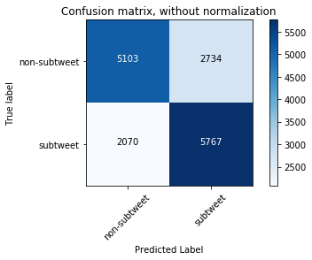
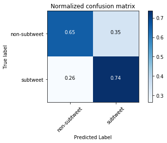
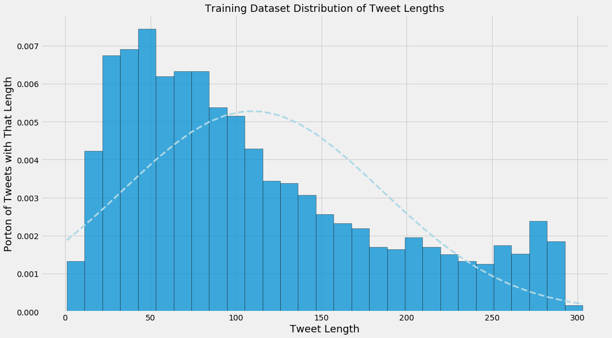
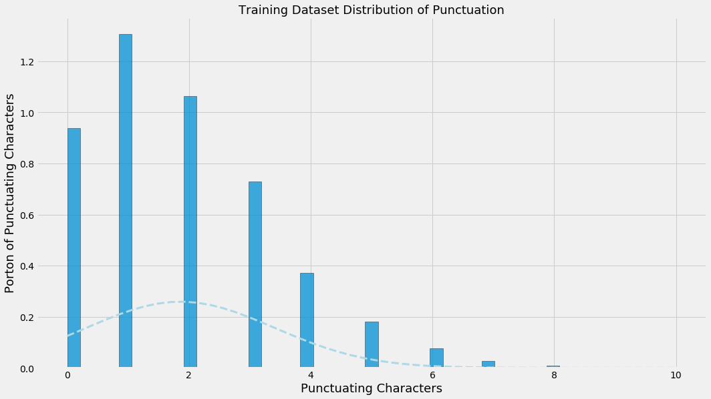
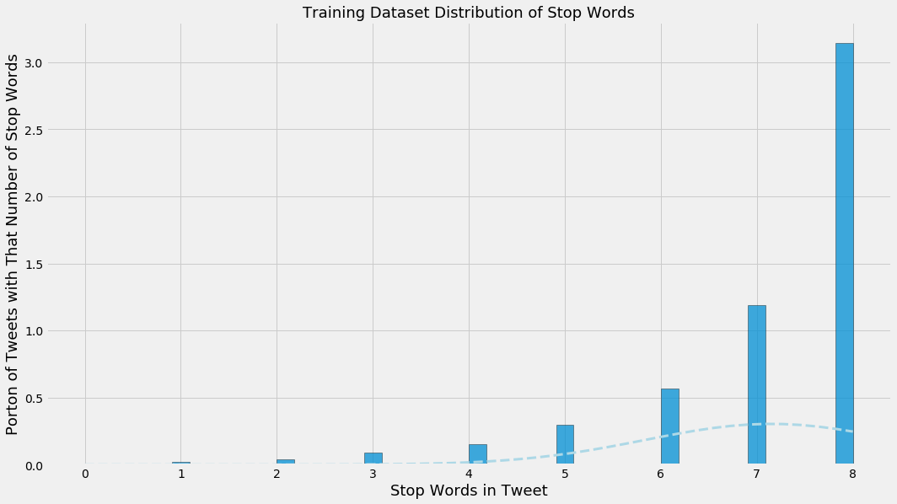
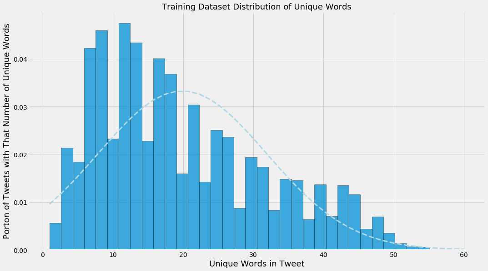

## Using Scikit-Learn and NLTK to build a Naive Bayes Classifier that identifies subtweets

#### In all tables, assume:
* "➊" represents a single hashtag
* "➋" represents a single URL
* "➌" represents a single mention of username (e.g. "@noah")

#### Import libraries


```python
%matplotlib inline
```


```python
from sklearn.feature_extraction import text
from sklearn.feature_extraction.text import TfidfVectorizer
from sklearn.naive_bayes import MultinomialNB
from sklearn.pipeline import Pipeline
from sklearn.model_selection import KFold
from sklearn.metrics import classification_report, confusion_matrix, accuracy_score
from sklearn.externals import joblib
from nltk.corpus import stopwords
from random import choice
from string import punctuation

import matplotlib.pyplot as plt
import pandas as pd
import numpy as np

import scipy.stats
import itertools
import enchant
import nltk
import json
import re
```

#### Set up some regex patterns


```python
hashtags_pattern = r'(\#[a-zA-Z0-9]+)'
```


```python
urls_pattern = r'(?i)\b((?:https?://|www\d{0,3}[.]|[a-z0-9.\-]+[.][a-z]{2,4}/)(?:[^\s()<>]|\(([^\s()<>]+|(\([^\s()<>]+\)))*\))+(?:\(([^\s()<>]+|(\([^\s()<>]+\)))*\)|[^\s`!()\[\]{};:\'".,<>?\xab\xbb\u201c\u201d\u2018\u2019]))'

```


```python
at_mentions_pattern = r'(?<=^|(?<=[^a-zA-Z0-9-\.]))@([A-Za-z0-9_]+)'
```

#### Prepare English dictionary for language detection


```python
english_dict = enchant.Dict("en_US")
```

#### Use NLTK's tokenizer instead of Scikit's


```python
tokenizer = nltk.casual.TweetTokenizer(preserve_case=False, reduce_len=True)
```

#### Prepare for viewing long text in CSVs and ones with really big and small numbers


```python
pd.set_option("max_colwidth", 280)
```


```python
pd.options.display.float_format = "{:.4f}".format
```

#### Load the two data files


```python
subtweets_data = [t for t in json.load(open("../data/other_data/subtweets.json")) 
                  if t["tweet_data"]["user"]["lang"] == "en" 
                  and t["reply"]["user"]["lang"] == "en"]
```


```python
non_subtweets_data = [t for t in json.load(open("../data/other_data/non_subtweets.json")) 
                      if t["tweet_data"]["user"]["lang"] == "en" 
                      and t["reply"]["user"]["lang"] == "en"]
```

#### Only use tweets with at least 50% English words
#### Also, make the mentions of usernames, URLs, and hashtags generic


```python
%%time
subtweets_data = [(re.sub(hashtags_pattern, 
                          "➊", 
                          re.sub(urls_pattern, 
                                 "➋", 
                                 re.sub(at_mentions_pattern, 
                                        "➌", 
                                        t["tweet_data"]["full_text"])))
                   .replace("\u2018", "'")
                   .replace("\u2019", "'")
                   .replace("&quot;", "\"")
                   .replace("&amp;", "&")
                   .replace("&gt;", ">")
                   .replace("&lt;", "<"))
                  for t in subtweets_data]
```

    CPU times: user 311 ms, sys: 13.1 ms, total: 324 ms
    Wall time: 336 ms


```python
new_subtweets_data = []
for tweet in subtweets_data:
    tokens = tokenizer.tokenize(tweet)
    english_tokens = [english_dict.check(token) for token in tokens]
    percent_english_words = sum(english_tokens)/len(english_tokens)
    if percent_english_words >= 0.5:
        new_subtweets_data.append(tweet)
```


```python
%%time
non_subtweets_data = [(re.sub(hashtags_pattern, 
                              "➊", 
                              re.sub(urls_pattern, 
                                     "➋", 
                                     re.sub(at_mentions_pattern, 
                                            "➌", 
                                            t["tweet_data"]["full_text"])))
                       .replace("\u2018", "'")
                       .replace("\u2019", "'")
                       .replace("&quot;", "\"")
                       .replace("&amp;", "&")
                       .replace("&gt;", ">")
                       .replace("&lt;", "<"))
                      for t in non_subtweets_data]
```

    CPU times: user 470 ms, sys: 44.1 ms, total: 514 ms
    Wall time: 543 ms


```python
new_non_subtweets_data = []
for tweet in non_subtweets_data:
    tokens = tokenizer.tokenize(tweet)
    english_tokens = [english_dict.check(token) for token in tokens]
    percent_english_words = sum(english_tokens)/len(english_tokens)
    if percent_english_words >= 0.5:
        new_non_subtweets_data.append(tweet)
```

#### Show examples


```python
print("Subtweets dataset example:")
print(choice(new_subtweets_data))
```

    Subtweets dataset example:
    people with zero sense of humor are scary.


```python
print("Non-subtweets dataset example:")
print(choice(new_non_subtweets_data))
```

    Non-subtweets dataset example:
    The trouble is even if the OPCW finds no evidence that Assad used chemical weapons, thus proving that Israel, US, England, France, etc. official govts. are fucking liars,  trying to promote even WW3, what of it? NOTHING! Just like the UN team found no weapons of mass destruction


#### Find the length of the smaller dataset


```python
smallest_length = len(min([new_subtweets_data, new_non_subtweets_data], key=len))
```

#### Cut both down to be the same length


```python
subtweets_data = new_subtweets_data[:smallest_length]
```


```python
non_subtweets_data = new_non_subtweets_data[:smallest_length]
```


```python
print("Smallest dataset length: {}".format(len(non_subtweets_data)))
```

    Smallest dataset length: 7837


#### Prepare data for training


```python
subtweets_data = [(tweet, "subtweet") for tweet in subtweets_data]
```


```python
non_subtweets_data = [(tweet, "non-subtweet") for tweet in non_subtweets_data]
```

#### Combine them


```python
training_data = subtweets_data + non_subtweets_data
```

#### Create custom stop words to include generic usernames, URLs, and hashtags, as well as common English first names


```python
names_lower = set([name.lower() for name in open("../data/other_data/first_names.txt").read().split("\n")])
```


```python
generic_tokens = {"➊", "➋", "➌"}
```


```python
stop_words = text.ENGLISH_STOP_WORDS | names_lower | generic_tokens
```

#### Build the pipeline


```python
sentiment_pipeline = Pipeline([
    ("vectorizer", TfidfVectorizer(tokenizer=tokenizer.tokenize, 
                                   ngram_range=(1, 3), 
                                   stop_words=stop_words)),
    ("classifier", MultinomialNB())
])
```

#### K-Folds splits up and separates out 10 training and test sets from the data, from which the classifier is trained and the confusion matrix and classification reports are updated


```python
text_training_data = np.array([row[0] for row in training_data])
```


```python
class_training_data = np.array([row[1] for row in training_data])
```


```python
kf = KFold(n_splits=10, random_state=42, shuffle=True)
```


```python
%%time
cnf_matrix = np.zeros((2, 2), dtype=int)
for i, (train_index, test_index) in enumerate(kf.split(text_training_data)):
    
    text_train, text_test = text_training_data[train_index], text_training_data[test_index]
    class_train, class_test = class_training_data[train_index], class_training_data[test_index]
    
    sentiment_pipeline.fit(text_train, class_train)
    predictions = sentiment_pipeline.predict(text_test)
        
    cnf_matrix += confusion_matrix(class_test, predictions)
    
    print("Iteration {}".format(i+1))
    print(classification_report(class_test, predictions, digits=3))
    print("accuracy: {:.3f}\n".format(accuracy_score(class_test, predictions)))
    print("="*53)
```

    Iteration 1
                  precision    recall  f1-score   support
    
    non-subtweet      0.732     0.644     0.685       793
        subtweet      0.676     0.759     0.715       775
    
     avg / total      0.704     0.701     0.700      1568
    
    accuracy: 0.701
    
    =====================================================
    Iteration 2
                  precision    recall  f1-score   support
    
    non-subtweet      0.688     0.631     0.658       789
        subtweet      0.655     0.710     0.681       779
    
     avg / total      0.672     0.670     0.670      1568
    
    accuracy: 0.670
    
    =====================================================
    Iteration 3
                  precision    recall  f1-score   support
    
    non-subtweet      0.703     0.685     0.694       769
        subtweet      0.704     0.721     0.712       799
    
     avg / total      0.703     0.703     0.703      1568
    
    accuracy: 0.703
    
    =====================================================
    Iteration 4
                  precision    recall  f1-score   support
    
    non-subtweet      0.731     0.639     0.682       801
        subtweet      0.667     0.755     0.708       767
    
     avg / total      0.700     0.696     0.695      1568
    
    accuracy: 0.696
    
    =====================================================
    Iteration 5
                  precision    recall  f1-score   support
    
    non-subtweet      0.708     0.656     0.681       779
        subtweet      0.683     0.732     0.707       788
    
     avg / total      0.695     0.694     0.694      1567
    
    accuracy: 0.694
    
    =====================================================
    Iteration 6
                  precision    recall  f1-score   support
    
    non-subtweet      0.684     0.662     0.673       758
        subtweet      0.693     0.713     0.703       809
    
     avg / total      0.688     0.689     0.688      1567
    
    accuracy: 0.689
    
    =====================================================
    Iteration 7
                  precision    recall  f1-score   support
    
    non-subtweet      0.699     0.630     0.662       751
        subtweet      0.688     0.750     0.717       816
    
     avg / total      0.693     0.692     0.691      1567
    
    accuracy: 0.692
    
    =====================================================
    Iteration 8
                  precision    recall  f1-score   support
    
    non-subtweet      0.733     0.643     0.685       812
        subtweet      0.661     0.748     0.702       755
    
     avg / total      0.698     0.694     0.693      1567
    
    accuracy: 0.694
    
    =====================================================
    Iteration 9
                  precision    recall  f1-score   support
    
    non-subtweet      0.731     0.642     0.683       829
        subtweet      0.646     0.734     0.687       738
    
     avg / total      0.691     0.685     0.685      1567
    
    accuracy: 0.685
    
    =====================================================
    Iteration 10
                  precision    recall  f1-score   support
    
    non-subtweet      0.707     0.681     0.694       756
        subtweet      0.713     0.737     0.725       811
    
     avg / total      0.710     0.710     0.710      1567
    
    accuracy: 0.710
    
    =====================================================
    CPU times: user 43.3 s, sys: 1.33 s, total: 44.6 s
    Wall time: 49.2 s


#### See the most informative features


```python
def most_informative_features(pipeline, n=50):
    vectorizer = pipeline.named_steps["vectorizer"]
    classifier = pipeline.named_steps["classifier"]
    
    class_labels = classifier.classes_
    
    feature_names = vectorizer.get_feature_names()
    
    top_n_class_1 = sorted(zip(classifier.coef_[0], feature_names))[:n]
    top_n_class_2 = sorted(zip(classifier.coef_[0], feature_names))[-n:]
    
    return {class_labels[0]: pd.DataFrame({"Weight": [tup[0] for tup in top_n_class_1], 
                                           "Feature": [tup[1] for tup in top_n_class_1]}), 
            class_labels[1]: pd.DataFrame({"Weight": [tup[0] for tup in reversed(top_n_class_2)],
                                           "Feature": [tup[1] for tup in reversed(top_n_class_2)]})}
```


```python
most_informative_features_all = most_informative_features(sentiment_pipeline)
```


```python
most_informative_features_non_subtweet = most_informative_features_all["non-subtweet"]
```


```python
most_informative_features_subtweet = most_informative_features_all["subtweet"]
```


```python
most_informative_features_non_subtweet.join(most_informative_features_subtweet, 
                                            lsuffix=" (Non-subtweet)", 
                                            rsuffix=" (Subtweet)")
```


<div>

<table border="1" class="dataframe">
  <thead>
    <tr style="text-align: right;">
      <th></th>
      <th>Feature (Non-subtweet)</th>
      <th>Weight (Non-subtweet)</th>
      <th>Feature (Subtweet)</th>
      <th>Weight (Subtweet)</th>
    </tr>
  </thead>
  <tbody>
    <tr>
      <th>0</th>
      <td>! ! &amp;</td>
      <td>-12.6640</td>
      <td>.</td>
      <td>-7.5326</td>
    </tr>
    <tr>
      <th>1</th>
      <td>! ! (</td>
      <td>-12.6640</td>
      <td>,</td>
      <td>-7.9221</td>
    </tr>
    <tr>
      <th>2</th>
      <td>! ! )</td>
      <td>-12.6640</td>
      <td>people</td>
      <td>-8.3929</td>
    </tr>
    <tr>
      <th>3</th>
      <td>! ! .</td>
      <td>-12.6640</td>
      <td>?</td>
      <td>-8.4622</td>
    </tr>
    <tr>
      <th>4</th>
      <td>! ! 100</td>
      <td>-12.6640</td>
      <td>don't</td>
      <td>-8.5613</td>
    </tr>
    <tr>
      <th>5</th>
      <td>! ! 15</td>
      <td>-12.6640</td>
      <td>like</td>
      <td>-8.5917</td>
    </tr>
    <tr>
      <th>6</th>
      <td>! ! 3</td>
      <td>-12.6640</td>
      <td>"</td>
      <td>-8.6097</td>
    </tr>
    <tr>
      <th>7</th>
      <td>! ! 5</td>
      <td>-12.6640</td>
      <td>just</td>
      <td>-8.6781</td>
    </tr>
    <tr>
      <th>8</th>
      <td>! ! 8am</td>
      <td>-12.6640</td>
      <td>i'm</td>
      <td>-8.6996</td>
    </tr>
    <tr>
      <th>9</th>
      <td>! ! :)</td>
      <td>-12.6640</td>
      <td>!</td>
      <td>-8.9060</td>
    </tr>
    <tr>
      <th>10</th>
      <td>! ! ;)</td>
      <td>-12.6640</td>
      <td>it's</td>
      <td>-8.9756</td>
    </tr>
    <tr>
      <th>11</th>
      <td>! ! absolutely</td>
      <td>-12.6640</td>
      <td>...</td>
      <td>-9.0457</td>
    </tr>
    <tr>
      <th>12</th>
      <td>! ! amazing</td>
      <td>-12.6640</td>
      <td>you're</td>
      <td>-9.0515</td>
    </tr>
    <tr>
      <th>13</th>
      <td>! ! ask</td>
      <td>-12.6640</td>
      <td>:</td>
      <td>-9.0737</td>
    </tr>
    <tr>
      <th>14</th>
      <td>! ! awesome</td>
      <td>-12.6640</td>
      <td>know</td>
      <td>-9.0953</td>
    </tr>
    <tr>
      <th>15</th>
      <td>! ! big</td>
      <td>-12.6640</td>
      <td>twitter</td>
      <td>-9.1468</td>
    </tr>
    <tr>
      <th>16</th>
      <td>! ! bite</td>
      <td>-12.6640</td>
      <td>friends</td>
      <td>-9.1676</td>
    </tr>
    <tr>
      <th>17</th>
      <td>! ! close</td>
      <td>-12.6640</td>
      <td>”</td>
      <td>-9.2655</td>
    </tr>
    <tr>
      <th>18</th>
      <td>! ! collection</td>
      <td>-12.6640</td>
      <td>“</td>
      <td>-9.2730</td>
    </tr>
    <tr>
      <th>19</th>
      <td>! ! come</td>
      <td>-12.6640</td>
      <td>time</td>
      <td>-9.2904</td>
    </tr>
    <tr>
      <th>20</th>
      <td>! ! don't</td>
      <td>-12.6640</td>
      <td>want</td>
      <td>-9.2949</td>
    </tr>
    <tr>
      <th>21</th>
      <td>! ! enter</td>
      <td>-12.6640</td>
      <td>u</td>
      <td>-9.3026</td>
    </tr>
    <tr>
      <th>22</th>
      <td>! ! epic</td>
      <td>-12.6640</td>
      <td>really</td>
      <td>-9.3542</td>
    </tr>
    <tr>
      <th>23</th>
      <td>! ! extremely</td>
      <td>-12.6640</td>
      <td>shit</td>
      <td>-9.3723</td>
    </tr>
    <tr>
      <th>24</th>
      <td>! ! family</td>
      <td>-12.6640</td>
      <td>good</td>
      <td>-9.4043</td>
    </tr>
    <tr>
      <th>25</th>
      <td>! ! finally</td>
      <td>-12.6640</td>
      <td>think</td>
      <td>-9.4184</td>
    </tr>
    <tr>
      <th>26</th>
      <td>! ! glasgow</td>
      <td>-12.6640</td>
      <td>make</td>
      <td>-9.4248</td>
    </tr>
    <tr>
      <th>27</th>
      <td>! ! guess</td>
      <td>-12.6640</td>
      <td>😂</td>
      <td>-9.4359</td>
    </tr>
    <tr>
      <th>28</th>
      <td>! ! happy</td>
      <td>-12.6640</td>
      <td>can't</td>
      <td>-9.4544</td>
    </tr>
    <tr>
      <th>29</th>
      <td>! ! hardest</td>
      <td>-12.6640</td>
      <td>*</td>
      <td>-9.5023</td>
    </tr>
    <tr>
      <th>30</th>
      <td>! ! he's</td>
      <td>-12.6640</td>
      <td>need</td>
      <td>-9.5308</td>
    </tr>
    <tr>
      <th>31</th>
      <td>! ! homeland</td>
      <td>-12.6640</td>
      <td>fuck</td>
      <td>-9.5328</td>
    </tr>
    <tr>
      <th>32</th>
      <td>! ! isn't</td>
      <td>-12.6640</td>
      <td>tweet</td>
      <td>-9.5364</td>
    </tr>
    <tr>
      <th>33</th>
      <td>! ! it's</td>
      <td>-12.6640</td>
      <td>say</td>
      <td>-9.5649</td>
    </tr>
    <tr>
      <th>34</th>
      <td>! ! know</td>
      <td>-12.6640</td>
      <td>stop</td>
      <td>-9.6284</td>
    </tr>
    <tr>
      <th>35</th>
      <td>! ! like</td>
      <td>-12.6640</td>
      <td>)</td>
      <td>-9.6436</td>
    </tr>
    <tr>
      <th>36</th>
      <td>! ! lol</td>
      <td>-12.6640</td>
      <td>-</td>
      <td>-9.6666</td>
    </tr>
    <tr>
      <th>37</th>
      <td>! ! looking</td>
      <td>-12.6640</td>
      <td>/</td>
      <td>-9.6850</td>
    </tr>
    <tr>
      <th>38</th>
      <td>! ! looks</td>
      <td>-12.6640</td>
      <td>lol</td>
      <td>-9.6878</td>
    </tr>
    <tr>
      <th>39</th>
      <td>! ! lov</td>
      <td>-12.6640</td>
      <td>person</td>
      <td>-9.6952</td>
    </tr>
    <tr>
      <th>40</th>
      <td>! ! loved</td>
      <td>-12.6640</td>
      <td>fucking</td>
      <td>-9.7133</td>
    </tr>
    <tr>
      <th>41</th>
      <td>! ! maaawd</td>
      <td>-12.6640</td>
      <td>life</td>
      <td>-9.7144</td>
    </tr>
    <tr>
      <th>42</th>
      <td>! ! maga</td>
      <td>-12.6640</td>
      <td>hate</td>
      <td>-9.7286</td>
    </tr>
    <tr>
      <th>43</th>
      <td>! ! make</td>
      <td>-12.6640</td>
      <td>got</td>
      <td>-9.7451</td>
    </tr>
    <tr>
      <th>44</th>
      <td>! ! maybe</td>
      <td>-12.6640</td>
      <td>y'all</td>
      <td>-9.7635</td>
    </tr>
    <tr>
      <th>45</th>
      <td>! ! need</td>
      <td>-12.6640</td>
      <td>'</td>
      <td>-9.7664</td>
    </tr>
    <tr>
      <th>46</th>
      <td>! ! omfg</td>
      <td>-12.6640</td>
      <td>(</td>
      <td>-9.7790</td>
    </tr>
    <tr>
      <th>47</th>
      <td>! ! open</td>
      <td>-12.6640</td>
      <td>! !</td>
      <td>-9.7901</td>
    </tr>
    <tr>
      <th>48</th>
      <td>! ! packed</td>
      <td>-12.6640</td>
      <td>thing</td>
      <td>-9.7926</td>
    </tr>
    <tr>
      <th>49</th>
      <td>! ! people</td>
      <td>-12.6640</td>
      <td>@</td>
      <td>-9.7958</td>
    </tr>
  </tbody>
</table>
</div>


#### Define function for visualizing confusion matrices


```python
def plot_confusion_matrix(cm, classes, normalize=False,
                          title="Confusion Matrix", cmap=plt.cm.Blues):
    if normalize:
        cm = cm.astype("float") / cm.sum(axis=1)[:, np.newaxis]

    plt.imshow(cm, interpolation="nearest", cmap=cmap)
    plt.title(title)
    plt.colorbar()
    tick_marks = np.arange(len(classes))
    plt.xticks(tick_marks, classes, rotation=45)
    plt.yticks(tick_marks, classes)

    fmt = ".2f" if normalize else "d"
    thresh = cm.max() / 2.
    for i, j in itertools.product(range(cm.shape[0]), range(cm.shape[1])):
        plt.text(j, i, format(cm[i, j], fmt),
                 horizontalalignment="center",
                 color="white" if cm[i, j] > thresh else "black")

    plt.tight_layout()
    plt.ylabel("True label")
    plt.xlabel("Predicted Label")
```

#### Show the matrices


```python
class_names = ["non-subtweet", "subtweet"]

np.set_printoptions(precision=2)

plt.figure()
plot_confusion_matrix(cnf_matrix, classes=class_names,
                      title='Confusion matrix, without normalization')

plt.figure()
plot_confusion_matrix(cnf_matrix, classes=class_names, normalize=True,
                      title='Normalized confusion matrix')

plt.show()
```








#### Update matplotlib style


```python
plt.style.use("fivethirtyeight")
```

#### Save the classifier for another time


```python
joblib.dump(sentiment_pipeline, "../data/other_data/subtweets_classifier.pkl");
```

#### Print tests for the classifier


```python
def tests_dataframe(tweets_dataframe, text_column="SentimentText", sentiment_column="Sentiment"):
    predictions = sentiment_pipeline.predict_proba(tweets_dataframe[text_column])
    negative_probability = predictions[:, 0].tolist()
    positive_probability = predictions[:, 1].tolist()
    return pd.DataFrame({"tweet": tweets_dataframe[text_column], 
                         "sentiment_score": tweets_dataframe[sentiment_column], 
                         "subtweet_negative_probability": negative_probability, 
                         "subtweet_positive_probability": positive_probability}).sort_values(by="subtweet_positive_probability", 
                                                                                             ascending=False)
```

#### Make up some tweets


```python
test_tweets = ["Some people don't know their place.", 
               "Isn't it funny how some people don't know their place?", 
               "How come you people act like this?", 
               "You're such a nerd.",
               "I love Noah, he's so cool.",
               "Who the heck is Noah?",
               "This is a @NoahSegalGould subtweet. Go check out https://segal-gould.com.", 
               "This is a subtweet.", 
               "Hey @jack!", 
               "Hey Jack!",
               "http://www.google.com"]
```

#### Make a dataframe from the list


```python
test_tweets_df = pd.DataFrame({"Tweet": test_tweets, "Sentiment": [None]*len(test_tweets)})
```

#### Remove usernames, URLs, and hashtags


```python
test_tweets_df["Tweet"] = test_tweets_df["Tweet"].str.replace(hashtags_pattern, "➊")
```


```python
test_tweets_df["Tweet"] = test_tweets_df["Tweet"].str.replace(urls_pattern, "➋")
```


```python
test_tweets_df["Tweet"] = test_tweets_df["Tweet"].str.replace(at_mentions_pattern, "➌")
```

#### Print the tests


```python
tests_dataframe(test_tweets_df, text_column="Tweet", 
                sentiment_column="Sentiment").drop(["sentiment_score", 
                                                    "subtweet_negative_probability"], axis=1)
```


<div>

<table border="1" class="dataframe">
  <thead>
    <tr style="text-align: right;">
      <th></th>
      <th>subtweet_positive_probability</th>
      <th>tweet</th>
    </tr>
  </thead>
  <tbody>
    <tr>
      <th>0</th>
      <td>0.7802</td>
      <td>Some people don't know their place.</td>
    </tr>
    <tr>
      <th>1</th>
      <td>0.7730</td>
      <td>Isn't it funny how some people don't know their place?</td>
    </tr>
    <tr>
      <th>2</th>
      <td>0.7179</td>
      <td>How come you people act like this?</td>
    </tr>
    <tr>
      <th>3</th>
      <td>0.6903</td>
      <td>You're such a nerd.</td>
    </tr>
    <tr>
      <th>4</th>
      <td>0.5781</td>
      <td>I love Noah, he's so cool.</td>
    </tr>
    <tr>
      <th>10</th>
      <td>0.4981</td>
      <td>➋</td>
    </tr>
    <tr>
      <th>5</th>
      <td>0.4625</td>
      <td>Who the heck is Noah?</td>
    </tr>
    <tr>
      <th>6</th>
      <td>0.4487</td>
      <td>This is a ➌ subtweet. Go check out ➋.</td>
    </tr>
    <tr>
      <th>7</th>
      <td>0.4425</td>
      <td>This is a subtweet.</td>
    </tr>
    <tr>
      <th>8</th>
      <td>0.2996</td>
      <td>Hey ➌!</td>
    </tr>
    <tr>
      <th>9</th>
      <td>0.2996</td>
      <td>Hey Jack!</td>
    </tr>
  </tbody>
</table>
</div>


#### Tests on friends' tweets

#### Aaron


```python
aaron_df = pd.read_csv("../data/data_for_testing/friends_data/akrapf96_tweets.csv").dropna()
aaron_df["Sentiment"] = None
```

#### Remove usernames, URLs, and hashtags


```python
aaron_df["Text"] = aaron_df["Text"].str.replace(hashtags_pattern, "➊")
```


```python
aaron_df["Text"] = aaron_df["Text"].str.replace(urls_pattern, "➋")
```


```python
aaron_df["Text"] = aaron_df["Text"].str.replace(at_mentions_pattern, "➌")
```


```python
aaron_df = tests_dataframe(aaron_df, text_column="Text", 
                           sentiment_column="Sentiment").drop(["sentiment_score", 
                                                               "subtweet_negative_probability"], axis=1)
```


```python
aaron_df.to_csv("../data/data_from_testing/friends_data/akrapf96_tests.csv")
```


```python
aaron_df.head(10)
```


<div>

<table border="1" class="dataframe">
  <thead>
    <tr style="text-align: right;">
      <th></th>
      <th>subtweet_positive_probability</th>
      <th>tweet</th>
    </tr>
  </thead>
  <tbody>
    <tr>
      <th>2092</th>
      <td>0.8578</td>
      <td>I hate when people overuse emojis</td>
    </tr>
    <tr>
      <th>2137</th>
      <td>0.8442</td>
      <td>Also you don't need to resort to social media 24/7 to complain about your very privileged life ¯\_(ツ)_/¯</td>
    </tr>
    <tr>
      <th>2151</th>
      <td>0.8366</td>
      <td>When I try to be supportive and caring I get ignored and then I'm told I'm not being supportive or caring ¯\_(ツ)_/¯</td>
    </tr>
    <tr>
      <th>2134</th>
      <td>0.8177</td>
      <td>What he doesn't know (unless he stalks my twitter which I know he does) is that I have fake accounts following all his social media</td>
    </tr>
    <tr>
      <th>181</th>
      <td>0.8143</td>
      <td>I often obsess when texting older people if they will think less of me for saying "LOL" so I say "haha" instead but my mom just texting me "LOL" so maybe I've been overthinking this?</td>
    </tr>
    <tr>
      <th>1510</th>
      <td>0.8076</td>
      <td>If you don't have tweet notifications turned on for me are we really friends</td>
    </tr>
    <tr>
      <th>658</th>
      <td>0.8062</td>
      <td>I wonder how many animal social media accounts I follow across every platform</td>
    </tr>
    <tr>
      <th>2076</th>
      <td>0.8027</td>
      <td>I still don't understand why my brother feels a need to literally narrate his life on Twitter. Nobody cares when you go to sleep or wake up</td>
    </tr>
    <tr>
      <th>1519</th>
      <td>0.8013</td>
      <td>Is it weird how my mind designates which social media specific content belongs on? Like this tweet wouldn't make sense to me on facebook</td>
    </tr>
    <tr>
      <th>2319</th>
      <td>0.8005</td>
      <td>Sometimes I wonder if people don't realize the 140 character limit and try to type a really long message and end up having it get cut off at</td>
    </tr>
  </tbody>
</table>
</div>


```python
aaron_df_for_plotting = aaron_df.drop(["tweet"], axis=1)
```

#### Julia


```python
julia_df = pd.read_csv("../data/data_for_testing/friends_data/juliaeberry_tweets.csv").dropna()
julia_df["Sentiment"] = None
```

#### Remove usernames, URLs, and hashtags


```python
julia_df["Text"] = julia_df["Text"].str.replace(hashtags_pattern, "➊")
```


```python
julia_df["Text"] = julia_df["Text"].str.replace(urls_pattern, "➋")
```


```python
julia_df["Text"] = julia_df["Text"].str.replace(at_mentions_pattern, "➌")
```


```python
julia_df = tests_dataframe(julia_df, text_column="Text", 
                           sentiment_column="Sentiment").drop(["sentiment_score", 
                                                               "subtweet_negative_probability"], axis=1)
```


```python
julia_df.to_csv("../data/data_from_testing/friends_data/juliaeberry_tests.csv")
```


```python
julia_df.head(10)
```


<div>

<table border="1" class="dataframe">
  <thead>
    <tr style="text-align: right;">
      <th></th>
      <th>subtweet_positive_probability</th>
      <th>tweet</th>
    </tr>
  </thead>
  <tbody>
    <tr>
      <th>3197</th>
      <td>0.8674</td>
      <td>unpopular twitter opinion I don't like christine sudoku and elijah whatever and I don't think they're funny</td>
    </tr>
    <tr>
      <th>3613</th>
      <td>0.8566</td>
      <td>don't follow bachelor contestants u liked on insta bc it will just make u hate them for being annoying and unoriginal ➊</td>
    </tr>
    <tr>
      <th>2325</th>
      <td>0.8399</td>
      <td>I love seeing people I knew from hs at the gym! and by that I mean don't talk to me don't even look at me</td>
    </tr>
    <tr>
      <th>1555</th>
      <td>0.8317</td>
      <td>tbt to when ➌ are real trash out of the garbage</td>
    </tr>
    <tr>
      <th>3913</th>
      <td>0.8153</td>
      <td>tfw ur anxiety kills ur appetite but you can't do anything done bc ur still hungry so u just get more anxiety ➊</td>
    </tr>
    <tr>
      <th>2235</th>
      <td>0.8152</td>
      <td>david mitchell said the world is full of people who want to make people who don't want to dance dance....</td>
    </tr>
    <tr>
      <th>1450</th>
      <td>0.8129</td>
      <td>between this is just to say and sophia the robot memes, twitter has been fucking On recently</td>
    </tr>
    <tr>
      <th>3859</th>
      <td>0.8108</td>
      <td>I don't really tmi about volleyball on twitter but I wish I could bc I could vent for hours about how this sport makes me feel lyk trash</td>
    </tr>
    <tr>
      <th>2970</th>
      <td>0.8066</td>
      <td>funny how some people have suddenly become serious ""academics"" and think they're amazingly intelligent now....try no bitch u fake as fuck</td>
    </tr>
    <tr>
      <th>3348</th>
      <td>0.8026</td>
      <td>one critique I have of westworld: there are too many boring white guys with beards and it's hard to tell them apart</td>
    </tr>
  </tbody>
</table>
</div>


```python
julia_df_for_plotting = julia_df.drop(["tweet"], axis=1)
```

#### Lex


```python
lex_df = pd.read_csv("../data/data_for_testing/friends_data/gothodile_tweets.csv").dropna()
lex_df["Sentiment"] = None
```

#### Remove usernames, URLs, and hashtags


```python
lex_df["Text"] = lex_df["Text"].str.replace(hashtags_pattern, "➊")
```


```python
lex_df["Text"] = lex_df["Text"].str.replace(urls_pattern, "➋")
```


```python
lex_df["Text"] = lex_df["Text"].str.replace(at_mentions_pattern, "➌")
```


```python
lex_df = tests_dataframe(lex_df, text_column="Text", 
                         sentiment_column="Sentiment").drop(["sentiment_score",
                                                             "subtweet_negative_probability"], axis=1)
```


```python
lex_df.to_csv("../data/data_from_testing/friends_data/gothodile_tests.csv")
```


```python
lex_df.head(10)
```


<div>

<table border="1" class="dataframe">
  <thead>
    <tr style="text-align: right;">
      <th></th>
      <th>subtweet_positive_probability</th>
      <th>tweet</th>
    </tr>
  </thead>
  <tbody>
    <tr>
      <th>2054</th>
      <td>0.8466</td>
      <td>so like literally u can stop tweeting @ me to die because i didnt put an art cred on my relatable meme shitpost</td>
    </tr>
    <tr>
      <th>1043</th>
      <td>0.8446</td>
      <td>and i realize thats not something i should complain about but it feels kinda evolutionarily inefficiant.</td>
    </tr>
    <tr>
      <th>3260</th>
      <td>0.8338</td>
      <td>its as bad of an excuse as any to try and say "if you're a REAL comic book fan you'll like it"</td>
    </tr>
    <tr>
      <th>3052</th>
      <td>0.8317</td>
      <td>but like if you tell people you're a psych major they're like "o haha soft science"</td>
    </tr>
    <tr>
      <th>638</th>
      <td>0.8201</td>
      <td>my OTP: *touches even in a context where theyre just being rude to each other*\nme: ➋</td>
    </tr>
    <tr>
      <th>357</th>
      <td>0.8153</td>
      <td>"im like the girl that you take out because she seems nice but then your first time having sex I growl and bite your nipple and you tell all your friends about how weird it was"</td>
    </tr>
    <tr>
      <th>2110</th>
      <td>0.8099</td>
      <td>needing help on things but not wanting to ask because u know theyre just gonna say some stupid shit and u dont want to go to jail for murder</td>
    </tr>
    <tr>
      <th>3361</th>
      <td>0.8088</td>
      <td>RETWEET if you're like me and just throw your trash and belongings on the floor, LIKE if you're disgusted by my lifestyle</td>
    </tr>
    <tr>
      <th>2133</th>
      <td>0.8011</td>
      <td>"Why X-Men is right to ditch Magneto and Professor X's tired double act" good to know that you hate gay people but alright</td>
    </tr>
    <tr>
      <th>475</th>
      <td>0.7991</td>
      <td>i think the reason seeing throats slit bothers me is because i know what getting a paper cut feels like and i don't like it. so i assume i would hate it even more if it was on my neck.</td>
    </tr>
  </tbody>
</table>
</div>


```python
lex_df_for_plotting = lex_df.drop(["tweet"], axis=1)
```

#### Noah


```python
noah_df = pd.read_csv("../data/data_for_testing/friends_data/noahsegalgould_tweets.csv").dropna()
noah_df["Sentiment"] = None
```

#### Remove usernames, URLs, and hashtags


```python
noah_df["Text"] = noah_df["Text"].str.replace(hashtags_pattern, "➊")
```


```python
noah_df["Text"] = noah_df["Text"].str.replace(urls_pattern, "➋")
```


```python
noah_df["Text"] = noah_df["Text"].str.replace(at_mentions_pattern, "➌")
```


```python
noah_df = tests_dataframe(noah_df, text_column="Text", 
                          sentiment_column="Sentiment").drop(["sentiment_score", 
                                                              "subtweet_negative_probability"], axis=1)
```


```python
noah_df.to_csv("../data/data_from_testing/friends_data/noahsegalgould_tests.csv")
```


```python
noah_df.head(10)
```


<div>

<table border="1" class="dataframe">
  <thead>
    <tr style="text-align: right;">
      <th></th>
      <th>subtweet_positive_probability</th>
      <th>tweet</th>
    </tr>
  </thead>
  <tbody>
    <tr>
      <th>2022</th>
      <td>0.8972</td>
      <td>you may think you're cool but unless you're friends with my friends you're not actually as cool as you could be</td>
    </tr>
    <tr>
      <th>1689</th>
      <td>0.8490</td>
      <td>linkedin is better than twitter.\ndon't @ me.</td>
    </tr>
    <tr>
      <th>1716</th>
      <td>0.8412</td>
      <td>If you don't make your meatloaf with ketchup don't bother talking to me</td>
    </tr>
    <tr>
      <th>2027</th>
      <td>0.8372</td>
      <td>IF U CALL URSELF A WEEB BUT DONT HAVE ANIME PROF PICS ON ALL SOCIAL MEDIA\n DELETE  UR  ACCOUNTS</td>
    </tr>
    <tr>
      <th>1760</th>
      <td>0.8172</td>
      <td>don't ever talk to me or my hamartia ever again</td>
    </tr>
    <tr>
      <th>340</th>
      <td>0.8130</td>
      <td>Twitter changed the way bots download tweets and now my friends’ twitter bots can’t be updated unless they give me sensitive information</td>
    </tr>
    <tr>
      <th>291</th>
      <td>0.8129</td>
      <td>if you've still got tweet notifications on for me, I'm sorry, this is a subtweet</td>
    </tr>
    <tr>
      <th>2523</th>
      <td>0.8090</td>
      <td>Instead of posting several vague tweets revolving around my issues of self-worth I'll just ask this: Who decides how good a friend I am?</td>
    </tr>
    <tr>
      <th>1797</th>
      <td>0.8083</td>
      <td>don't @ ➋</td>
    </tr>
    <tr>
      <th>1242</th>
      <td>0.8020</td>
      <td>stupid pet peeve of the evening:\nsaying "greater than" aloud 5 times sounds stupid\nso why type &gt;&gt;&gt;&gt;&gt;</td>
    </tr>
  </tbody>
</table>
</div>


```python
noah_df_for_plotting = noah_df.drop(["tweet"], axis=1)
```

#### Rename the columns for later


```python
aaron_df_for_plotting_together = aaron_df_for_plotting.rename(columns={"subtweet_positive_probability": "Aaron"})
```


```python
julia_df_for_plotting_together = julia_df_for_plotting.rename(columns={"subtweet_positive_probability": "Julia"})
```


```python
lex_df_for_plotting_together = lex_df_for_plotting.rename(columns={"subtweet_positive_probability": "Lex"})
```


```python
noah_df_for_plotting_together = noah_df_for_plotting.rename(columns={"subtweet_positive_probability": "Noah"})
```

#### Prepare statistics on friends' tweets


```python
friends_df = pd.concat([aaron_df_for_plotting_together, 
                        julia_df_for_plotting_together, 
                        lex_df_for_plotting_together, 
                        noah_df_for_plotting_together], ignore_index=True)
```


```python
friends_df.describe()
```


<div>

<table border="1" class="dataframe">
  <thead>
    <tr style="text-align: right;">
      <th></th>
      <th>Aaron</th>
      <th>Julia</th>
      <th>Lex</th>
      <th>Noah</th>
    </tr>
  </thead>
  <tbody>
    <tr>
      <th>count</th>
      <td>2640.0000</td>
      <td>4356.0000</td>
      <td>3488.0000</td>
      <td>2814.0000</td>
    </tr>
    <tr>
      <th>mean</th>
      <td>0.5069</td>
      <td>0.5162</td>
      <td>0.5248</td>
      <td>0.5063</td>
    </tr>
    <tr>
      <th>std</th>
      <td>0.1147</td>
      <td>0.1014</td>
      <td>0.1075</td>
      <td>0.1078</td>
    </tr>
    <tr>
      <th>min</th>
      <td>0.0953</td>
      <td>0.1522</td>
      <td>0.1626</td>
      <td>0.1506</td>
    </tr>
    <tr>
      <th>25%</th>
      <td>0.4295</td>
      <td>0.4476</td>
      <td>0.4530</td>
      <td>0.4326</td>
    </tr>
    <tr>
      <th>50%</th>
      <td>0.5027</td>
      <td>0.5164</td>
      <td>0.5203</td>
      <td>0.5017</td>
    </tr>
    <tr>
      <th>75%</th>
      <td>0.5837</td>
      <td>0.5818</td>
      <td>0.5954</td>
      <td>0.5736</td>
    </tr>
    <tr>
      <th>max</th>
      <td>0.8578</td>
      <td>0.8674</td>
      <td>0.8466</td>
      <td>0.8972</td>
    </tr>
  </tbody>
</table>
</div>


```python
aaron_mean = friends_df.describe().Aaron[1]
aaron_std = friends_df.describe().Aaron[2]

julia_mean = friends_df.describe().Julia[1]
julia_std = friends_df.describe().Julia[2]

noah_mean = friends_df.describe().Noah[1]
noah_std = friends_df.describe().Noah[2]

lex_mean = friends_df.describe().Lex[1]
lex_std = friends_df.describe().Lex[2]
```

#### Plot all the histograms


```python
%%time
fig = plt.figure(figsize=(16, 9))
ax = fig.add_subplot(111)

n, bins, patches = ax.hist([aaron_df_for_plotting.subtweet_positive_probability, 
                            julia_df_for_plotting.subtweet_positive_probability, 
                            noah_df_for_plotting.subtweet_positive_probability, 
                            lex_df_for_plotting.subtweet_positive_probability], 
                           bins="scott",
                           color=["#256EFF", "#46237A", "#3DDC97", "#FF495C"],
                           density=True, label=["Aaron", "Julia", "Noah", "Lex"],
                           alpha=0.75)

aaron_line = scipy.stats.norm.pdf(bins, aaron_mean, aaron_std)
ax.plot(bins, aaron_line, "--", color="#256EFF", linewidth=3)

julia_line = scipy.stats.norm.pdf(bins, julia_mean, julia_std)
ax.plot(bins, julia_line, "--", color="#46237A", linewidth=3)

noah_line = scipy.stats.norm.pdf(bins, noah_mean, noah_std)
ax.plot(bins, noah_line, "--", color="#3DDC97", linewidth=3)

lex_line = scipy.stats.norm.pdf(bins, lex_mean, lex_std)
ax.plot(bins, lex_line, "--", color="#FF495C", linewidth=3)

ax.set_xticks([float(x/10) for x in range(11)], minor=False)
ax.set_title("Friends' Dataset Distribution of Subtweet Probabilities", fontsize=18)
ax.set_xlabel("Probability That Tweet is a Subtweet", fontsize=18)
ax.set_ylabel("Portion of Tweets with That Probability", fontsize=18)

ax.legend()

plt.show()
```

    /Users/Noah/anaconda/envs/work/lib/python3.6/site-packages/numpy/core/fromnumeric.py:52: FutureWarning: reshape is deprecated and will raise in a subsequent release. Please use .values.reshape(...) instead
      return getattr(obj, method)(*args, **kwds)


    CPU times: user 754 ms, sys: 45.5 ms, total: 799 ms
    Wall time: 847 ms


#### Statisitics on training data

#### Remove mentions of usernames for these statistics


```python
training_data = [" ".join([token for token in tokenizer.tokenize(pair[0]) if "@" not in token]) 
                 for pair in training_data]
```

#### Lengths (Less than or equal to 280 characters and greater than or equal to 5 characters)


```python
length_data = [len(tweet) for tweet in training_data]
```


```python
length_data_for_stats = pd.DataFrame({"Length": length_data, "Tweet": training_data})
```


```python
# length_data_for_stats = length_data_for_stats[length_data_for_stats["Length"] <= 280]  
```


```python
# length_data_for_stats = length_data_for_stats[length_data_for_stats["Length"] >= 5]
```


```python
length_data = length_data_for_stats.Length.tolist()
```

#### Top 10 longest tweets


```python
length_data_for_stats.sort_values(by="Length", ascending=False).head(10)
```


<div>

<table border="1" class="dataframe">
  <thead>
    <tr style="text-align: right;">
      <th></th>
      <th>Length</th>
      <th>Tweet</th>
    </tr>
  </thead>
  <tbody>
    <tr>
      <th>14329</th>
      <td>303</td>
      <td>from 10/18 / 15 when he 1st played hurt &amp; began noticeably throwing w poor mechanics thru end of his injured 2016 yr , luck's stats were as good as his healthiest / best 2013-2014 yrs : - injured : 61 % comp , 7.4 ypa , 93 rtg , 41:18 td : int - healthy : 61 % comp , 7.2 ypa ...</td>
    </tr>
    <tr>
      <th>4476</th>
      <td>302</td>
      <td>in situations of power imbalance , wealth inequality , unequal access to ... everything-can ' we ' drop the ' we ' - because it really means you not me . when . you . pretend . that . we . all . share . same . interests . you . are . helping . the . most . powerful . oppress ...</td>
    </tr>
    <tr>
      <th>8001</th>
      <td>300</td>
      <td>hotel elevator earlier today : i get in , a young man and a young woman already in the car . me : " good morning , both . " woman : " good morning . " man , clearly writhing , not wanting to say anything but caught in a vortex due to the young woman's response . ten seconds l...</td>
    </tr>
    <tr>
      <th>15228</th>
      <td>299</td>
      <td>" it is a key agreement that shapes today's globalisation " - frau merkel on the paris ' agreement ' . climatefraud-a contrived tool of the deadly eu / un-centric marxist-globalist / islamist alliance , to wealth transfer &amp; to create such energy poverty , that sovereignwester...</td>
    </tr>
    <tr>
      <th>14724</th>
      <td>299</td>
      <td>pentagon : master sergeant jonathan j . dunbar , assigned to headquarters , u . s . army special operations command , fort bragg , n . c . , was kia mar . 30 , while deployed in support of operation inherent resolve . dunbar died from wounds received during combat operations ...</td>
    </tr>
    <tr>
      <th>6017</th>
      <td>299</td>
      <td>person : * criticizes my writing * me : yup , they're right , 100 percent , spot on , very valid , absolutely agree person : * compliments my writing * me : ? ? ? did they read something else ? ? ? are they lying ? ? ? are they drunk ? ? ? i don't know what to do with this ? ...</td>
    </tr>
    <tr>
      <th>8702</th>
      <td>298</td>
      <td>i've fallen into a rabbit hole of goals from that 2016 run . faves : 1 ) crosby's goal against raanta in rd . 1 . 2 ) cullen's goal in ny . third period . tie game . 3 ) fehr's goal in game 2 vs . washington . 4 ) rust's breakaway in game 6 vs . tampa . 5 ) fehr's game 5 insu...</td>
    </tr>
    <tr>
      <th>5265</th>
      <td>296</td>
      <td>me : " we can't deviate from the clinical policies the client's medical team chose " coworker : " well we'll ask the cto " m : " okay but he's in agreement too " c : " i don't want to talk to you . our medical licenses are on the line " m : " no ... they aren't . you didn't c...</td>
    </tr>
    <tr>
      <th>8607</th>
      <td>296</td>
      <td>the first-time event , bucky's yard sale , is april 12 and 13 from 9am - 2pm at etsu in the quad . donations of clothing , shoes accessories , and other cool things are needed ! drop-off bins are in the cpa , outside of sorc a in the culp , and in centennial , governors , sto...</td>
    </tr>
    <tr>
      <th>9006</th>
      <td>296</td>
      <td>➊ campaign ideas i can't get out of my head : 💠 gothic monster hunting ( e . g . krevborna , ravenloft , solomon kane ) 💠 aetherpunk intrigue ( e . g . kaladesh , lantan , eberron ) 💠 megadungeon exploration ( e . g . doomvault , rappan athuk ) merging them would not work wel...</td>
    </tr>
  </tbody>
</table>
</div>


#### Top 10 shortest tweets


```python
length_data_for_stats.sort_values(by="Length", ascending=True).head(10)
```


<div>

<table border="1" class="dataframe">
  <thead>
    <tr style="text-align: right;">
      <th></th>
      <th>Length</th>
      <th>Tweet</th>
    </tr>
  </thead>
  <tbody>
    <tr>
      <th>7699</th>
      <td>1</td>
      <td>a</td>
    </tr>
    <tr>
      <th>2038</th>
      <td>2</td>
      <td>ha</td>
    </tr>
    <tr>
      <th>5896</th>
      <td>2</td>
      <td>uh</td>
    </tr>
    <tr>
      <th>3473</th>
      <td>2</td>
      <td>no</td>
    </tr>
    <tr>
      <th>3785</th>
      <td>3</td>
      <td>ugh</td>
    </tr>
    <tr>
      <th>6676</th>
      <td>3</td>
      <td>i -</td>
    </tr>
    <tr>
      <th>4596</th>
      <td>3</td>
      <td>die</td>
    </tr>
    <tr>
      <th>9177</th>
      <td>4</td>
      <td>go ➋</td>
    </tr>
    <tr>
      <th>636</th>
      <td>4</td>
      <td>us ➋</td>
    </tr>
    <tr>
      <th>648</th>
      <td>4</td>
      <td>oh ➋</td>
    </tr>
  </tbody>
</table>
</div>


#### Tweet length statistics


```python
length_data_for_stats.describe()
```


<div>

<table border="1" class="dataframe">
  <thead>
    <tr style="text-align: right;">
      <th></th>
      <th>Length</th>
    </tr>
  </thead>
  <tbody>
    <tr>
      <th>count</th>
      <td>15674.0000</td>
    </tr>
    <tr>
      <th>mean</th>
      <td>109.5542</td>
    </tr>
    <tr>
      <th>std</th>
      <td>75.5204</td>
    </tr>
    <tr>
      <th>min</th>
      <td>1.0000</td>
    </tr>
    <tr>
      <th>25%</th>
      <td>50.0000</td>
    </tr>
    <tr>
      <th>50%</th>
      <td>89.0000</td>
    </tr>
    <tr>
      <th>75%</th>
      <td>154.0000</td>
    </tr>
    <tr>
      <th>max</th>
      <td>303.0000</td>
    </tr>
  </tbody>
</table>
</div>


#### Punctuation


```python
punctuation_data = [len(set(punctuation).intersection(set(tweet))) for tweet in training_data]
```


```python
punctuation_data_for_stats = pd.DataFrame({"Punctuation": punctuation_data, "Tweet": training_data})
```

#### Top 10 most punctuated tweets


```python
punctuation_data_for_stats.sort_values(by="Punctuation", ascending=False).head(10)
```


<div>

<table border="1" class="dataframe">
  <thead>
    <tr style="text-align: right;">
      <th></th>
      <th>Punctuation</th>
      <th>Tweet</th>
    </tr>
  </thead>
  <tbody>
    <tr>
      <th>8957</th>
      <td>10</td>
      <td>going to go ahead and crown myself the absolute emperor of finding things on menus that sound interesting , deciding i would like to try them , then being told " i'm sorry sir , that's actually not available ... " [ then why the # $ % is it on your menuuu - - ]</td>
    </tr>
    <tr>
      <th>13365</th>
      <td>9</td>
      <td>billboard hot 100 : ➊ ( - 3 ) tell me you love me , ➌ [ 19 weeks ] . * peak : ➊ *</td>
    </tr>
    <tr>
      <th>11066</th>
      <td>9</td>
      <td>not every aspect worked , but overall had a lot of fun at ➊ . and also ( minor spoiler-ish thingy below ) ... … maybe the best " single use of the f word in a pg - 13 movie " ever ? ( didn't hurt that it was connected to a great love of mine ! )</td>
    </tr>
    <tr>
      <th>11845</th>
      <td>9</td>
      <td>tucker carlson tonight &amp; tfw you're asking about america but you're scolded it's really about israel ... tucker : " what is the american national security interest ... in syria ? " sen . wicker ( r ): " well , if you care about israel ... " that was the exact question &amp; answe...</td>
    </tr>
    <tr>
      <th>11718</th>
      <td>9</td>
      <td>self-employed people : have you ever turned to social media to call out a client who is many weeks / months delinquent on a payment ? ( obviously , you're probably burning a bridge with that move , but if they don't pay ... )</td>
    </tr>
    <tr>
      <th>909</th>
      <td>9</td>
      <td>twitter user : " if you're [ oppressed identity / status / role ] , no need to read this ; if you're [ privileged identity / status / role ] , read it " the parts of my brain responsible for assuring my physical &amp; emotional safety as a brainwashing survivor with 3000 diseases...</td>
    </tr>
    <tr>
      <th>6725</th>
      <td>9</td>
      <td>4 - yo : daddeee ! ? let's play ! me : ok , baby . 4yo : you play w / her . put a dress on her daddeee . me : ok . * puts doll in dollhouse * 4yo : she doesn't go there ! !</td>
    </tr>
    <tr>
      <th>13933</th>
      <td>9</td>
      <td>feds had one chance to search cohen's places ! since he , alone &amp; w / trump , has been busy w / so much possibly criminal activity , searches covered the whole enchilada : bank fraud , tax crimes , $ laundering &amp; 2016 election-related crimes , including payoffs that could be ...</td>
    </tr>
    <tr>
      <th>13817</th>
      <td>8</td>
      <td>print orders are available in my etsy store : ➋ ( * ´ ∀ ` * ) i am very proud of these prints and i'm very happy with their quality ! ! i hope you like them . this is a great way to support my works ( ｡ ･ ω ･ ｡ ) ﾉ ♡ rt and shares are always appreciated 💕 ➋</td>
    </tr>
    <tr>
      <th>14623</th>
      <td>8</td>
      <td>park jimin fancafe 01.04 . 2018 { 12:30 am kst } i left the dorm , hoseok will be alone in the room , i don't know what is army anymore you're all just from the past bye don't come to me when u see me in the street &amp; say jimin because ima punch u in the face ➊_we_are_beardtan</td>
    </tr>
  </tbody>
</table>
</div>


#### Tweets punctuation statistics


```python
punctuation_data_for_stats.describe()
```


<div>

<table border="1" class="dataframe">
  <thead>
    <tr style="text-align: right;">
      <th></th>
      <th>Punctuation</th>
    </tr>
  </thead>
  <tbody>
    <tr>
      <th>count</th>
      <td>15674.0000</td>
    </tr>
    <tr>
      <th>mean</th>
      <td>1.8610</td>
    </tr>
    <tr>
      <th>std</th>
      <td>1.5408</td>
    </tr>
    <tr>
      <th>min</th>
      <td>0.0000</td>
    </tr>
    <tr>
      <th>25%</th>
      <td>1.0000</td>
    </tr>
    <tr>
      <th>50%</th>
      <td>2.0000</td>
    </tr>
    <tr>
      <th>75%</th>
      <td>3.0000</td>
    </tr>
    <tr>
      <th>max</th>
      <td>10.0000</td>
    </tr>
  </tbody>
</table>
</div>


#### Stop words


```python
stop_words_data = [len(set(stopwords.words("english")).intersection(set(tweet.lower()))) 
                   for tweet in training_data]
```


```python
stop_words_data_for_stats = pd.DataFrame({"Stop words": stop_words_data, "Tweet": training_data})
```

#### Top 10 tweets with most stop words


```python
stop_words_data_for_stats.sort_values(by="Stop words", ascending=False).head(10)
```


<div>

<table border="1" class="dataframe">
  <thead>
    <tr style="text-align: right;">
      <th></th>
      <th>Stop words</th>
      <th>Tweet</th>
    </tr>
  </thead>
  <tbody>
    <tr>
      <th>0</th>
      <td>8</td>
      <td>i don't yet have adequate words to do so , but someday i wanna write about the beautiful dance which happens in google docs between a writer &amp; a good editor working simultaneously towards a deadline . when it's working , it's a beautiful dance — though no one really sees it .</td>
    </tr>
    <tr>
      <th>9062</th>
      <td>8</td>
      <td>➌ too fine .. ima need him to have a show in a city near me 😩</td>
    </tr>
    <tr>
      <th>9033</th>
      <td>8</td>
      <td>how is this still a " phase " if i'm voluntarily putting myself through a second , more intense puberty ? ? 🤔</td>
    </tr>
    <tr>
      <th>9035</th>
      <td>8</td>
      <td>the role of dag rod rosenstein will be an oscar winner in the future film about the trump presidency . i'd like the story of the first few months to be told through the eyes of the bewildered sean spicer .</td>
    </tr>
    <tr>
      <th>9038</th>
      <td>8</td>
      <td>done watching ' hacksaw ridge ' . if there's one thing i learned from that movie , it is simply , have faith in god .</td>
    </tr>
    <tr>
      <th>9039</th>
      <td>8</td>
      <td>i feel people who can't celebrate or at the very least respect cardi b's success have never watched the grind from the ground up . they can't understand that her work ethic has gotten her where she is now . you don't have to stand for what's she's about but she's worked for it</td>
    </tr>
    <tr>
      <th>9040</th>
      <td>8</td>
      <td>icymi : dolphins need to improve their 2nd round draft picks : ➋</td>
    </tr>
    <tr>
      <th>9041</th>
      <td>8</td>
      <td>another republican who wants us back in syria but doesn't want to vote for it . does the country support america going in alone ? ➋</td>
    </tr>
    <tr>
      <th>9043</th>
      <td>8</td>
      <td>you ever just have your phone in your hand and then you hand just decides it doesn't want to hold it anymore and throws it in the ground .</td>
    </tr>
    <tr>
      <th>9044</th>
      <td>8</td>
      <td>footage from the night of kenneka jenkins passing . please pass this on these two men were working the night she passed and were seen following her in the hallway ! ! ! police need to ask them what was in this bag . ➌ ➋</td>
    </tr>
  </tbody>
</table>
</div>


#### Top 10 tweets with fewest stop words


```python
stop_words_data_for_stats.sort_values(by="Stop words", ascending=True).head(10)
```


<div>

<table border="1" class="dataframe">
  <thead>
    <tr style="text-align: right;">
      <th></th>
      <th>Stop words</th>
      <th>Tweet</th>
    </tr>
  </thead>
  <tbody>
    <tr>
      <th>8290</th>
      <td>0</td>
      <td>24 ➋</td>
    </tr>
    <tr>
      <th>9100</th>
      <td>0</td>
      <td>... ➋</td>
    </tr>
    <tr>
      <th>958</th>
      <td>0</td>
      <td>luv u</td>
    </tr>
    <tr>
      <th>14086</th>
      <td>0</td>
      <td>➊ well ...</td>
    </tr>
    <tr>
      <th>3785</th>
      <td>0</td>
      <td>ugh</td>
    </tr>
    <tr>
      <th>3632</th>
      <td>0</td>
      <td>... ➋</td>
    </tr>
    <tr>
      <th>11925</th>
      <td>0</td>
      <td>fuck ➋</td>
    </tr>
    <tr>
      <th>3455</th>
      <td>0</td>
      <td>fuck ... ➋</td>
    </tr>
    <tr>
      <th>1662</th>
      <td>0</td>
      <td>uh ➋</td>
    </tr>
    <tr>
      <th>5896</th>
      <td>0</td>
      <td>uh</td>
    </tr>
  </tbody>
</table>
</div>


#### Tweets stop words statistics


```python
stop_words_data_for_stats.describe()
```


<div>

<table border="1" class="dataframe">
  <thead>
    <tr style="text-align: right;">
      <th></th>
      <th>Stop words</th>
    </tr>
  </thead>
  <tbody>
    <tr>
      <th>count</th>
      <td>15674.0000</td>
    </tr>
    <tr>
      <th>mean</th>
      <td>7.1504</td>
    </tr>
    <tr>
      <th>std</th>
      <td>1.3123</td>
    </tr>
    <tr>
      <th>min</th>
      <td>0.0000</td>
    </tr>
    <tr>
      <th>25%</th>
      <td>7.0000</td>
    </tr>
    <tr>
      <th>50%</th>
      <td>8.0000</td>
    </tr>
    <tr>
      <th>75%</th>
      <td>8.0000</td>
    </tr>
    <tr>
      <th>max</th>
      <td>8.0000</td>
    </tr>
  </tbody>
</table>
</div>


#### Unique words (at least 2)


```python
unique_words_data = [len(set(tokenizer.tokenize(tweet))) for tweet in training_data]
```


```python
unique_words_data_for_stats = pd.DataFrame({"Unique words": unique_words_data, "Tweet": training_data})
```


```python
# unique_words_data_for_stats = unique_words_data_for_stats[unique_words_data_for_stats["Unique words"] >= 2]
```


```python
unique_words_data = unique_words_data_for_stats["Unique words"].tolist()
```

#### Top 10 tweets with most unique words


```python
unique_words_data_for_stats.sort_values(by="Unique words", ascending=False).head(10)
```


<div>

<table border="1" class="dataframe">
  <thead>
    <tr style="text-align: right;">
      <th></th>
      <th>Tweet</th>
      <th>Unique words</th>
    </tr>
  </thead>
  <tbody>
    <tr>
      <th>13936</th>
      <td>give away ! the rules are really easy , all you have to do is : 1 . must be following me ( i check ) 2 . rt and fav this tweet 3 . tag your mutuals / anyone 4 . only 1 winner ! 5 . i ship worldwide ;) it ends in 8th may 2018 or when this tweet hit 2k rt and like ! good luck !...</td>
      <td>60</td>
    </tr>
    <tr>
      <th>4881</th>
      <td>got into a tepid back nd forth w / a uknowwhoaj + columnist bc i said they steal their " hot takes " from blk twitter &amp; alike . wallahi my bdeshi ass did not sign up 4 this app to be called asinine by a 30yrold pakistani whos whole politics is post colonial memes for oriental...</td>
      <td>57</td>
    </tr>
    <tr>
      <th>7013</th>
      <td>crazy how wrong u can be about someone . a girl i graduated w / was always doing drugs &amp; got pregnant at 16 . i assumed she'd end up being a loser but it turn out she now has 4 beautiful kids &amp; is making over $ 4,500 / month just off of child support payments from the 3 diffe...</td>
      <td>57</td>
    </tr>
    <tr>
      <th>11542</th>
      <td>thought i'd bring this back ... ➊ and no , i'm not talking about myself here . i wish just once i'd be so bored with my life that i'd find the time to bash people / celebs i don't like .. i mean if i despise someone that much , why still watch his / her every move ? 🤦 ‍ ♀ ️ ➋</td>
      <td>57</td>
    </tr>
    <tr>
      <th>13339</th>
      <td>- many 👮 ‍ ♂ ️ suffer in silence , not always by choice but by design ! ➊ can be a career killer &amp; worse many pd's do not see p . t . s . d as an insured disability ; this has to change 🆘 - hiding mine for 3 years made my ➊ unbearable ! please help us ➊ &amp; ➊ ⚖ ️ ➋</td>
      <td>56</td>
    </tr>
    <tr>
      <th>13107</th>
      <td>➌ missed meeting rey , i left at 1:30 ( 5th in line , for 2 hrs ) so i didn't miss my other event . am i able to get a refund for the prepaid that i paid for the combo ? i know it wasn't your guys fault , but if he was gonna show up later then 12 i wouldn't have bought it .</td>
      <td>55</td>
    </tr>
    <tr>
      <th>13567</th>
      <td>in loving memory of 21 yrs , my late husband i took off life support 1 yr ago this evening . the hardest thing i have ever had to do other than take your ashes to co . the memories of your 40 diff marriage proposals , i think of today . i love you &amp; semper fi , sgt . chris ! ...</td>
      <td>55</td>
    </tr>
    <tr>
      <th>8413</th>
      <td>i was born at 8: 48 in the morning 32 years ago . only one person calls me at that time every year and that is my mother . since the stroke she has forgotten so much . i didn't expect a call , but like clock work the phone rang . i got hit hard with the feels right now . than...</td>
      <td>55</td>
    </tr>
    <tr>
      <th>14327</th>
      <td>never thought i was gonna kick half team but damn ... i guess i'll do it smh should've let me know so i could find some active players .. ppl now a days cant be trusted “ oh i'm active ” fuck you m8 ! ! ! y'all aren't active for shit . btw sorry if i'm mad ... but im mad 😡 ➊ ➋</td>
      <td>55</td>
    </tr>
    <tr>
      <th>12224</th>
      <td>what's the one thing you hope for your character ( s ) to have / retain in smash 5 ? no matter what changes , i hope playing sonic feels just as free and enjoyable . i love being able to freely move anywhere in his cool blue style ( hoping shadow has a fiercer &amp; darker versio...</td>
      <td>55</td>
    </tr>
  </tbody>
</table>
</div>


#### Top 10 tweets with fewest unique words


```python
unique_words_data_for_stats.sort_values(by="Unique words", ascending=True).head(10)
```


<div>

<table border="1" class="dataframe">
  <thead>
    <tr style="text-align: right;">
      <th></th>
      <th>Tweet</th>
      <th>Unique words</th>
    </tr>
  </thead>
  <tbody>
    <tr>
      <th>2353</th>
      <td>catfish</td>
      <td>1</td>
    </tr>
    <tr>
      <th>975</th>
      <td>ginger</td>
      <td>1</td>
    </tr>
    <tr>
      <th>933</th>
      <td>assumptions</td>
      <td>1</td>
    </tr>
    <tr>
      <th>6106</th>
      <td>annoying</td>
      <td>1</td>
    </tr>
    <tr>
      <th>2525</th>
      <td>bitch</td>
      <td>1</td>
    </tr>
    <tr>
      <th>7702</th>
      <td>rude</td>
      <td>1</td>
    </tr>
    <tr>
      <th>2342</th>
      <td>corny</td>
      <td>1</td>
    </tr>
    <tr>
      <th>7699</th>
      <td>a</td>
      <td>1</td>
    </tr>
    <tr>
      <th>2038</th>
      <td>ha</td>
      <td>1</td>
    </tr>
    <tr>
      <th>2351</th>
      <td>soft</td>
      <td>1</td>
    </tr>
  </tbody>
</table>
</div>


#### Tweets unique words statistics


```python
unique_words_data_for_stats.describe()
```


<div>

<table border="1" class="dataframe">
  <thead>
    <tr style="text-align: right;">
      <th></th>
      <th>Unique words</th>
    </tr>
  </thead>
  <tbody>
    <tr>
      <th>count</th>
      <td>15674.0000</td>
    </tr>
    <tr>
      <th>mean</th>
      <td>19.8939</td>
    </tr>
    <tr>
      <th>std</th>
      <td>11.9839</td>
    </tr>
    <tr>
      <th>min</th>
      <td>1.0000</td>
    </tr>
    <tr>
      <th>25%</th>
      <td>10.0000</td>
    </tr>
    <tr>
      <th>50%</th>
      <td>17.0000</td>
    </tr>
    <tr>
      <th>75%</th>
      <td>28.0000</td>
    </tr>
    <tr>
      <th>max</th>
      <td>60.0000</td>
    </tr>
  </tbody>
</table>
</div>


#### Plot them


```python
length_mean = length_data_for_stats.describe().Length[1]
length_std = length_data_for_stats.describe().Length[2]

fig = plt.figure(figsize=(16, 9))
ax = fig.add_subplot(111)

n, bins, patches = ax.hist(length_data, 
                           bins="scott", 
                           edgecolor="black", 
                           density=True, 
                           alpha=0.75)

length_line = scipy.stats.norm.pdf(bins, length_mean, length_std)
ax.plot(bins, length_line, "--", linewidth=3, color="lightblue")

ax.set_title("Training Dataset Distribution of Tweet Lengths", fontsize=18)
ax.set_xlabel("Tweet Length", fontsize=18);
ax.set_ylabel("Porton of Tweets with That Length", fontsize=18);

plt.show()
```





```python
punctuation_mean = punctuation_data_for_stats.describe().Punctuation[1]
punctuation_std = punctuation_data_for_stats.describe().Punctuation[2]

fig = plt.figure(figsize=(16, 9))
ax = fig.add_subplot(111)

n, bins, patches = ax.hist(punctuation_data, 
                           bins="scott", 
                           edgecolor="black", 
                           density=True, 
                           alpha=0.75)

punctution_line = scipy.stats.norm.pdf(bins, punctuation_mean, punctuation_std)
ax.plot(bins, punctution_line, "--", linewidth=3, color="lightblue")

ax.set_title("Training Dataset Distribution of Punctuation", fontsize=18)
ax.set_xlabel("Punctuating Characters", fontsize=18)
ax.set_ylabel("Porton of Punctuating Characters", fontsize=18)

plt.show()
```





```python
stop_words_mean = stop_words_data_for_stats.describe()["Stop words"][1]
stop_words_std = stop_words_data_for_stats.describe()["Stop words"][2]

fig = plt.figure(figsize=(16, 9))
ax = fig.add_subplot(111)

n, bins, patches = ax.hist(stop_words_data, 
                           bins="scott", 
                           edgecolor="black", 
                           density=True, 
                           alpha=0.75)

stop_words_line = scipy.stats.norm.pdf(bins, stop_words_mean, stop_words_std)
ax.plot(bins, stop_words_line, "--", linewidth=3, color="lightblue")

ax.set_title("Training Dataset Distribution of Stop Words", fontsize=18)
ax.set_xlabel("Stop Words in Tweet", fontsize=18)
ax.set_ylabel("Porton of Tweets with That Number of Stop Words", fontsize=18)

plt.show()
```





```python
unique_words_mean = unique_words_data_for_stats.describe()["Unique words"][1]
unique_words_std = unique_words_data_for_stats.describe()["Unique words"][2]

fig = plt.figure(figsize=(16, 9))
ax = fig.add_subplot(111)

n, bins, patches = ax.hist(unique_words_data, 
                           bins="scott", 
                           edgecolor="black", 
                           density=True, 
                           alpha=0.75)

unique_words_line = scipy.stats.norm.pdf(bins, unique_words_mean, unique_words_std)
ax.plot(bins, unique_words_line, "--", linewidth=3, color="lightblue")

ax.set_title("Training Dataset Distribution of Unique Words", fontsize=18)
ax.set_xlabel("Unique Words in Tweet", fontsize=18)
ax.set_ylabel("Porton of Tweets with That Number of Unique Words", fontsize=18)

plt.show()
```




