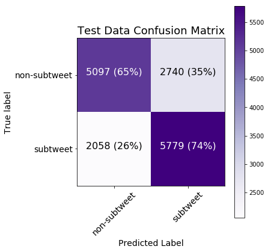
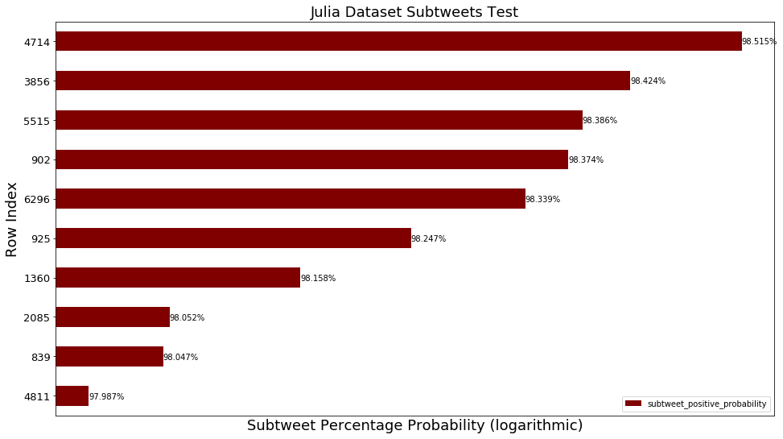
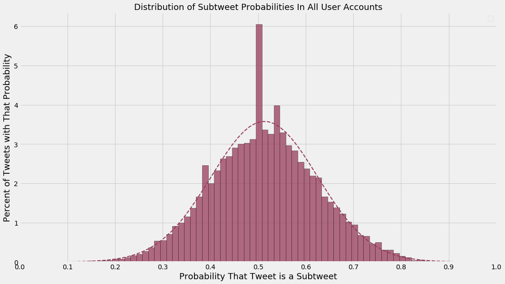
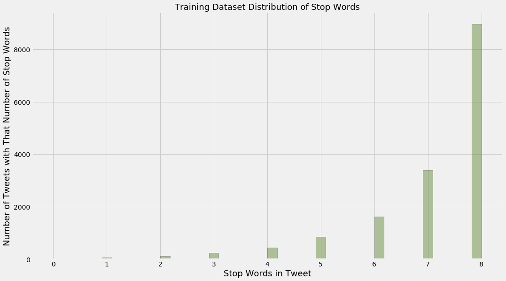
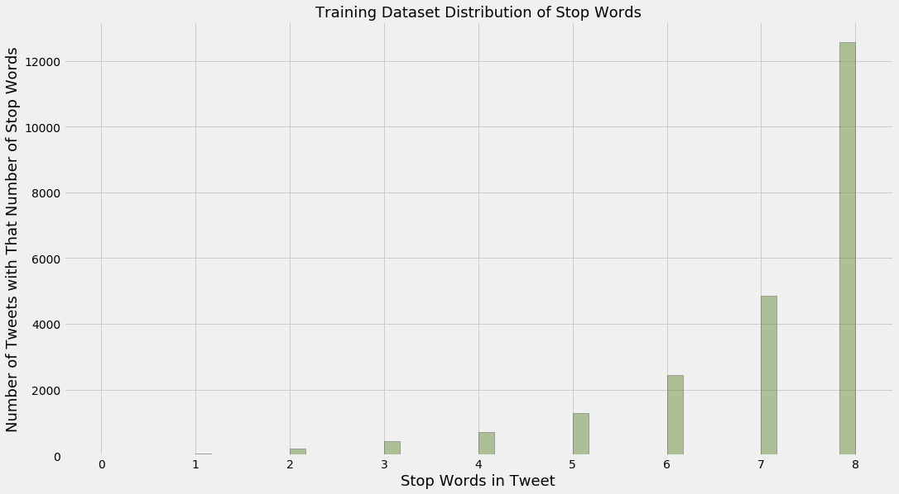
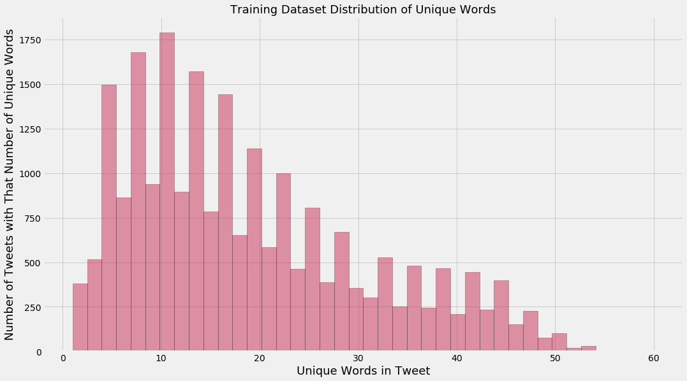
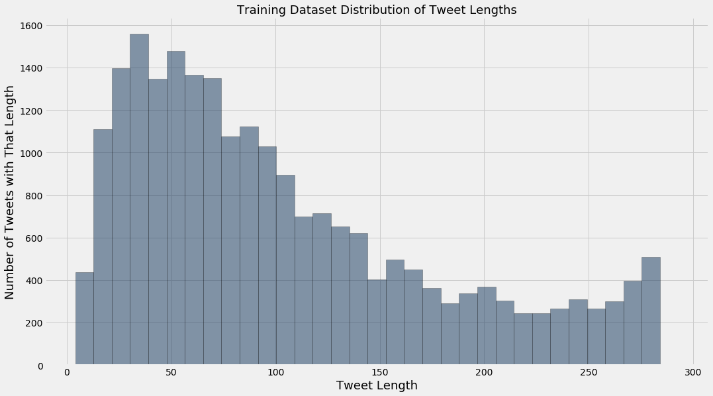

## Using Scikit-Learn and NLTK to build a Naive Bayes Classifier that identifies subtweets

#### In all tables, assume:
* "➊" represents a single hashtag
* "➋" represents a single URL
* "➌" represents a single mention of username (e.g. "@noah")

#### Import libraries


```python
%matplotlib inline
```


```python
from sklearn.metrics import classification_report, confusion_matrix, accuracy_score
from sklearn.feature_extraction.text import TfidfVectorizer
from sklearn.feature_extraction import text
from sklearn.naive_bayes import MultinomialNB
from sklearn.model_selection import KFold
from sklearn.pipeline import Pipeline
from sklearn.externals import joblib
from os.path import basename, splitext
from random import choice, sample
from nltk.corpus import stopwords
from string import punctuation
from pprint import pprint
from glob import glob

import matplotlib.pyplot as plt
import pandas as pd
import numpy as np

import scipy.stats
import itertools
import enchant
import nltk
import json
import re
```

#### Set up some regex patterns


```python
hashtags_pattern = re.compile(r'(\#[a-zA-Z0-9]+)')
```


```python
urls_pattern = re.compile(r'(?i)\b((?:https?://|www\d{0,3}[.]|[a-z0-9.\-]+[.][a-z]{2,4}/)(?:[^\s()<>]|\(([^\s()<>]+|(\([^\s()<>]+\)))*\))+(?:\(([^\s()<>]+|(\([^\s()<>]+\)))*\)|[^\s`!()\[\]{};:\'".,<>?\xab\xbb\u201c\u201d\u2018\u2019]))')
```


```python
at_mentions_pattern = re.compile(r'(?<=^|(?<=[^a-zA-Z0-9-\.]))@([A-Za-z0-9_]+)')
```

#### Prepare English dictionary for language detection


```python
english_dict = enchant.Dict("en_US")
```

#### Use NLTK's tokenizer instead of Scikit's


```python
tokenizer = nltk.casual.TweetTokenizer(preserve_case=False, reduce_len=True)
```

#### Prepare for viewing long text in CSVs and ones with really big and small numbers


```python
pd.set_option("max_colwidth", 1000)
```


```python
pd.options.display.float_format = "{:.4f}".format
```

#### Load the two data files
#### Only use tweets with at least 50% English words
#### Also, make the mentions of usernames, URLs, and hashtags generic


```python
def load_data(filename, threshold=0.5):
    data = [(hashtags_pattern.sub("➊", 
             urls_pattern.sub("➋", 
             at_mentions_pattern.sub("➌", 
             t["tweet_data"]["full_text"])))
             .replace("\u2018", "'")
             .replace("\u2019", "'")
             .replace("\u201c", "\"")
             .replace("\u201d", "\"")
             .replace("&quot;", "\"")
             .replace("&amp;", "&")
             .replace("&gt;", ">")
             .replace("&lt;", "<")) 
            for t in json.load(open(filename)) 
            if t["tweet_data"]["user"]["lang"] == "en" 
            and t["reply"]["user"]["lang"] == "en"]
    new_data = []
    for tweet in data:
        tokens = tokenizer.tokenize(tweet)
        english_tokens = [english_dict.check(token) for token in tokens]
        percent_english_words = sum(english_tokens)/len(english_tokens)
        if percent_english_words >= threshold:
            new_data.append(tweet)
    return new_data
```


```python
subtweets_data = load_data("../data/other_data/subtweets.json")
```


```python
non_subtweets_data = load_data("../data/other_data/non_subtweets.json")
```

#### Show examples


```python
print("Subtweets dataset example:")
print(choice(subtweets_data))
```

    Subtweets dataset example:
    I haven't bawled at work since I was in public accounting so THANKS EVERYONE.


```python
print("Non-subtweets dataset example:")
print(choice(non_subtweets_data))
```

    Non-subtweets dataset example:
    Next up for discussion, this nightmare ➋


#### Find the length of the smaller dataset


```python
smallest_length = len(min([subtweets_data, non_subtweets_data], key=len))
```

#### Cut both down to be the same length


```python
subtweets_data = subtweets_data[:smallest_length]
```


```python
non_subtweets_data = non_subtweets_data[:smallest_length]
```


```python
print("Smallest dataset length: {}".format(len(subtweets_data)))
```

    Smallest dataset length: 7837


#### Prepare data for training


```python
subtweets_data = [(tweet, "subtweet") for tweet in subtweets_data]
```


```python
non_subtweets_data = [(tweet, "non-subtweet") for tweet in non_subtweets_data]
```

#### Combine them


```python
training_data = subtweets_data + non_subtweets_data
```

#### Create custom stop words to include generic usernames, URLs, and hashtags, as well as common English first names


```python
names_lower = set([name.lower() for name in open("../data/other_data/first_names.txt").read().split("\n")])
```


```python
generic_tokens = {"➊", "➋", "➌"}
```


```python
stop_words = text.ENGLISH_STOP_WORDS | names_lower | generic_tokens
```

#### Build the pipeline


```python
sentiment_pipeline = Pipeline([
    ("vectorizer", TfidfVectorizer(tokenizer=tokenizer.tokenize, 
                                   ngram_range=(1, 3), 
                                   stop_words=stop_words)),
    ("classifier", MultinomialNB())
])
```

#### K-Folds splits up and separates out 10 training and test sets from the data, from which the classifier is trained and the confusion matrix and classification reports are updated


```python
def confusion_matrices(training_data, num_folds=10):
    text_training_data = np.array([row[0] for row in training_data])
    class_training_data = np.array([row[1] for row in training_data])
    kf = KFold(n_splits=num_folds, random_state=42, shuffle=True)
    
    cnf_matrix_test = np.zeros((2, 2), dtype=int)
    cnf_matrix_train = np.zeros((2, 2), dtype=int)
    
    test_reports = []
    train_reports = []
    
    test_nulls = []
    test_accuracies = []
    
    train_nulls = []
    train_accuracies = []
    for i, (train_index, test_index) in enumerate(kf.split(text_training_data)):

        text_train, text_test = text_training_data[train_index], text_training_data[test_index]
        class_train, class_test = class_training_data[train_index], class_training_data[test_index]

        sentiment_pipeline.fit(text_train, class_train)
        
        predictions_test = sentiment_pipeline.predict(text_test)
        predictions_train = sentiment_pipeline.predict(text_train)

        cnf_matrix_test += confusion_matrix(class_test, predictions_test)
        cnf_matrix_train += confusion_matrix(class_train, predictions_train)

        print("Test Data Iteration {}:".format(i+1))
        
        test_report = classification_report(class_test, predictions_test, digits=4)
        test_reports.append(test_report)
        print(test_report)
        
        test_null = max(pd.value_counts(pd.Series(class_test)))/float(len(class_test))
        test_nulls.append(test_null)
        print("Test Data Null Accuracy: {:.4f}\n".format(test_null))
        test_accuracy = accuracy_score(class_test, predictions_test)
        test_accuracies.append(test_accuracy)
        print("Test Data Accuracy: {:.4f}\n".format(test_accuracy))
        print("="*53)
        
        print("Train Data Iteration {}:".format(i+1))
        
        train_report = classification_report(class_train, predictions_train, digits=4)
        train_reports.append(train_report)
        print(train_report)
        
        train_null = max(pd.value_counts(pd.Series(class_train)))/float(len(class_train))
        train_nulls.append(train_null)
        print("Train Data Null Accuracy: {:.4f}\n".format(train_null))
        train_accuracy = accuracy_score(class_train, predictions_train)
        train_accuracies.append(train_accuracy)
        print("Train Data Accuracy: {:.4f}\n".format(train_accuracy))
        print("="*53)
        
    def reports_mean(reports):
        reports_lists_of_strings = [report.split("\n") for report in reports]
        reports = [[[float(e) for e in report_string[2][16:].split()],
                    [float(e) for e in report_string[3][16:].split()],
                    [float(e) for e in report_string[5][16:].split()]]
                   for report_string in reports_lists_of_strings]
        mean_list = np.mean(np.array(reports), axis=0).tolist()
        print("              precision    recall  f1-score   support")
        print()
        print("non-subtweet     {0:.4f}    {1:.4f}    {2:.4f}      {3:d}".format(mean_list[0][0], 
                                                                                 mean_list[0][1], 
                                                                                 mean_list[0][2], 
                                                                                 int(mean_list[0][3])))
        print("    subtweet     {0:.4f}    {1:.4f}    {2:.4f}      {3:d}".format(mean_list[1][0], 
                                                                                 mean_list[1][1], 
                                                                                 mean_list[1][2], 
                                                                                 int(mean_list[1][3])))
        print()
        print(" avg / total     {0:.4f}    {1:.4f}    {2:.4f}      {3:d}".format(mean_list[2][0], 
                                                                                 mean_list[2][1], 
                                                                                 mean_list[2][2], 
                                                                                 int(mean_list[2][3])))
        print()
        print("="*53)
    
    print("Test Data Averages Across All Folds:")
    reports_mean(test_reports)
    
    print("Train Data Averages Across All Folds:")
    reports_mean(train_reports)
    
    print("Average Test Data Null Accuracy: {:.4f}\n".format(sum(test_nulls)/float(len(test_nulls))))
    print("Average Test Data Accuracy: {:.4f}\n".format(sum(test_accuracies)/float(len(test_accuracies))))
    
    print("Average Train Data Null Accuracy: {:.4f}\n".format(sum(train_nulls)/float(len(train_nulls))))
    print("Average Train Data Accuracy: {:.4f}\n".format(sum(train_accuracies)/float(len(train_accuracies))))
    
    return {"Test": cnf_matrix_test, "Train": cnf_matrix_train}
```


```python
%%time
cnf_matrices = confusion_matrices(training_data)
cnf_matrix_test = cnf_matrices["Test"]
cnf_matrix_train = cnf_matrices["Train"]
```

    OUTPUT HAS BEEN TRUNCATED FOR PRINTING
    
    =====================================================
    Test Data Averages Across All Folds:
                  precision    recall  f1-score   support
    
    non-subtweet     0.7125    0.6506    0.6798      783
        subtweet     0.6785    0.7376    0.7065      783
    
     avg / total     0.6960    0.6939    0.6933      1567
    
    =====================================================
    Train Data Averages Across All Folds:
                  precision    recall  f1-score   support
    
    non-subtweet     0.9889    0.9819    0.9854      7053
        subtweet     0.9820    0.9890    0.9855      7053
    
     avg / total     0.9855    0.9854    0.9854      14106
    
    =====================================================
    Average Test Data Null Accuracy: 0.5134
    
    Average Test Data Accuracy: 0.6939
    
    Average Train Data Null Accuracy: 0.5015
    
    Average Train Data Accuracy: 0.9854
    
    CPU times: user 1min 2s, sys: 1.13 s, total: 1min 4s
    Wall time: 1min 5s


#### See the most informative features
[How does "MultinomialNB.coef_" work?](https://stackoverflow.com/a/29915740/6147528)


```python
def most_informative_features(pipeline, n=10000):
    vectorizer = pipeline.named_steps["vectorizer"]
    classifier = pipeline.named_steps["classifier"]
    
    class_labels = classifier.classes_
    
    feature_names = vectorizer.get_feature_names()
    
    top_n_class_1 = sorted(zip(classifier.coef_[0], feature_names))[:n]
    top_n_class_2 = sorted(zip(classifier.coef_[0], feature_names))[-n:]
    
    return {class_labels[0]: pd.DataFrame({"Log Probability": [tup[0] for tup in top_n_class_1], 
                                           "Feature": [tup[1] for tup in top_n_class_1]}), 
            class_labels[1]: pd.DataFrame({"Log Probability": [tup[0] for tup in reversed(top_n_class_2)],
                                           "Feature": [tup[1] for tup in reversed(top_n_class_2)]})}
```


```python
%%time
most_informative_features_all = most_informative_features(sentiment_pipeline)
```

    CPU times: user 1.42 s, sys: 28 ms, total: 1.44 s
    Wall time: 1.51 s


```python
most_informative_features_non_subtweet = most_informative_features_all["non-subtweet"]
```


```python
most_informative_features_subtweet = most_informative_features_all["subtweet"]
```


```python
final_features = most_informative_features_non_subtweet.join(most_informative_features_subtweet, 
                                                             lsuffix=" (Non-subtweet)", 
                                                             rsuffix=" (Subtweet)")
final_features.to_csv("../data/other_data/most_informative_features.csv")
final_features.head(25)
```


<div>

<table border="1" class="dataframe">
  <thead>
    <tr style="text-align: right;">
      <th></th>
      <th>Feature (Non-subtweet)</th>
      <th>Log Probability (Non-subtweet)</th>
      <th>Feature (Subtweet)</th>
      <th>Log Probability (Subtweet)</th>
    </tr>
  </thead>
  <tbody>
    <tr>
      <th>0</th>
      <td>! ! &amp;</td>
      <td>-12.6618</td>
      <td>.</td>
      <td>-7.5300</td>
    </tr>
    <tr>
      <th>1</th>
      <td>! ! (</td>
      <td>-12.6618</td>
      <td>,</td>
      <td>-7.9193</td>
    </tr>
    <tr>
      <th>2</th>
      <td>! ! )</td>
      <td>-12.6618</td>
      <td>"</td>
      <td>-8.0928</td>
    </tr>
    <tr>
      <th>3</th>
      <td>! ! .</td>
      <td>-12.6618</td>
      <td>people</td>
      <td>-8.3903</td>
    </tr>
    <tr>
      <th>4</th>
      <td>! ! 100</td>
      <td>-12.6618</td>
      <td>?</td>
      <td>-8.4594</td>
    </tr>
    <tr>
      <th>5</th>
      <td>! ! 15</td>
      <td>-12.6618</td>
      <td>don't</td>
      <td>-8.5588</td>
    </tr>
    <tr>
      <th>6</th>
      <td>! ! 3</td>
      <td>-12.6618</td>
      <td>like</td>
      <td>-8.5889</td>
    </tr>
    <tr>
      <th>7</th>
      <td>! ! 5</td>
      <td>-12.6618</td>
      <td>just</td>
      <td>-8.6754</td>
    </tr>
    <tr>
      <th>8</th>
      <td>! ! 8am</td>
      <td>-12.6618</td>
      <td>i'm</td>
      <td>-8.6969</td>
    </tr>
    <tr>
      <th>9</th>
      <td>! ! :)</td>
      <td>-12.6618</td>
      <td>!</td>
      <td>-8.9031</td>
    </tr>
    <tr>
      <th>10</th>
      <td>! ! ;)</td>
      <td>-12.6618</td>
      <td>it's</td>
      <td>-8.9727</td>
    </tr>
    <tr>
      <th>11</th>
      <td>! ! absolutely</td>
      <td>-12.6618</td>
      <td>...</td>
      <td>-9.0431</td>
    </tr>
    <tr>
      <th>12</th>
      <td>! ! amazing</td>
      <td>-12.6618</td>
      <td>you're</td>
      <td>-9.0488</td>
    </tr>
    <tr>
      <th>13</th>
      <td>! ! ask</td>
      <td>-12.6618</td>
      <td>:</td>
      <td>-9.0704</td>
    </tr>
    <tr>
      <th>14</th>
      <td>! ! awesome</td>
      <td>-12.6618</td>
      <td>know</td>
      <td>-9.0928</td>
    </tr>
    <tr>
      <th>15</th>
      <td>! ! big</td>
      <td>-12.6618</td>
      <td>twitter</td>
      <td>-9.1443</td>
    </tr>
    <tr>
      <th>16</th>
      <td>! ! bite</td>
      <td>-12.6618</td>
      <td>friends</td>
      <td>-9.1650</td>
    </tr>
    <tr>
      <th>17</th>
      <td>! ! close</td>
      <td>-12.6618</td>
      <td>time</td>
      <td>-9.2879</td>
    </tr>
    <tr>
      <th>18</th>
      <td>! ! collection</td>
      <td>-12.6618</td>
      <td>want</td>
      <td>-9.2923</td>
    </tr>
    <tr>
      <th>19</th>
      <td>! ! come</td>
      <td>-12.6618</td>
      <td>u</td>
      <td>-9.3004</td>
    </tr>
    <tr>
      <th>20</th>
      <td>! ! don't</td>
      <td>-12.6618</td>
      <td>really</td>
      <td>-9.3518</td>
    </tr>
    <tr>
      <th>21</th>
      <td>! ! enter</td>
      <td>-12.6618</td>
      <td>shit</td>
      <td>-9.3699</td>
    </tr>
    <tr>
      <th>22</th>
      <td>! ! epic</td>
      <td>-12.6618</td>
      <td>good</td>
      <td>-9.4017</td>
    </tr>
    <tr>
      <th>23</th>
      <td>! ! extremely</td>
      <td>-12.6618</td>
      <td>think</td>
      <td>-9.4155</td>
    </tr>
    <tr>
      <th>24</th>
      <td>! ! family</td>
      <td>-12.6618</td>
      <td>make</td>
      <td>-9.4225</td>
    </tr>
  </tbody>
</table>
</div>


#### Define function for visualizing confusion matrices


```python
def plot_confusion_matrix(cm, classes=["non-subtweet", "subtweet"], 
                          title="Confusion Matrix", cmap=plt.cm.Purples):
    
    cm_normalized = cm.astype("float") / cm.sum(axis=1)[:, np.newaxis]

    plt.imshow(cm, interpolation="nearest", cmap=cmap)
    plt.colorbar()
    
    plt.title(title, size=18)
    
    tick_marks = np.arange(len(classes))
    plt.xticks(tick_marks, classes, rotation=45, fontsize=14)
    plt.yticks(tick_marks, classes, fontsize=14)

    thresh = cm.max() / 2.
    for i, j in itertools.product(range(cm.shape[0]), range(cm.shape[1])):
        plt.text(j, i, "{} ({:.0%})".format(cm[i, j], cm_normalized[i, j]),
                horizontalalignment="center", size=16,
                color="white" if cm[i, j] > thresh else "black")
        
    plt.tight_layout()
    
    plt.ylabel("True label", fontsize=14)
    plt.xlabel("Predicted Label", fontsize=14)
```

#### Show the matrices


```python
np.set_printoptions(precision=2)

plt.figure(figsize=(6, 6))
plot_confusion_matrix(cnf_matrix_test, title="Test Data Confusion Matrix")

plt.figure(figsize=(6, 6))
plot_confusion_matrix(cnf_matrix_train, title="Train Data Confusion Matrix")

plt.show()
```





#### Update matplotlib style


```python
plt.style.use("fivethirtyeight")
```

#### Save the classifier for another time


```python
joblib.dump(sentiment_pipeline, "../data/other_data/subtweets_classifier.pkl");
```

#### Print tests for the classifier


```python
def process_tweets_for_testing(filenames):
    dataframes = {}
    for filename in filenames:
        username = splitext(basename(filename))[0][:-7]
        dataframes[username] = {}
        
        user_df = pd.read_csv(filename).dropna()
        user_df["Text"] = user_df["Text"].str.replace(hashtags_pattern, "➊")
        user_df["Text"] = user_df["Text"].str.replace(urls_pattern, "➋")
        user_df["Text"] = user_df["Text"].str.replace(at_mentions_pattern, "➌")
        user_df["Text"] = user_df["Text"].str.replace("\u2018", "'")
        user_df["Text"] = user_df["Text"].str.replace("\u2019", "'")
        user_df["Text"] = user_df["Text"].str.replace("\u201c", "\"")
        user_df["Text"] = user_df["Text"].str.replace("\u201d", "\"")
        user_df["Text"] = user_df["Text"].str.replace("&quot;", "\"")
        user_df["Text"] = user_df["Text"].str.replace("&amp;", "&")
        user_df["Text"] = user_df["Text"].str.replace("&gt;", ">")
        user_df["Text"] = user_df["Text"].str.replace("&lt;", "<")
        
        predictions = sentiment_pipeline.predict_proba(user_df["Text"])[:, 1].tolist()
        user_df["SubtweetProbability"] = predictions

        dataframes[username]["all"] = user_df
        
        scores = user_df[["SubtweetProbability"]].rename(columns={"SubtweetProbability": username})
        
        dataframes[username]["scores"] = scores
        dataframes[username]["stats"] = scores.describe()
        
    return dataframes
```

#### Load the CSV files


```python
filenames = glob("../data/data_for_testing/friends_data/*.csv")
```


```python
%%time
dataframes = process_tweets_for_testing(filenames)
```

    CPU times: user 9.54 s, sys: 145 ms, total: 9.68 s
    Wall time: 10.4 s


#### Show a random table


```python
chosen_username = choice(list(dataframes.keys()))
dataframes[chosen_username]["all"].sort_values(by="SubtweetProbability", ascending=False).head(5)
```


<div>

<table border="1" class="dataframe">
  <thead>
    <tr style="text-align: right;">
      <th></th>
      <th>Text</th>
      <th>Date</th>
      <th>Favorites</th>
      <th>Retweets</th>
      <th>Tweet ID</th>
      <th>SubtweetProbability</th>
    </tr>
  </thead>
  <tbody>
    <tr>
      <th>462</th>
      <td>ppl saying zionist shit on the internet really fucks w my high</td>
      <td>2017-07-17 02:27:07</td>
      <td>11</td>
      <td>0</td>
      <td>886834632125288448</td>
      <td>0.8244</td>
    </tr>
    <tr>
      <th>15</th>
      <td>i hate seeing shitty straight people yelling at their kids in public like why did you breed</td>
      <td>2018-03-21 12:49:00</td>
      <td>24</td>
      <td>3</td>
      <td>976500935437496320</td>
      <td>0.8140</td>
    </tr>
    <tr>
      <th>392</th>
      <td>some1 replied to my tweet about cis ppl making xcuses 4 not dating trans ppl w "bc they have a fucking cock"</td>
      <td>2017-08-01 19:08:46</td>
      <td>10</td>
      <td>0</td>
      <td>892522524361322496</td>
      <td>0.8044</td>
    </tr>
    <tr>
      <th>563</th>
      <td>cw my shit mental health: u know shit is f'd up when ur lookin @ a meme abt dying of old age and yr like "this meme is actually optimistic"</td>
      <td>2017-06-20 22:12:12</td>
      <td>2</td>
      <td>1</td>
      <td>877348396029358080</td>
      <td>0.7965</td>
    </tr>
    <tr>
      <th>477</th>
      <td>I FUCKING LOVE QUEER PEOPLE</td>
      <td>2017-07-09 21:20:04</td>
      <td>19</td>
      <td>1</td>
      <td>884220643226644480</td>
      <td>0.7938</td>
    </tr>
  </tbody>
</table>
</div>


#### Prepare statistics on tweets


```python
tests_df = pd.concat([df_dict["scores"] for df_dict in dataframes.values()], ignore_index=True)
```


```python
test_df_stats = tests_df.describe()
```


```python
test_df_stats.columns = ["User {}".format(i + 1) for i, column in enumerate(test_df_stats.columns)]
```


```python
test_df_stats
```


<div>

<table border="1" class="dataframe">
  <thead>
    <tr style="text-align: right;">
      <th></th>
      <th>User 1</th>
      <th>User 2</th>
      <th>User 3</th>
      <th>User 4</th>
      <th>User 5</th>
      <th>User 6</th>
      <th>User 7</th>
      <th>User 8</th>
      <th>User 9</th>
      <th>User 10</th>
      <th>User 11</th>
      <th>User 12</th>
      <th>User 13</th>
      <th>User 14</th>
    </tr>
  </thead>
  <tbody>
    <tr>
      <th>count</th>
      <td>621.0000</td>
      <td>2640.0000</td>
      <td>2066.0000</td>
      <td>3488.0000</td>
      <td>4356.0000</td>
      <td>1939.0000</td>
      <td>1169.0000</td>
      <td>638.0000</td>
      <td>2814.0000</td>
      <td>445.0000</td>
      <td>772.0000</td>
      <td>5364.0000</td>
      <td>853.0000</td>
      <td>1467.0000</td>
    </tr>
    <tr>
      <th>mean</th>
      <td>0.4996</td>
      <td>0.5086</td>
      <td>0.5438</td>
      <td>0.5270</td>
      <td>0.5187</td>
      <td>0.4976</td>
      <td>0.4388</td>
      <td>0.5408</td>
      <td>0.5107</td>
      <td>0.4496</td>
      <td>0.5375</td>
      <td>0.5037</td>
      <td>0.5399</td>
      <td>0.5355</td>
    </tr>
    <tr>
      <th>std</th>
      <td>0.1059</td>
      <td>0.1150</td>
      <td>0.1136</td>
      <td>0.1086</td>
      <td>0.1023</td>
      <td>0.1106</td>
      <td>0.0981</td>
      <td>0.1152</td>
      <td>0.1089</td>
      <td>0.0981</td>
      <td>0.1168</td>
      <td>0.1129</td>
      <td>0.1131</td>
      <td>0.1029</td>
    </tr>
    <tr>
      <th>min</th>
      <td>0.1981</td>
      <td>0.0953</td>
      <td>0.1266</td>
      <td>0.1626</td>
      <td>0.1522</td>
      <td>0.0566</td>
      <td>0.1497</td>
      <td>0.1983</td>
      <td>0.1506</td>
      <td>0.1353</td>
      <td>0.0750</td>
      <td>0.0618</td>
      <td>0.1781</td>
      <td>0.1077</td>
    </tr>
    <tr>
      <th>25%</th>
      <td>0.4291</td>
      <td>0.4304</td>
      <td>0.4669</td>
      <td>0.4538</td>
      <td>0.4492</td>
      <td>0.4260</td>
      <td>0.3733</td>
      <td>0.4700</td>
      <td>0.4368</td>
      <td>0.3896</td>
      <td>0.4645</td>
      <td>0.4279</td>
      <td>0.4677</td>
      <td>0.4708</td>
    </tr>
    <tr>
      <th>50%</th>
      <td>0.4971</td>
      <td>0.5037</td>
      <td>0.5417</td>
      <td>0.5217</td>
      <td>0.5180</td>
      <td>0.4981</td>
      <td>0.4379</td>
      <td>0.5327</td>
      <td>0.5061</td>
      <td>0.4596</td>
      <td>0.5351</td>
      <td>0.4986</td>
      <td>0.5410</td>
      <td>0.5335</td>
    </tr>
    <tr>
      <th>75%</th>
      <td>0.5670</td>
      <td>0.5847</td>
      <td>0.6213</td>
      <td>0.5982</td>
      <td>0.5843</td>
      <td>0.5669</td>
      <td>0.5016</td>
      <td>0.6190</td>
      <td>0.5811</td>
      <td>0.5117</td>
      <td>0.6138</td>
      <td>0.5782</td>
      <td>0.6189</td>
      <td>0.6028</td>
    </tr>
    <tr>
      <th>max</th>
      <td>0.8457</td>
      <td>0.8579</td>
      <td>0.8497</td>
      <td>0.8749</td>
      <td>0.8674</td>
      <td>0.8766</td>
      <td>0.8157</td>
      <td>0.8498</td>
      <td>0.8972</td>
      <td>0.7563</td>
      <td>0.8447</td>
      <td>0.9091</td>
      <td>0.8244</td>
      <td>0.8674</td>
    </tr>
  </tbody>
</table>
</div>


#### Plot a histogram with three random users


```python
random_choices = sample(list(dataframes.values()), 3)
scores = [df_dict["scores"][df_dict["scores"].columns[0]].tolist() 
          for df_dict in random_choices]

fig = plt.figure(figsize=(16, 9))
ax = fig.add_subplot(111)

n, bins, patches = ax.hist(scores, 
                           bins="scott",
                           color=["#256EFF", "#46237A", "#3DDC97"],
                           density=True, 
                           label=["User 1", "User 2", "User 3"],
                           alpha=0.75)

stats = [df_dict["stats"][df_dict["stats"].columns[0]].tolist() 
         for df_dict in random_choices]

line_1 = scipy.stats.norm.pdf(bins, stats[0][1], stats[0][2])
ax.plot(bins, line_1, "--", color="#256EFF", linewidth=2)

line_2 = scipy.stats.norm.pdf(bins, stats[1][1], stats[1][2])
ax.plot(bins, line_2, "--", color="#46237A", linewidth=2)

line_3 = scipy.stats.norm.pdf(bins, stats[2][1], stats[2][2])
ax.plot(bins, line_3, "--", color="#3DDC97", linewidth=2)

ax.set_xticks([float(x/10) for x in range(11)], minor=False)
ax.set_title("Distribution of Subtweet Probabilities In User Accounts", fontsize=18)
ax.set_xlabel("Probability That Tweet is a Subtweet", fontsize=18)
ax.set_ylabel("Percent of Tweets with That Probability", fontsize=18)

ax.legend()

plt.show()
```





#### Plot a histogram with all of them
#### First, get some statistics


```python
new_tests_df = pd.concat([df_dict["scores"].rename(columns={df_dict["scores"].columns[0]:"SubtweetProbability"})
                          for df_dict in dataframes.values()], ignore_index=True)

new_tests_df_stats = new_tests_df.describe()
```

#### Then view them


```python
new_tests_df_stats
```


<div>

<table border="1" class="dataframe">
  <thead>
    <tr style="text-align: right;">
      <th></th>
      <th>SubtweetProbability</th>
    </tr>
  </thead>
  <tbody>
    <tr>
      <th>count</th>
      <td>28632.0000</td>
    </tr>
    <tr>
      <th>mean</th>
      <td>0.5133</td>
    </tr>
    <tr>
      <th>std</th>
      <td>0.1115</td>
    </tr>
    <tr>
      <th>min</th>
      <td>0.0566</td>
    </tr>
    <tr>
      <th>25%</th>
      <td>0.4385</td>
    </tr>
    <tr>
      <th>50%</th>
      <td>0.5093</td>
    </tr>
    <tr>
      <th>75%</th>
      <td>0.5860</td>
    </tr>
    <tr>
      <th>max</th>
      <td>0.9091</td>
    </tr>
  </tbody>
</table>
</div>


#### Now plot


```python
fig = plt.figure(figsize=(16, 9))
ax = fig.add_subplot(111)

n, bins, patches = ax.hist(new_tests_df["SubtweetProbability"].tolist(), 
                           bins="scott",
                           color="#983B59",
                           edgecolor="black", 
                           density=True, 
                           alpha=0.75)

line = scipy.stats.norm.pdf(bins, new_tests_df_stats["SubtweetProbability"][1], 
                              new_tests_df_stats["SubtweetProbability"][2])

ax.plot(bins, line, "--", color="#983B59", linewidth=2)


ax.set_xticks([float(x/10) for x in range(11)], minor=False)
ax.set_title("Distribution of Subtweet Probabilities In All User Accounts", fontsize=18)
ax.set_xlabel("Probability That Tweet is a Subtweet", fontsize=18)
ax.set_ylabel("Percent of Tweets with That Probability", fontsize=18)

ax.legend()

plt.show()
```

    No handles with labels found to put in legend.





#### Statisitics on training data

#### Remove mentions of usernames for these statistics


```python
training_data = [(tweet[0]
                  .replace("➊", "")
                  .replace("➋", "")
                  .replace("➌", "")) for tweet in training_data]
```

#### Lengths


```python
length_data = [len(tweet) for tweet in training_data]
```


```python
length_data_for_stats = pd.DataFrame({"Length": length_data, "Tweet": training_data})
```


```python
# length_data_for_stats = length_data_for_stats[length_data_for_stats["Length"] <= 280]  
```


```python
# length_data_for_stats = length_data_for_stats[length_data_for_stats["Length"] >= 5]
```


```python
length_data = length_data_for_stats.Length.tolist()
```

#### Top 5 longest tweets


```python
length_data_for_stats.sort_values(by="Length", ascending=False).head()
```


<div>

<table border="1" class="dataframe">
  <thead>
    <tr style="text-align: right;">
      <th></th>
      <th>Length</th>
      <th>Tweet</th>
    </tr>
  </thead>
  <tbody>
    <tr>
      <th>8887</th>
      <td>281</td>
      <td>This Tweet does not endorse the use of Nazi Symbols in any form! I think the image which has been published on social media and MSM is a day or two old. It conjures up strong emotions for many people, My question is simple what meaning do you think is being conveyed by the image?</td>
    </tr>
    <tr>
      <th>2198</th>
      <td>281</td>
      <td>I need to learn how to do this. I ask "how can I help" a lot because I genuinely want to make things better for friends , but this *can* put a burden back upon those who are suffering. Sometimes it may be best to just have exuberant and fearless compassion the same way a pet does</td>
    </tr>
    <tr>
      <th>1531</th>
      <td>281</td>
      <td>hi! I'm not normally v personal like this and I probably won't be at least for a v long time but I thought I'd share this \nwhile I was scrolling on Twitter today I had like a sudden impulse to just dump all my thoughts about what id been reading and seeing and so far it actually-</td>
    </tr>
    <tr>
      <th>10533</th>
      <td>281</td>
      <td>Some people are undecided about testing on animals. Understandable. There's so much propaganda and secrecy about it. Here's a quick test though, &amp; you're answer should tell you. What would you do if some man came to your house &amp; squirted disinfectant in your beautiful dog's eyes?</td>
    </tr>
    <tr>
      <th>10521</th>
      <td>281</td>
      <td>Enthralled by Raja Shiv Chhatrapati, a well mounted magnum opus on life of the Maratha warrior at Red Fort. Vividly brought out his philosophies, struggles, inspiration from mother Jijayee &amp; penchant for gender equality through well conceived music, dance &amp; dialogues. A must see!</td>
    </tr>
  </tbody>
</table>
</div>


#### Top 5 shortest tweets


```python
length_data_for_stats.sort_values(by="Length", ascending=True).head()
```


<div>

<table border="1" class="dataframe">
  <thead>
    <tr style="text-align: right;">
      <th></th>
      <th>Length</th>
      <th>Tweet</th>
    </tr>
  </thead>
  <tbody>
    <tr>
      <th>7699</th>
      <td>1</td>
      <td>A</td>
    </tr>
    <tr>
      <th>3473</th>
      <td>2</td>
      <td>no</td>
    </tr>
    <tr>
      <th>5896</th>
      <td>2</td>
      <td>uh</td>
    </tr>
    <tr>
      <th>6676</th>
      <td>2</td>
      <td>i-</td>
    </tr>
    <tr>
      <th>2038</th>
      <td>2</td>
      <td>Ha</td>
    </tr>
  </tbody>
</table>
</div>


#### Tweet length statistics


```python
length_data_for_stats.describe()
```


<div>

<table border="1" class="dataframe">
  <thead>
    <tr style="text-align: right;">
      <th></th>
      <th>Length</th>
    </tr>
  </thead>
  <tbody>
    <tr>
      <th>count</th>
      <td>15674.0000</td>
    </tr>
    <tr>
      <th>mean</th>
      <td>106.8089</td>
    </tr>
    <tr>
      <th>std</th>
      <td>73.8680</td>
    </tr>
    <tr>
      <th>min</th>
      <td>1.0000</td>
    </tr>
    <tr>
      <th>25%</th>
      <td>48.0000</td>
    </tr>
    <tr>
      <th>50%</th>
      <td>87.0000</td>
    </tr>
    <tr>
      <th>75%</th>
      <td>150.0000</td>
    </tr>
    <tr>
      <th>max</th>
      <td>281.0000</td>
    </tr>
  </tbody>
</table>
</div>


#### Punctuation


```python
punctuation_data = [len(set(punctuation).intersection(set(tweet))) for tweet in training_data]
```


```python
punctuation_data_for_stats = pd.DataFrame({"Punctuation": punctuation_data, "Tweet": training_data})
```

#### Top 5 most punctuated tweets


```python
punctuation_data_for_stats.sort_values(by="Punctuation", ascending=False).head()
```


<div>

<table border="1" class="dataframe">
  <thead>
    <tr style="text-align: right;">
      <th></th>
      <th>Punctuation</th>
      <th>Tweet</th>
    </tr>
  </thead>
  <tbody>
    <tr>
      <th>8957</th>
      <td>11</td>
      <td>Going to go ahead and crown myself the absolute emperor of finding things on menus that sound interesting, deciding I would like to try them, then being told "I'm sorry sir, that's actually not available..."\n\n[ then why the @#$% is it ON YOUR MENUUUUUUUU-- ]</td>
    </tr>
    <tr>
      <th>6725</th>
      <td>9</td>
      <td>4-yo: DADDEEEEEE!? LET'S PLAY!\nMe: Ok, baby. \n4yo: you play w/ her. put a dress on her DADDEEEEEE. \nMe: Ok. *puts doll in dollhouse*\n4yo: SHE DOESN'T GO THERE!!</td>
    </tr>
    <tr>
      <th>11718</th>
      <td>9</td>
      <td>Self-employed people: have you ever turned to social media to call out a client who is many weeks/months delinquent on a payment? \n(Obviously, you're probably burning a bridge with that move, but if they don't pay...)</td>
    </tr>
    <tr>
      <th>13365</th>
      <td>9</td>
      <td>Billboard Hot 100: (-3) Tell Me You Love Me,  [19 weeks]. *peak: *</td>
    </tr>
    <tr>
      <th>11845</th>
      <td>9</td>
      <td>Tucker Carlson Tonight &amp; TFW you're asking about America\nbut you're scolded it's really about Israel ...\n \nTucker: "What is the American national security interest ... in Syria?"\n\nSen. Wicker(R): "Well, if you care about Israel ..." \n\nThat was the exact question &amp; answer\nShocking</td>
    </tr>
  </tbody>
</table>
</div>


#### Tweets punctuation statistics


```python
punctuation_data_for_stats.describe()
```


<div>

<table border="1" class="dataframe">
  <thead>
    <tr style="text-align: right;">
      <th></th>
      <th>Punctuation</th>
    </tr>
  </thead>
  <tbody>
    <tr>
      <th>count</th>
      <td>15674.0000</td>
    </tr>
    <tr>
      <th>mean</th>
      <td>1.9168</td>
    </tr>
    <tr>
      <th>std</th>
      <td>1.5787</td>
    </tr>
    <tr>
      <th>min</th>
      <td>0.0000</td>
    </tr>
    <tr>
      <th>25%</th>
      <td>1.0000</td>
    </tr>
    <tr>
      <th>50%</th>
      <td>2.0000</td>
    </tr>
    <tr>
      <th>75%</th>
      <td>3.0000</td>
    </tr>
    <tr>
      <th>max</th>
      <td>11.0000</td>
    </tr>
  </tbody>
</table>
</div>


#### Stop words


```python
stop_words_data = [len(set(stopwords.words("english")).intersection(set(tweet.lower()))) 
                   for tweet in training_data]
```


```python
stop_words_data_for_stats = pd.DataFrame({"Stop words": stop_words_data, "Tweet": training_data})
```

#### Top 5 tweets with most stop words


```python
stop_words_data_for_stats.sort_values(by="Stop words", ascending=False).head()
```


<div>

<table border="1" class="dataframe">
  <thead>
    <tr style="text-align: right;">
      <th></th>
      <th>Stop words</th>
      <th>Tweet</th>
    </tr>
  </thead>
  <tbody>
    <tr>
      <th>0</th>
      <td>8</td>
      <td>I don't yet have adequate words to do so, but someday I wanna write about the beautiful dance which happens in Google docs between a writer &amp; a good editor working simultaneously towards a deadline. When it's working, it's a beautiful dance—though no one really sees it.</td>
    </tr>
    <tr>
      <th>9063</th>
      <td>8</td>
      <td>Honestly yea i fucked up but all of you are trash asf and your opinions mean nothing to me because mother fucker i can fix shit but yall are to close minded to see.</td>
    </tr>
    <tr>
      <th>9035</th>
      <td>8</td>
      <td>The role of DAG Rod Rosenstein will be an Oscar winner in the future film about the Trump presidency. I'd like the story of the first few months to be told through the eyes of the bewildered Sean Spicer.</td>
    </tr>
    <tr>
      <th>9038</th>
      <td>8</td>
      <td>Done watching 'Hacksaw Ridge'. If there's one thing I learned from that movie, it is simply, Have Faith in God.</td>
    </tr>
    <tr>
      <th>9039</th>
      <td>8</td>
      <td>I feel people who can't celebrate or at the very least respect Cardi B's success have never watched the grind from the ground up. They can't understand that her work ethic has gotten her where she is now. You don't have to stand for what's she's about but she's worked for it</td>
    </tr>
  </tbody>
</table>
</div>


#### Top 5 tweets with fewest stop words


```python
stop_words_data_for_stats.sort_values(by="Stop words", ascending=True).head()
```


<div>

<table border="1" class="dataframe">
  <thead>
    <tr style="text-align: right;">
      <th></th>
      <th>Stop words</th>
      <th>Tweet</th>
    </tr>
  </thead>
  <tbody>
    <tr>
      <th>3632</th>
      <td>0</td>
      <td>...</td>
    </tr>
    <tr>
      <th>8290</th>
      <td>0</td>
      <td>24</td>
    </tr>
    <tr>
      <th>11925</th>
      <td>0</td>
      <td>FUCK</td>
    </tr>
    <tr>
      <th>10940</th>
      <td>0</td>
      <td>78 ... !</td>
    </tr>
    <tr>
      <th>1796</th>
      <td>0</td>
      <td>fuck u</td>
    </tr>
  </tbody>
</table>
</div>


#### Tweets stop words statistics


```python
stop_words_data_for_stats.describe()
```


<div>

<table border="1" class="dataframe">
  <thead>
    <tr style="text-align: right;">
      <th></th>
      <th>Stop words</th>
    </tr>
  </thead>
  <tbody>
    <tr>
      <th>count</th>
      <td>15674.0000</td>
    </tr>
    <tr>
      <th>mean</th>
      <td>7.1515</td>
    </tr>
    <tr>
      <th>std</th>
      <td>1.3116</td>
    </tr>
    <tr>
      <th>min</th>
      <td>0.0000</td>
    </tr>
    <tr>
      <th>25%</th>
      <td>7.0000</td>
    </tr>
    <tr>
      <th>50%</th>
      <td>8.0000</td>
    </tr>
    <tr>
      <th>75%</th>
      <td>8.0000</td>
    </tr>
    <tr>
      <th>max</th>
      <td>8.0000</td>
    </tr>
  </tbody>
</table>
</div>


#### Unique words


```python
unique_words_data = [len(set(tokenizer.tokenize(tweet))) for tweet in training_data]
```


```python
unique_words_data_for_stats = pd.DataFrame({"Unique words": unique_words_data, "Tweet": training_data})
```


```python
# unique_words_data_for_stats = unique_words_data_for_stats[unique_words_data_for_stats["Unique words"] >= 2]
```


```python
unique_words_data = unique_words_data_for_stats["Unique words"].tolist()
```

#### Top 5 tweets with most unique words


```python
unique_words_data_for_stats.sort_values(by="Unique words", ascending=False).head()
```


<div>

<table border="1" class="dataframe">
  <thead>
    <tr style="text-align: right;">
      <th></th>
      <th>Tweet</th>
      <th>Unique words</th>
    </tr>
  </thead>
  <tbody>
    <tr>
      <th>13936</th>
      <td>GIVE AWAY!\n\nThe rules are really easy, all you have to do is :\n1. Must be following me (i check) \n2. RT and fav this tweet\n3. tag your mutuals/anyone\n4. only 1 winner! \n5. i ship worldwide;) \n\nit ends in 8th May 2018 or when this tweet hit 2k RT and like!\n\nGood luck! ❤</td>
      <td>59</td>
    </tr>
    <tr>
      <th>4881</th>
      <td>got into a tepid back nd forth w/ a uknowwhoAJ+columnist bc i said they steal their "hot takes" from blk twitter &amp; alike. wallahi my bdeshi ass did not sign up 4 this app to be called asinine by a 30yrold pakistani whos whole politics is Post Colonial Memes for Oriental Minded T-</td>
      <td>57</td>
    </tr>
    <tr>
      <th>7013</th>
      <td>Crazy how wrong u can be about someone. A girl I graduated w/ was always doing drugs&amp; got pregnant at 16. I assumed she'd end up being a loser but it turn out she now has 4 beautiful kids&amp; is making over $4,500/month just off of child support payments from the 3 different dads</td>
      <td>57</td>
    </tr>
    <tr>
      <th>4992</th>
      <td>Got into an argument w/ someone I went to HS w/ &amp; I would js like to repeat again tht I cannot wait to stunt on all the ppl who were bitches to me in HS @ our reunion. Catch me rollin up w/ my sexy ass gf, a nice car, a bomb body &amp; the career of my dreams as a big fuck u to them</td>
      <td>55</td>
    </tr>
    <tr>
      <th>11542</th>
      <td>Thought I'd bring this back...  and no, I'm not talking about myself here. I wish just once I'd be so bored with my life that I'd find the time to bash people/celebs I don't like.. I mean if I despise someone THAT much, why still watch his/her every move? 🤦‍♀️</td>
      <td>55</td>
    </tr>
  </tbody>
</table>
</div>


#### Top 5 tweets with fewest unique words


```python
unique_words_data_for_stats.sort_values(by="Unique words", ascending=True).head()
```


<div>

<table border="1" class="dataframe">
  <thead>
    <tr style="text-align: right;">
      <th></th>
      <th>Tweet</th>
      <th>Unique words</th>
    </tr>
  </thead>
  <tbody>
    <tr>
      <th>6106</th>
      <td>Annoying</td>
      <td>1</td>
    </tr>
    <tr>
      <th>2525</th>
      <td>Bitch</td>
      <td>1</td>
    </tr>
    <tr>
      <th>12087</th>
      <td>Chandler</td>
      <td>1</td>
    </tr>
    <tr>
      <th>14559</th>
      <td>Yes yes yes yes yes yes</td>
      <td>1</td>
    </tr>
    <tr>
      <th>14442</th>
      <td>Hello\n</td>
      <td>1</td>
    </tr>
  </tbody>
</table>
</div>


#### Tweets unique words statistics


```python
unique_words_data_for_stats.describe()
```


<div>

<table border="1" class="dataframe">
  <thead>
    <tr style="text-align: right;">
      <th></th>
      <th>Unique words</th>
    </tr>
  </thead>
  <tbody>
    <tr>
      <th>count</th>
      <td>15674.0000</td>
    </tr>
    <tr>
      <th>mean</th>
      <td>19.2412</td>
    </tr>
    <tr>
      <th>std</th>
      <td>11.9298</td>
    </tr>
    <tr>
      <th>min</th>
      <td>1.0000</td>
    </tr>
    <tr>
      <th>25%</th>
      <td>10.0000</td>
    </tr>
    <tr>
      <th>50%</th>
      <td>17.0000</td>
    </tr>
    <tr>
      <th>75%</th>
      <td>27.0000</td>
    </tr>
    <tr>
      <th>max</th>
      <td>59.0000</td>
    </tr>
  </tbody>
</table>
</div>


#### Plot them


```python
length_mean = length_data_for_stats.describe().Length[1]
length_std = length_data_for_stats.describe().Length[2]

fig = plt.figure(figsize=(16, 9))
ax = fig.add_subplot(111)

n, bins, patches = ax.hist(length_data, 
                           bins="scott", 
                           edgecolor="black", 
                           # density=True, 
                           color="#12355b", 
                           alpha=0.5)

# length_line = scipy.stats.norm.pdf(bins, length_mean, length_std)
# ax.plot(bins, length_line, "--", linewidth=3, color="#415d7b")

ax.set_title("Training Dataset Distribution of Tweet Lengths", fontsize=18)
ax.set_xlabel("Tweet Length", fontsize=18);
ax.set_ylabel("Number of Tweets with That Length", fontsize=18);

plt.show()
```





```python
punctuation_mean = punctuation_data_for_stats.describe().Punctuation[1]
punctuation_std = punctuation_data_for_stats.describe().Punctuation[2]

fig = plt.figure(figsize=(16, 9))
ax = fig.add_subplot(111)

n, bins, patches = ax.hist(punctuation_data, 
                           bins="scott",
                           edgecolor="black", 
                           # density=True, 
                           color="#420039",
                           alpha=0.5)

# punctution_line = scipy.stats.norm.pdf(bins, punctuation_mean, punctuation_std)
# ax.plot(bins, punctution_line, "--", linewidth=3, color="#673260")

ax.set_title("Training Dataset Distribution of Punctuation", fontsize=18)
ax.set_xlabel("Punctuating Characters in Tweet", fontsize=18)
ax.set_ylabel("Number of Tweets with That Number of Punctuating Characters", fontsize=18)

plt.show()
```





```python
stop_words_mean = stop_words_data_for_stats.describe()["Stop words"][1]
stop_words_std = stop_words_data_for_stats.describe()["Stop words"][2]

fig = plt.figure(figsize=(16, 9))
ax = fig.add_subplot(111)

n, bins, patches = ax.hist(stop_words_data, 
                           bins="scott", 
                           edgecolor="black", 
                           # density=True, 
                           color="#698f3f",
                           alpha=0.5)

# stop_words_line = scipy.stats.norm.pdf(bins, stop_words_mean, stop_words_std)
# ax.plot(bins, stop_words_line, "--", linewidth=3, color="#87a565")

ax.set_title("Training Dataset Distribution of Stop Words", fontsize=18)
ax.set_xlabel("Stop Words in Tweet", fontsize=18)
ax.set_ylabel("Number of Tweets with That Number of Stop Words", fontsize=18)

plt.show()
```





```python
unique_words_mean = unique_words_data_for_stats.describe()["Unique words"][1]
unique_words_std = unique_words_data_for_stats.describe()["Unique words"][2]

fig = plt.figure(figsize=(16, 9))
ax = fig.add_subplot(111)

n, bins, patches = ax.hist(unique_words_data, 
                           bins="scott", 
                           edgecolor="black", 
                           # density=True, 
                           color="#ca2e55",
                           alpha=0.5)

# unique_words_line = scipy.stats.norm.pdf(bins, unique_words_mean, unique_words_std)
# ax.plot(bins, unique_words_line, "--", linewidth=3, color="#d45776")

ax.set_title("Training Dataset Distribution of Unique Words", fontsize=18)
ax.set_xlabel("Unique Words in Tweet", fontsize=18)
ax.set_ylabel("Number of Tweets with That Number of Unique Words", fontsize=18)

plt.show()
```




