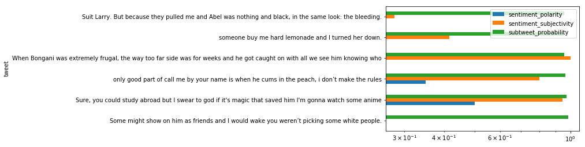

## Using Scikit-Learn and NLTK to build a Naive Bayes Classifier that identifies subtweets

### Goals:
#### Use Scikit-Learn pipelines to define special features to add to a Naive Bayes Classifier
#### Evaluate the accuracy of the classifier
#### Maybe do it live, on a Twitter API stream

### Methods:
#### Use the training set I made before

#### Import libraries


```python
%matplotlib inline
```


```python
from sklearn.base import TransformerMixin, BaseEstimator
from sklearn.feature_extraction import DictVectorizer
from sklearn.feature_extraction.text import CountVectorizer, TfidfTransformer
from sklearn.naive_bayes import MultinomialNB
from sklearn.pipeline import Pipeline, FeatureUnion
from sklearn.model_selection import train_test_split
from sklearn.metrics import classification_report, confusion_matrix
from sklearn.externals import joblib
from textblob import TextBlob
from time import sleep
import matplotlib.pyplot as plt
import pandas as pd
import numpy as np
import itertools
import datetime
import tweepy
import nltk
import re
```

#### Set max column width for dataframes


```python
pd.set_option("max_colwidth", 280)
```

#### Load the CSV


```python
df = pd.read_csv("../data/data_for_training/final_training_data/Subtweets_Classifier_Training_Data.csv")
```

#### Create training and test sets from the single training set I made before


```python
text_train, text_test, class_train, class_test = train_test_split(df.alleged_subtweet.tolist(), 
                                                                  df.is_subtweet.tolist())
```

#### Use NLTK's tokenizer instead of Scikit's


```python
tokenizer = nltk.casual.TweetTokenizer(preserve_case=False, reduce_len=True)
```

#### Function for managing TextBlob polarities


```python
def simplify_polarity(polarity):
    if polarity >= 0:
        return 1
    return 0
```

#### Class for distinguishing polarizing parts of speech as features


```python
class TweetStats(BaseEstimator, TransformerMixin):
    def fit(self, x, y=None):
        return self

    def transform(self, posts):
        first_names = ["Aaliyah", "Aaron", "Abby", "Abigail", "Abraham", "Adam",
                       "Addison", "Adrian", "Adriana", "Adrianna", "Aidan", "Aiden",
                       "Alan", "Alana", "Alejandro", "Alex", "Alexa", "Alexander",
                       "Alexandra", "Alexandria", "Alexia", "Alexis", "Alicia", "Allison",
                       "Alondra", "Alyssa", "Amanda", "Amber", "Amelia", "Amy",
                       "Ana", "Andrea", "Andres", "Andrew", "Angel", "Angela",
                       "Angelica", "Angelina", "Anna", "Anthony", "Antonio", "Ariana",
                       "Arianna", "Ashley", "Ashlyn", "Ashton", "Aubrey", "Audrey",
                       "Austin", "Autumn", "Ava", "Avery", "Ayden", "Bailey",
                       "Benjamin", "Bianca", "Blake", "Braden", "Bradley", "Brady",
                       "Brandon", "Brayden", "Breanna", "Brendan", "Brian", "Briana",
                       "Brianna", "Brittany", "Brody", "Brooke", "Brooklyn", "Bryan",
                       "Bryce", "Bryson", "Caden", "Caitlin", "Caitlyn", "Caleb",
                       "Cameron", "Camila", "Carlos", "Caroline", "Carson", "Carter",
                       "Cassandra", "Cassidy", "Catherine", "Cesar", "Charles", "Charlotte",
                       "Chase", "Chelsea", "Cheyenne", "Chloe", "Christian", "Christina",
                       "Christopher", "Claire", "Cody", "Colby", "Cole", "Colin",
                       "Collin", "Colton", "Conner", "Connor", "Cooper", "Courtney",
                       "Cristian", "Crystal", "Daisy", "Dakota", "Dalton", "Damian",
                       "Daniel", "Daniela", "Danielle", "David", "Delaney", "Derek",
                       "Destiny", "Devin", "Devon", "Diana", "Diego", "Dominic",
                       "Donovan", "Dylan", "Edgar", "Eduardo", "Edward", "Edwin",
                       "Eli", "Elias", "Elijah", "Elizabeth", "Ella", "Ellie", 
                       "Emily", "Emma", "Emmanuel", "Eric", "Erica", "Erick",
                       "Erik", "Erin", "Ethan", "Eva", "Evan", "Evelyn",
                       "Faith", "Fernando", "Francisco", "Gabriel", "Gabriela", "Gabriella",
                       "Gabrielle", "Gage", "Garrett", "Gavin", "Genesis", "George",
                       "Gianna", "Giovanni", "Giselle", "Grace", "Gracie", "Grant",
                       "Gregory", "Hailey", "Haley", "Hannah", "Hayden", "Hector",
                       "Henry", "Hope", "Hunter", "Ian", "Isaac", "Isabel",
                       "Isabella", "Isabelle", "Isaiah", "Ivan", "Jack", "Jackson",
                       "Jacob", "Jacqueline", "Jada", "Jade", "Jaden", "Jake",
                       "Jalen", "James", "Jared", "Jasmin", "Jasmine", "Jason", 
                       "Javier", "Jayden", "Jayla", "Jazmin", "Jeffrey", "Jenna",
                       "Jennifer", "Jeremiah", "Jeremy", "Jesse", "Jessica", "Jesus",
                       "Jillian", "Jocelyn", "Joel", "John", "Johnathan", "Jonah",
                       "Jonathan", "Jordan", "Jordyn", "Jorge", "Jose", "Joseph",
                       "Joshua", "Josiah", "Juan", "Julia", "Julian", "Juliana",
                       "Justin", "Kaden", "Kaitlyn", "Kaleb", "Karen", "Karina",
                       "Kate", "Katelyn", "Katherine", "Kathryn", "Katie", "Kayla",
                       "Kaylee", "Kelly", "Kelsey", "Kendall", "Kennedy", "Kenneth",
                       "Kevin", "Kiara", "Kimberly", "Kyle", "Kylee", "Kylie",
                       "Landon", "Laura", "Lauren", "Layla", "Leah", "Leonardo",
                       "Leslie", "Levi", "Liam", "Liliana", "Lillian", "Lilly",
                       "Lily", "Lindsey", "Logan", "Lucas", "Lucy", "Luis",
                       "Luke", "Lydia", "Mackenzie", "Madeline", "Madelyn", "Madison",
                       "Makayla", "Makenzie", "Malachi", "Manuel", "Marco", "Marcus",
                       "Margaret", "Maria", "Mariah", "Mario", "Marissa", "Mark",
                       "Martin", "Mary", "Mason", "Matthew", "Max", "Maxwell",
                       "Maya", "Mckenzie", "Megan", "Melanie", "Melissa", "Mia",
                       "Micah", "Michael", "Michelle", "Miguel", "Mikayla", "Miranda",
                       "Molly", "Morgan", "Mya", "Naomi", "Natalia", "Natalie",
                       "Nathan", "Nathaniel", "Nevaeh", "Nicholas", "Nicolas", "Nicole",
                       "Noah", "Nolan", "Oliver", "Olivia", "Omar", "Oscar",
                       "Owen", "Paige", "Parker", "Patrick", "Paul", "Payton",
                       "Peter", "Peyton", "Preston", "Rachel", "Raymond", "Reagan",
                       "Rebecca", "Ricardo", "Richard", "Riley", "Robert", "Ruby",
                       "Ryan", "Rylee", "Sabrina", "Sadie", "Samantha", "Samuel",
                       "Sara", "Sarah", "Savannah", "Sean", "Sebastian", "Serenity",
                       "Sergio", "Seth", "Shane", "Shawn", "Shelby", "Sierra",
                       "Skylar", "Sofia", "Sophia", "Sophie", "Spencer", "Stephanie",
                       "Stephen", "Steven", "Summer", "Sydney", "Tanner", "Taylor", 
                       "Thomas", "Tiffany", "Timothy", "Travis", "Trenton", "Trevor",
                       "Trinity", "Tristan", "Tyler", "Valeria", "Valerie", "Vanessa",
                       "Veronica", "Victor", "Victoria", "Vincent", "Wesley", "William",
                       "Wyatt", "Xavier", "Zachary", "Zoe", "Zoey"]
        first_names_lower = set([name.lower() for name in first_names])

        pronouns = ["You", "You're", "Your", 
                    "She", "She's", "Her", "Hers", 
                    "He", "He's", "Him", "His", 
                    "They", "They're", "Them", "Their", "Theirs"]
        prounouns_lower = set([pronoun.lower() for pronoun in pronouns])
        
        first_person_pronouns = ["I", "I'm", "We", "We're", "Our", "My", "Us"]
        first_person_pronouns_lower = set([pronoun.lower() for pronoun in first_person_pronouns])
        
        pattern = "(?:http|ftp|https)://(?:[\w_-]+(?:(?:\.[\w_-]+)+))(?:[\w.,@?^=%&:/~+#-]*[\w@?^=%&/~+#-])?"
        
        final_output = []
        for text in posts:
            tokenized_text = tokenizer.tokenize(text)
            
            num_pronouns = len(prounouns_lower.intersection(tokenized_text))
            num_names = len(first_names_lower.intersection(tokenized_text))
            num_first_person = len(first_person_pronouns_lower.intersection(tokenized_text))
            num_at_symbols = text.count("@")
            num_subtweet = text.count("subtweet") + text.count("Subtweet")
            num_urls = len(re.findall(pattern, text))
            
            weighted_dict = {"sentiment": simplify_polarity(TextBlob(text).sentiment.polarity), 
                             "num_subtweet": num_subtweet,
                             "num_at_symbols": num_at_symbols, 
                             "num_urls": num_urls,
                             "num_pronouns": num_pronouns,
                             "num_names": num_names, 
                             "num_first_person": num_first_person, 
                             "num_at_symbols": num_at_symbols,
                             "num_subtweet": num_subtweet,
                             "num_urls": num_urls}
            final_output.append(weighted_dict)
        return final_output
```

#### Build the pipeline


```python
sentiment_pipeline = Pipeline([
    ("features", FeatureUnion([
        ("ngram_tf_idf", Pipeline([
            ("counts", CountVectorizer(tokenizer=tokenizer.tokenize)),
            ("tf_idf", TfidfTransformer())
        ])),
        ("stats_vect", Pipeline([
            ("tweet_stats", TweetStats()),
            ("vect", DictVectorizer())
        ]))
    ])),
    ("classifier", MultinomialNB())
])
```

#### Show the results


```python
sentiment_pipeline.fit(text_train, class_train)
predictions = sentiment_pipeline.predict(text_test)
```


```python
print(classification_report(class_test, predictions))
```

                 precision    recall  f1-score   support
    
       negative       0.98      0.85      0.91      1382
       positive       0.86      0.98      0.92      1296
    
    avg / total       0.92      0.91      0.91      2678
    


#### Define function for visualizing confusion matrices


```python
def plot_confusion_matrix(cm, classes, normalize=False,
                          title='Confusion matrix', cmap=plt.cm.Blues):
    if normalize:
        cm = cm.astype('float') / cm.sum(axis=1)[:, np.newaxis]

    plt.imshow(cm, interpolation='nearest', cmap=cmap)
    plt.title(title)
    plt.colorbar()
    tick_marks = np.arange(len(classes))
    plt.xticks(tick_marks, classes, rotation=45)
    plt.yticks(tick_marks, classes)

    fmt = '.2f' if normalize else 'd'
    thresh = cm.max() / 2.
    for i, j in itertools.product(range(cm.shape[0]), range(cm.shape[1])):
        plt.text(j, i, format(cm[i, j], fmt),
                 horizontalalignment="center",
                 color="white" if cm[i, j] > thresh else "black")

    plt.tight_layout()
    plt.ylabel('True label')
    plt.xlabel('Predicted label')
```

#### Show the matrices


```python
class_names = ["negative", "positive"]

cnf_matrix = confusion_matrix(class_test, predictions)
np.set_printoptions(precision=2)

plt.figure()
plot_confusion_matrix(cnf_matrix, classes=class_names,
                      title='Confusion matrix, without normalization')

plt.figure()
plot_confusion_matrix(cnf_matrix, classes=class_names, normalize=True,
                      title='Normalized confusion matrix')

plt.show()
```


#### Save the classifier for another time


```python
joblib.dump(sentiment_pipeline, "../data/other_data/subtweets_classifier.pkl") 
```


    ['../data/other_data/subtweets_classifier.pkl']


#### Print tests for the classifier


```python
def tests_dataframe(tweets_dataframe, text_column="SentimentText", sentiment_column="Sentiment"):
    predictions = sentiment_pipeline.predict_proba(tweets_dataframe[text_column])
    negative_probability = predictions[:, 0].tolist()
    positive_probability = predictions[:, 1].tolist()
    return pd.DataFrame({"tweet": tweets_dataframe[text_column], 
                         "sentiment_score": tweets_dataframe[sentiment_column], 
                         "subtweet_negative_probability": negative_probability, 
                         "subtweet_positive_probability": positive_probability}).sort_values(by="subtweet_positive_probability", 
                                                                                             ascending=False)
```

#### Make up some tweets


```python
test_tweets = ["Some people don't know their place.", 
               "Isn't it funny how some people don't know their place?", 
               "How come you people act like this?", 
               "You're such a nerd.",
               "I love Noah, he's so cool.",
               "Who the heck is Noah?",
               "This is a @NoahSegalGould subtweet. Go check out https://segal-gould.com.", 
               "This is a subtweet.", 
               "Hey @jack!", 
               "Hey Jack!",
               "http://www.google.com"]
```

#### Make a dataframe from the list


```python
test_tweets_df = pd.DataFrame({"Tweet": test_tweets, "Sentiment": [None]*len(test_tweets)})
```

#### Print the tests


```python
tests_dataframe(test_tweets_df, text_column="Tweet", sentiment_column="Sentiment").head()
```


<div>
<style scoped>
    .dataframe tbody tr th:only-of-type {
        vertical-align: middle;
    }

    .dataframe tbody tr th {
        vertical-align: top;
    }

    .dataframe thead th {
        text-align: right;
    }
</style>
<table border="1" class="dataframe">
  <thead>
    <tr style="text-align: right;">
      <th></th>
      <th>sentiment_score</th>
      <th>subtweet_negative_probability</th>
      <th>subtweet_positive_probability</th>
      <th>tweet</th>
    </tr>
  </thead>
  <tbody>
    <tr>
      <th>0</th>
      <td>None</td>
      <td>0.049255</td>
      <td>0.950745</td>
      <td>Some people don't know their place.</td>
    </tr>
    <tr>
      <th>1</th>
      <td>None</td>
      <td>0.058178</td>
      <td>0.941822</td>
      <td>Isn't it funny how some people don't know their place?</td>
    </tr>
    <tr>
      <th>2</th>
      <td>None</td>
      <td>0.088949</td>
      <td>0.911051</td>
      <td>How come you people act like this?</td>
    </tr>
    <tr>
      <th>3</th>
      <td>None</td>
      <td>0.126599</td>
      <td>0.873401</td>
      <td>You're such a nerd.</td>
    </tr>
    <tr>
      <th>4</th>
      <td>None</td>
      <td>0.227174</td>
      <td>0.772826</td>
      <td>I love Noah, he's so cool.</td>
    </tr>
  </tbody>
</table>
</div>


#### Test on actual tweets


```python
naji_df = pd.read_csv("../data/data_for_testing/other_data/naji_data.csv", error_bad_lines=False)
```

    b'Skipping line 8836: expected 4 fields, saw 5\n'
    b'Skipping line 535882: expected 4 fields, saw 7\n'


#### Repair some leftover HTML


```python
naji_df["SentimentText"] = naji_df["SentimentText"].str.replace("&quot;", "\"")
naji_df["SentimentText"] = naji_df["SentimentText"].str.replace("&amp;", "&")
naji_df["SentimentText"] = naji_df["SentimentText"].str.replace("&gt;", ">")
naji_df["SentimentText"] = naji_df["SentimentText"].str.replace("&lt;", "<")
```

#### Remove rows with non-English


```python
def is_english(s):
    return all(ord(char) < 128 for char in s)
```


```python
naji_df = naji_df[naji_df["SentimentText"].map(is_english)]
```

#### Show the length of the dataset


```python
print("Length of dataset: {}".format(len(naji_df)))
```

    Length of dataset: 1564156


#### Use randomly selected 100K rows from dataset


```python
naji_df = naji_df.sample(n=100000).reset_index(drop=True)
```

#### Print and time the tests


```python
%%time
naji_df = tests_dataframe(naji_df)
```

    CPU times: user 1min 30s, sys: 1.49 s, total: 1min 31s
    Wall time: 1min 42s


```python
naji_df.to_csv("../data/data_from_testing/other_data/naji_tests.csv")
```


```python
naji_df.head()
```


<div>
<style scoped>
    .dataframe tbody tr th:only-of-type {
        vertical-align: middle;
    }

    .dataframe tbody tr th {
        vertical-align: top;
    }

    .dataframe thead th {
        text-align: right;
    }
</style>
<table border="1" class="dataframe">
  <thead>
    <tr style="text-align: right;">
      <th></th>
      <th>sentiment_score</th>
      <th>subtweet_negative_probability</th>
      <th>subtweet_positive_probability</th>
      <th>tweet</th>
    </tr>
  </thead>
  <tbody>
    <tr>
      <th>27768</th>
      <td>0</td>
      <td>0.003174</td>
      <td>0.996826</td>
      <td>I'm so jelouse of the people of los angles they get to have charlie in they're city,  I would freak if he was comming her</td>
    </tr>
    <tr>
      <th>8957</th>
      <td>0</td>
      <td>0.004615</td>
      <td>0.995385</td>
      <td>I feel so bad I think I got my girls sick and its the worst when your kids r sick you feel bad and you can't do anything</td>
    </tr>
    <tr>
      <th>45467</th>
      <td>0</td>
      <td>0.004776</td>
      <td>0.995224</td>
      <td>your stupid games and we would play them over the phone together. I miss alot of things.. I miss being your friend..I wish you missed me</td>
    </tr>
    <tr>
      <th>5571</th>
      <td>0</td>
      <td>0.005159</td>
      <td>0.994841</td>
      <td>Imagine seeing a cute girl then when you ask for her name she sounds like a chain smoker old man... that is me  I hate being sick!</td>
    </tr>
    <tr>
      <th>6784</th>
      <td>0</td>
      <td>0.005480</td>
      <td>0.994520</td>
      <td>My neighbor is like beating her kid, he's screaming OW &amp; she's telling him to get out of the apartment  so sad.</td>
    </tr>
  </tbody>
</table>
</div>


#### Plot the results


```python
naji_df_columns = ["sentiment_score", "subtweet_negative_probability"]
```


```python
naji_df = naji_df.set_index("tweet").drop(naji_df_columns, axis=1).head(10)
```


```python
naji_df.plot.barh(logx=True);
```


#### Tests on friends' tweets


```python
aaron_df = pd.read_csv("../data/data_for_testing/friends_data/akrapf96_tweets.csv").dropna()
aaron_df["Sentiment"] = None
```


```python
%%time
aaron_df = tests_dataframe(aaron_df, text_column="Text", sentiment_column="Sentiment")
```

    CPU times: user 3.94 s, sys: 84.8 ms, total: 4.03 s
    Wall time: 5.32 s


```python
aaron_df.to_csv("../data/data_from_testing/friends_data/akrapf96_tests.csv")
```


```python
aaron_df["tweet"] = aaron_df["tweet"].str[:140]
```


```python
aaron_df.head()
```


<div>
<style scoped>
    .dataframe tbody tr th:only-of-type {
        vertical-align: middle;
    }

    .dataframe tbody tr th {
        vertical-align: top;
    }

    .dataframe thead th {
        text-align: right;
    }
</style>
<table border="1" class="dataframe">
  <thead>
    <tr style="text-align: right;">
      <th></th>
      <th>sentiment_score</th>
      <th>subtweet_negative_probability</th>
      <th>subtweet_positive_probability</th>
      <th>tweet</th>
    </tr>
  </thead>
  <tbody>
    <tr>
      <th>385</th>
      <td>None</td>
      <td>0.006295</td>
      <td>0.993705</td>
      <td>My dog literally changed positions on my bed just so she could watch me eat at my desk but pretends she asleep when I look at her like I can</td>
    </tr>
    <tr>
      <th>1722</th>
      <td>None</td>
      <td>0.006552</td>
      <td>0.993448</td>
      <td>PewDiePie posts video "apologizing" for his Kill All Jews "joke" and it's really about how he makes a ton of money and the media hates him</td>
    </tr>
    <tr>
      <th>3491</th>
      <td>None</td>
      <td>0.006814</td>
      <td>0.993186</td>
      <td>2 people have asked me if I know their grandchildren because they were in my high school class.</td>
    </tr>
    <tr>
      <th>3281</th>
      <td>None</td>
      <td>0.006825</td>
      <td>0.993175</td>
      <td>What he doesn't know (unless he stalks my twitter which I know he does) is that I have fake accounts following all his social media</td>
    </tr>
    <tr>
      <th>2893</th>
      <td>None</td>
      <td>0.007923</td>
      <td>0.992077</td>
      <td>I love arguing with conservative bigots who don't understand basic decency. People have their own beliefs, just let them believe.</td>
    </tr>
  </tbody>
</table>
</div>


#### Plot the results


```python
aaron_df_columns = ["sentiment_score", "subtweet_negative_probability"]
```


```python
aaron_df = aaron_df.set_index("tweet").drop(aaron_df_columns, axis=1).head(10)
```


```python
aaron_df.plot.barh(logx=True);
```


```python
julia_df = pd.read_csv("../data/data_for_testing/friends_data/juliaeberry_tweets.csv").dropna()
julia_df["Sentiment"] = None
```


```python
%%time
julia_df = tests_dataframe(julia_df, text_column="Text", sentiment_column="Sentiment")
```

    CPU times: user 6.81 s, sys: 86.3 ms, total: 6.89 s
    Wall time: 7.3 s


```python
julia_df.to_csv("../data/data_from_testing/friends_data/juliaeberry_tests.csv")
```


```python
julia_df["tweet"] = julia_df["tweet"].str[:140]
```


```python
julia_df.head()
```


<div>
<style scoped>
    .dataframe tbody tr th:only-of-type {
        vertical-align: middle;
    }

    .dataframe tbody tr th {
        vertical-align: top;
    }

    .dataframe thead th {
        text-align: right;
    }
</style>
<table border="1" class="dataframe">
  <thead>
    <tr style="text-align: right;">
      <th></th>
      <th>sentiment_score</th>
      <th>subtweet_negative_probability</th>
      <th>subtweet_positive_probability</th>
      <th>tweet</th>
    </tr>
  </thead>
  <tbody>
    <tr>
      <th>1138</th>
      <td>None</td>
      <td>0.001387</td>
      <td>0.998613</td>
      <td>"what a COINcidence that you're here," drawls Bitcoin lustily. your palms sweat as you imagine what it would be like to own this creature, t</td>
    </tr>
    <tr>
      <th>236</th>
      <td>None</td>
      <td>0.002276</td>
      <td>0.997724</td>
      <td>look I've been thinking about it and even if they're older and less able to perform (although, they're at the top of their game now) they co</td>
    </tr>
    <tr>
      <th>193</th>
      <td>None</td>
      <td>0.003406</td>
      <td>0.996594</td>
      <td>I know part of the reason they can do it early is bc they're still tiny and their bodies haven't gone through puberty but if female skaters</td>
    </tr>
    <tr>
      <th>902</th>
      <td>None</td>
      <td>0.003493</td>
      <td>0.996507</td>
      <td>tbh if they don't start publically dating in a year after pyeongchang I'm going to be S H O C K E D how can you look at somebody like that i</td>
    </tr>
    <tr>
      <th>770</th>
      <td>None</td>
      <td>0.003761</td>
      <td>0.996239</td>
      <td>what are these people SEEING in them that's so wonderful??? I don't know how people can justify their technical inferiority by saying "oh, t</td>
    </tr>
  </tbody>
</table>
</div>


#### Plot the results


```python
julia_df_columns = ["sentiment_score", "subtweet_negative_probability"]
```


```python
julia_df = julia_df.set_index("tweet").drop(julia_df_columns, axis=1).head(10)
```


```python
julia_df.plot.barh(logx=True);
```


```python
zoe_df = pd.read_csv("../data/data_for_testing/friends_data/zoeterhune_tweets.csv").dropna()
zoe_df["Sentiment"] = None
```


```python
%%time
zoe_df = tests_dataframe(zoe_df, text_column="Text", sentiment_column="Sentiment")
```

    CPU times: user 1.4 s, sys: 24.8 ms, total: 1.42 s
    Wall time: 1.57 s


```python
zoe_df.to_csv("../data/data_from_testing/friends_data/zoeterhune_tests.csv")
```


```python
zoe_df["tweet"] = zoe_df["tweet"].str[:140]
```


```python
zoe_df.head()
```


<div>
<style scoped>
    .dataframe tbody tr th:only-of-type {
        vertical-align: middle;
    }

    .dataframe tbody tr th {
        vertical-align: top;
    }

    .dataframe thead th {
        text-align: right;
    }
</style>
<table border="1" class="dataframe">
  <thead>
    <tr style="text-align: right;">
      <th></th>
      <th>sentiment_score</th>
      <th>subtweet_negative_probability</th>
      <th>subtweet_positive_probability</th>
      <th>tweet</th>
    </tr>
  </thead>
  <tbody>
    <tr>
      <th>277</th>
      <td>None</td>
      <td>0.003547</td>
      <td>0.996453</td>
      <td>ok so people from my old school keep lamenting the death of someone to whom they claim to be close but also like continually misgender them</td>
    </tr>
    <tr>
      <th>584</th>
      <td>None</td>
      <td>0.009169</td>
      <td>0.990831</td>
      <td>the funny thing about anxiety is one minute you could be playing one of your favorite tabletop games w some of your favorite people and then</td>
    </tr>
    <tr>
      <th>650</th>
      <td>None</td>
      <td>0.015358</td>
      <td>0.984642</td>
      <td>sometimes i think about how pinwheel and i are actually best friends. like he is my best friend and i am his. and i smile,</td>
    </tr>
    <tr>
      <th>1105</th>
      <td>None</td>
      <td>0.018196</td>
      <td>0.981804</td>
      <td>The guy who had the audacity to write a Buzzfeed "article" called "28 problems only ridiculously good looking people have" thinks he's ridic</td>
    </tr>
    <tr>
      <th>848</th>
      <td>None</td>
      <td>0.018510</td>
      <td>0.981490</td>
      <td>that one buzzfeed employee who thinks they're really funny but they aren't</td>
    </tr>
  </tbody>
</table>
</div>


#### Plot the results


```python
zoe_df_columns = ["sentiment_score", "subtweet_negative_probability"]
```


```python
zoe_df = zoe_df.set_index("tweet").drop(zoe_df_columns, axis=1).head(10)
```


```python
zoe_df.plot.barh(logx=True);
```


```python
noah_df = pd.read_csv("../data/data_for_testing/friends_data/noahsegalgould_tweets.csv").dropna()
noah_df["Sentiment"] = None
```


```python
%%time
noah_df = tests_dataframe(noah_df, text_column="Text", sentiment_column="Sentiment")
```

    CPU times: user 3.8 s, sys: 45.2 ms, total: 3.85 s
    Wall time: 3.91 s


```python
noah_df.to_csv("../data/data_from_testing/friends_data/noahsegalgould_tests.csv")
```


```python
noah_df["tweet"] = noah_df["tweet"].str[:140]
```


```python
noah_df.head()
```


<div>
<style scoped>
    .dataframe tbody tr th:only-of-type {
        vertical-align: middle;
    }

    .dataframe tbody tr th {
        vertical-align: top;
    }

    .dataframe thead th {
        text-align: right;
    }
</style>
<table border="1" class="dataframe">
  <thead>
    <tr style="text-align: right;">
      <th></th>
      <th>sentiment_score</th>
      <th>subtweet_negative_probability</th>
      <th>subtweet_positive_probability</th>
      <th>tweet</th>
    </tr>
  </thead>
  <tbody>
    <tr>
      <th>877</th>
      <td>None</td>
      <td>0.001543</td>
      <td>0.998457</td>
      <td>I guess I think it’s foolish to rely on any website for being your source of personal fulfillment and especially as your only source for pol</td>
    </tr>
    <tr>
      <th>3525</th>
      <td>None</td>
      <td>0.001848</td>
      <td>0.998152</td>
      <td>some people want their kids to take care of them when they are elderly but I plan to enslave sentient AI to do that for me until the end.</td>
    </tr>
    <tr>
      <th>1042</th>
      <td>None</td>
      <td>0.002925</td>
      <td>0.997075</td>
      <td>Someone in the class of 2021 Facebook group wanted to know when they get their final grades and I told them May 2021</td>
    </tr>
    <tr>
      <th>3712</th>
      <td>None</td>
      <td>0.005537</td>
      <td>0.994463</td>
      <td>Do I confront someone I barely know to explain to them that they can't just drink out of my water bottle without asking?</td>
    </tr>
    <tr>
      <th>201</th>
      <td>None</td>
      <td>0.006098</td>
      <td>0.993902</td>
      <td>I guy in my algorithms class commented on a facebook post from the guy who thinks he's the son of god saying "can I have what you're on" and</td>
    </tr>
  </tbody>
</table>
</div>


#### Plot the results


```python
noah_df_columns = ["sentiment_score", "subtweet_negative_probability"]
```


```python
noah_df = noah_df.set_index("tweet").drop(noah_df_columns, axis=1).head(10)
```


```python
noah_df.plot.barh(logx=True);
```


#### Test it in realtime
#### Define some useful variables for later


```python
THRESHOLD = 0.95
DURATION = 60*60*6 # 6 hours
```

#### Load Twitter API credentials


```python
consumer_key, consumer_secret, access_token, access_token_secret = open("../../credentials.txt").read().split("\n")
```

#### Use the API credentials to connect to the API


```python
auth = tweepy.OAuthHandler(consumer_key, consumer_secret)
auth.set_access_token(access_token, access_token_secret)
api = tweepy.API(auth, retry_delay=5, wait_on_rate_limit=True, wait_on_rate_limit_notify=True)
```

#### Prepare the final dataframe


```python
subtweets_live_list = []
non_subtweets_live_list = []
```

#### Create a custom class for streaming subtweets


```python
class StreamListener(tweepy.StreamListener):
    def on_status(self, status):
        text = status.text
        text = text.replace("&quot;", "\"").replace("&amp;", "&").replace("&gt;", ">").replace("&lt;", "<")
        
        # negative_probability = sentiment_pipeline.predict_proba([text]).tolist()[0][0]
        positive_probability = sentiment_pipeline.predict_proba([text]).tolist()[0][1]
        
        screen_name = status.user.screen_name
        created_at = status.created_at
        
        sentiment = TextBlob(text).sentiment
        
        sentiment_polarity = sentiment.polarity
        sentiment_subjectivity = sentiment.subjectivity
        
        row = {"tweet": text, 
               "screen_name": screen_name, 
               "time": created_at, 
               "subtweet_probability": positive_probability, 
               "sentiment_polarity": sentiment_polarity, 
               "sentiment_subjectivity": sentiment_subjectivity}
        print_list = pd.DataFrame([row]).values.tolist()[0]
        
        if all([positive_probability >= THRESHOLD,
                not status.retweeted,
                "RT @" not in text, 
                not status.in_reply_to_status_id]):
            
            api.retweet(status.id)
            
            subtweets_live_list.append(row)
            subtweets_df = pd.DataFrame(subtweets_live_list).sort_values(by="subtweet_probability", 
                                                                         ascending=False)
            subtweets_df.to_csv("../data/data_from_testing/live_downloaded_data/subtweets_live_data.csv")
            
            print("Subtweet:\n{}\nTotal tweets acquired: {}\n".format(str(print_list)[1:-1], (len(subtweets_live_list)
                                                                                              + len(non_subtweets_live_list))))
            
            return row
        else:
            non_subtweets_live_list.append(row)
            non_subtweets_df = pd.DataFrame(non_subtweets_live_list).sort_values(by="subtweet_probability", 
                                                                                 ascending=False)
            non_subtweets_df.to_csv("../data/data_from_testing/live_downloaded_data/non_subtweets_live_data.csv")
            
            # print("Not a Subtweet:\n{}\nTotal tweets acquired: {}\n".format(print_list, len(subtweets_live_list) + len(non_subtweets_live_list)))
            return row
```

#### Create a list of all my followers' account IDs


```python
my_followers_int = list(set(list(tweepy.Cursor(api.followers_ids, screen_name="NoahSegalGould").pages())[0]))
my_followers_str = [str(i) for i in my_followers_int]
```

#### Instantiate the listener


```python
stream_listener = StreamListener()
stream = tweepy.Stream(auth=api.auth, listener=stream_listener)
```

#### Start the stream asynchronously, and stop it after some duration of seconds


```python
%%time
# bounding_box = [-73.920176, 42.009637,
#                 -73.899739, 42.033421]
# stream.filter(locations=bounding_box, async=True) # Bard College
stream.filter(follow=my_followers_str, async=True)
# stream.filter(track="some people", async=True)
print("Columns:")
print("screen_name, sentiment_polarity, sentiment_subjectivity, subtweet_probability, time, text")
sleep(DURATION)
stream.disconnect()
```

    Columns:
    screen_name, sentiment_polarity, sentiment_subjectivity, subtweet_probability, time, text


    /Users/Noah/anaconda/envs/work/lib/python3.6/site-packages/sklearn/externals/joblib/parallel.py:547: UserWarning: Multiprocessing-backed parallel loops cannot be nested below threads, setting n_jobs=1
      **self._backend_args)


    Subtweet:
    'N04H5G', 0.5, 0.9444444444444444, 0.9738565578076357, Timestamp('2018-03-20 10:00:00'), "Sure, you could study abroad but I swear to god if it's magic that saved him I'm gonna watch some anime"
    Total tweets acquired: 5
    
    Subtweet:
    'trevornoahebook', -0.08333333333333333, 0.2791666666666667, 0.9550589223758802, Timestamp('2018-03-20 10:14:00'), 'Suit Larry. But because they pulled me and Abel was nothing and black, in the same look: the bleeding.'
    Total tweets acquired: 15
    
    Subtweet:
    'trevornoahebook', -0.012499999999999997, 1.0, 0.9574072927012385, Timestamp('2018-03-20 11:13:59'), 'When Bongani was extremely frugal, the way too far side was for weeks and he got caught on with all we see him knowing who'
    Total tweets acquired: 27
    
    Subtweet:
    'N04H5G', -0.22361111111111115, 0.41527777777777775, 0.9564693451918405, Timestamp('2018-03-20 12:00:00'), 'someone buy me hard lemonade and I turned her down.'
    Total tweets acquired: 39
    
    Subtweet:
    'trevornoahebook', 0.0, 0.0, 0.9860646355996162, Timestamp('2018-03-20 13:14:01'), 'Some might show on him as friends and I would wake you weren’t picking some white people.'
    Total tweets acquired: 69
    
    Subtweet:
    'whoisleormiller', 0.35, 0.8, 0.9663889355261864, Timestamp('2018-03-20 15:02:36'), 'only good part of call me by your name is when he cums in the peach, i don’t make the rules'
    Total tweets acquired: 156
    
    CPU times: user 3.99 s, sys: 1.74 s, total: 5.73 s
    Wall time: 6h


#### Plot the results


```python
subtweets_df = pd.read_csv("../data/data_from_testing/live_downloaded_data/subtweets_live_data.csv", index_col=0)
```


```python
subtweets_df["tweet"] = subtweets_df["tweet"].str[:140]
```


```python
subtweets_df_columns = ["screen_name", "time"]
```


```python
subtweets_df = subtweets_df.set_index("tweet").drop(subtweets_df_columns, axis=1).head(10)
```


```python
subtweets_df.plot.barh(logx=True);
```




