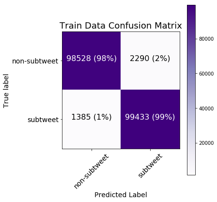
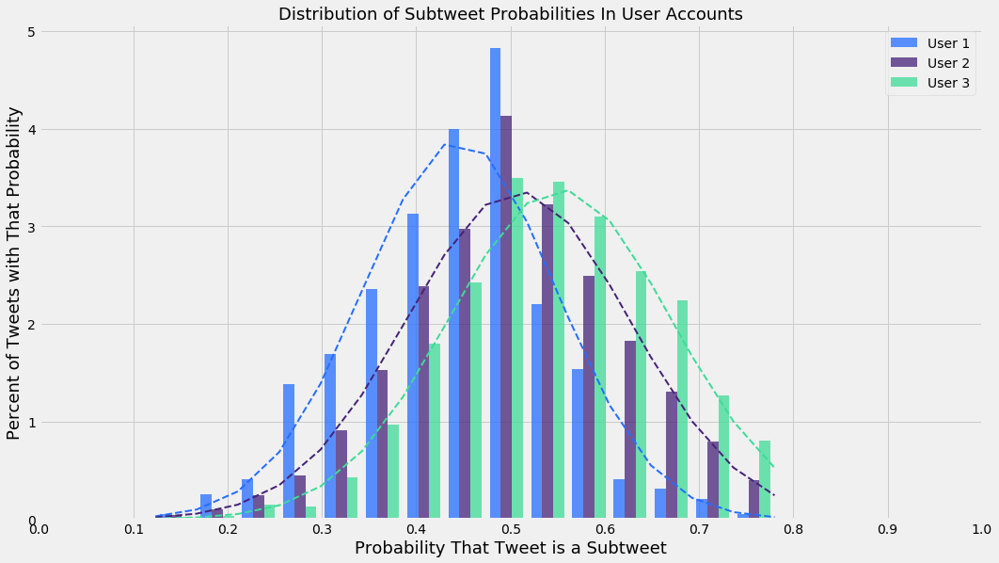
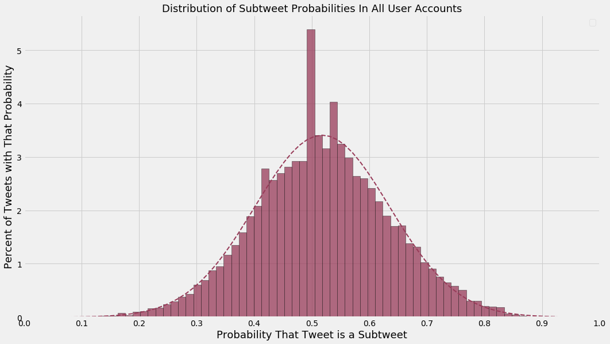
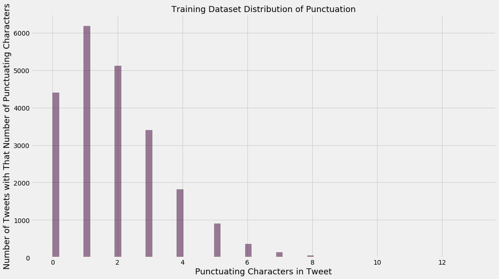
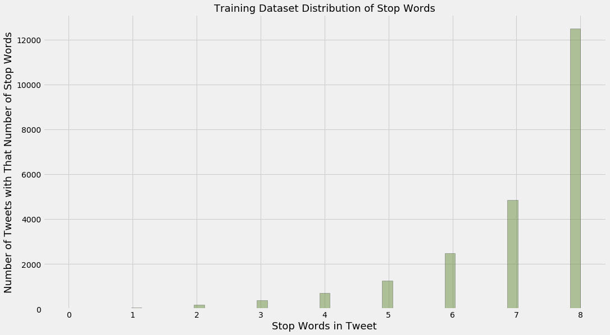
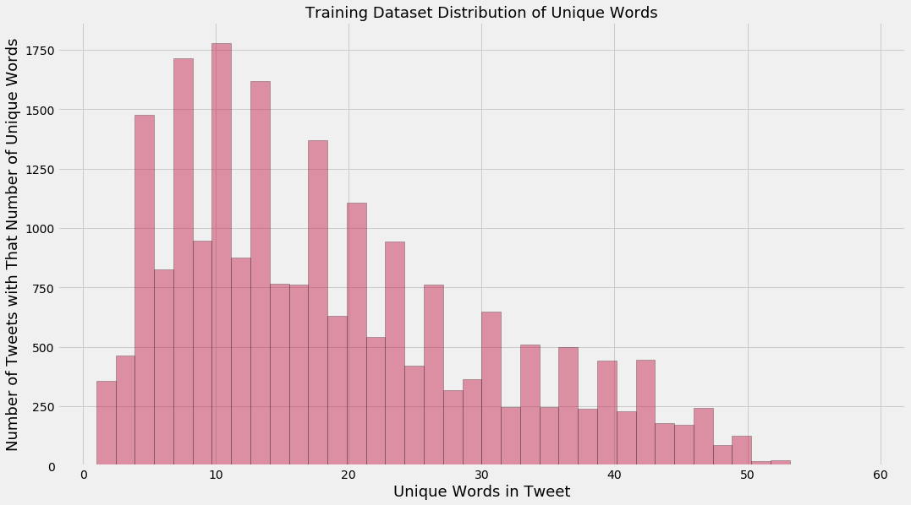

## Using Scikit-Learn and NLTK to build a Naive Bayes Classifier that identifies subtweets

#### In all tables, assume:
* "➊" represents a single hashtag
* "➋" represents a single URL
* "➌" represents a single mention of username (e.g. "@noah")

#### Import libraries


```python
%matplotlib inline
```


```python
from sklearn.metrics import classification_report, confusion_matrix, accuracy_score
from sklearn.feature_extraction.text import TfidfVectorizer
from sklearn.feature_extraction import text
from sklearn.naive_bayes import MultinomialNB
from sklearn.model_selection import KFold
from sklearn.pipeline import Pipeline
from sklearn.externals import joblib
from os.path import basename, splitext
from random import choice, sample
from nltk.corpus import stopwords
from string import punctuation
from pprint import pprint
from glob import glob

import matplotlib.pyplot as plt
import pandas as pd
import numpy as np

import scipy.stats
import itertools
import enchant
import nltk
import json
import re
```

#### Set up some regex patterns


```python
hashtags_pattern = re.compile(r'(\#[a-zA-Z0-9]+)')
```


```python
urls_pattern = re.compile(r'(?i)\b((?:https?://|www\d{0,3}[.]|[a-z0-9.\-]+[.][a-z]{2,4}/)(?:[^\s()<>]|\(([^\s()<>]+|(\([^\s()<>]+\)))*\))+(?:\(([^\s()<>]+|(\([^\s()<>]+\)))*\)|[^\s`!()\[\]{};:\'".,<>?\xab\xbb\u201c\u201d\u2018\u2019]))')
```


```python
at_mentions_pattern = re.compile(r'(?<=^|(?<=[^a-zA-Z0-9-\.]))@([A-Za-z0-9_]+)')
```

#### Prepare English dictionary for language detection


```python
english_dict = enchant.Dict("en_US")
```

#### Use NLTK's tokenizer instead of Scikit's


```python
tokenizer = nltk.casual.TweetTokenizer(preserve_case=False, reduce_len=True)
```

#### Prepare for viewing long text in CSVs and ones with really big and small numbers


```python
pd.set_option("max_colwidth", 1000)
```


```python
pd.options.display.float_format = "{:.4f}".format
```

#### Load the two data files
#### Only use tweets with at least 75% English words
#### Also, make the mentions of usernames, URLs, and hashtags generic


```python
def load_data(filename, threshold=0.33):
    data = [(hashtags_pattern.sub("➊", 
             urls_pattern.sub("➋", 
             at_mentions_pattern.sub("➌", 
             t["tweet_data"]["full_text"])))
             .replace("\u2018", "'")
             .replace("\u2019", "'")
             .replace("\u201c", "\"")
             .replace("\u201d", "\"")
             .replace("&quot;", "\"")
             .replace("&amp;", "&")
             .replace("&gt;", ">")
             .replace("&lt;", "<")) 
            for t in json.load(open(filename)) 
            if t["tweet_data"]["lang"] == "en" 
            and t["reply"]["lang"] == "en" 
            and t["tweet_data"]["user"]["lang"] == "en" 
            and t["reply"]["user"]["lang"] == "en"]
    new_data = []
    for tweet in data:
        tokens = tokenizer.tokenize(tweet)
        english_tokens = [english_dict.check(token) for token in tokens]
        percent_english_words = sum(english_tokens)/len(english_tokens)
        if percent_english_words >= threshold:
            new_data.append(tweet)
    return new_data
```


```python
subtweets_data = load_data("../data/other_data/subtweets.json")
```


```python
non_subtweets_data = load_data("../data/other_data/non_subtweets.json")
```

#### Remove tweets which are present in both datasets


```python
subtweets_data = [tweet for tweet in subtweets_data if tweet not in non_subtweets_data]
```


```python
non_subtweets_data = [tweet for tweet in non_subtweets_data if tweet not in subtweets_data]
```

#### Show examples


```python
print("Subtweets dataset example:")
print(choice(subtweets_data))
```

    Subtweets dataset example:
    people distancing themselves from me always seem to make me feel sad


```python
print("Non-subtweets dataset example:")
print(choice(non_subtweets_data))
```

    Non-subtweets dataset example:
    It is, evidently, ➊.
    
    Yes, I have siblings. Three, actually.
    
    No, they're not on twitter.
    
    No, I'm not posting a photo.
    
    No, I'm not wishing them a "Happy National Siblings Day."
    
    What a silly concept.


#### Find the length of the smaller dataset


```python
smallest_length = len(min([subtweets_data, non_subtweets_data], key=len))
```

#### Cut both down to be the same length


```python
subtweets_data = sample(subtweets_data, smallest_length)
```


```python
non_subtweets_data = sample(non_subtweets_data, smallest_length)
```


```python
print("Smallest dataset length: {}".format(len(subtweets_data)))
```

    Smallest dataset length: 11202


#### Prepare data for training


```python
subtweets_data = [(tweet, "subtweet") for tweet in subtweets_data]
```


```python
non_subtweets_data = [(tweet, "non-subtweet") for tweet in non_subtweets_data]
```

#### Combine them


```python
training_data = subtweets_data + non_subtweets_data
```

#### Create custom stop words to include generic usernames, URLs, and hashtags, as well as common English first names


```python
names_lower = set([name.lower() for name in open("../data/other_data/first_names.txt").read().split("\n")])
```


```python
generic_tokens = {"➊", "➋", "➌"}
```


```python
stop_words = text.ENGLISH_STOP_WORDS | names_lower | generic_tokens
```

#### Build the pipeline


```python
sentiment_pipeline = Pipeline([
    ("vectorizer", TfidfVectorizer(tokenizer=tokenizer.tokenize, 
                                   ngram_range=(1, 3), 
                                   stop_words=stop_words)),
    ("classifier", MultinomialNB())
])
```

#### K-Folds splits up and separates out 10 training and test sets from the data, from which the classifier is trained and the confusion matrix and classification reports are updated


```python
def confusion_matrices(training_data, num_folds=10):
    text_training_data = np.array([row[0] for row in training_data])
    class_training_data = np.array([row[1] for row in training_data])
    kf = KFold(n_splits=num_folds, random_state=42, shuffle=True)
    
    cnf_matrix_test = np.zeros((2, 2), dtype=int)
    cnf_matrix_train = np.zeros((2, 2), dtype=int)
    
    test_reports = []
    train_reports = []
    
    test_accuracies = []
    train_accuracies = []
    for i, (train_index, test_index) in enumerate(kf.split(text_training_data)):

        text_train, text_test = text_training_data[train_index], text_training_data[test_index]
        class_train, class_test = class_training_data[train_index], class_training_data[test_index]

        sentiment_pipeline.fit(text_train, class_train)
        
        predictions_test = sentiment_pipeline.predict(text_test)
        predictions_train = sentiment_pipeline.predict(text_train)

        cnf_matrix_test += confusion_matrix(class_test, predictions_test)
        cnf_matrix_train += confusion_matrix(class_train, predictions_train)

        print("Test Data Iteration {}:".format(i+1))
        
        test_report = classification_report(class_test, predictions_test, digits=4)
        test_reports.append(test_report)
        print(test_report)
                
        test_accuracy = accuracy_score(class_test, predictions_test)
        test_accuracies.append(test_accuracy)
        print("Test Data Accuracy: {:.4f}\n".format(test_accuracy))
        print("="*53)
        
        print("Train Data Iteration {}:".format(i+1))
        
        train_report = classification_report(class_train, predictions_train, digits=4)
        train_reports.append(train_report)
        print(train_report)
                
        train_accuracy = accuracy_score(class_train, predictions_train)
        train_accuracies.append(train_accuracy)
        print("Train Data Accuracy: {:.4f}\n".format(train_accuracy))
        print("="*53)
        
    def reports_mean(reports):
        reports_lists_of_strings = [report.split("\n") for report in reports]
        reports = [[[float(e) for e in report_string[2][16:].split()],
                    [float(e) for e in report_string[3][16:].split()],
                    [float(e) for e in report_string[5][16:].split()]]
                   for report_string in reports_lists_of_strings]
        mean_list = np.mean(np.array(reports), axis=0).tolist()
        print("              precision    recall  f1-score   support")
        print()
        print("non-subtweet     {0:.4f}    {1:.4f}    {2:.4f}      {3:d}".format(mean_list[0][0], 
                                                                                 mean_list[0][1], 
                                                                                 mean_list[0][2], 
                                                                                 int(mean_list[0][3])))
        print("    subtweet     {0:.4f}    {1:.4f}    {2:.4f}      {3:d}".format(mean_list[1][0], 
                                                                                 mean_list[1][1], 
                                                                                 mean_list[1][2], 
                                                                                 int(mean_list[1][3])))
        print()
        print(" avg / total     {0:.4f}    {1:.4f}    {2:.4f}      {3:d}".format(mean_list[2][0], 
                                                                                 mean_list[2][1], 
                                                                                 mean_list[2][2], 
                                                                                 int(mean_list[2][3])))
        print()
        print("="*53)
    
    print("Test Data Averages Across All Folds:")
    reports_mean(test_reports)
    
    print("Train Data Averages Across All Folds:")
    reports_mean(train_reports)
    
    return {"Test": cnf_matrix_test, "Train": cnf_matrix_train}
```


```python
%%time
cnf_matrices = confusion_matrices(training_data)
cnf_matrix_test = cnf_matrices["Test"]
cnf_matrix_train = cnf_matrices["Train"]
```

    Test Data Iteration 1:
                  precision    recall  f1-score   support
    
    non-subtweet     0.7080    0.6811    0.6943      1082
        subtweet     0.7125    0.7377    0.7249      1159
    
     avg / total     0.7103    0.7104    0.7101      2241
    
    Test Data Accuracy: 0.7104
    
    =====================================================
    Train Data Iteration 1:
                  precision    recall  f1-score   support
    
    non-subtweet     0.9846    0.9796    0.9821     10120
        subtweet     0.9796    0.9846    0.9821     10043
    
     avg / total     0.9821    0.9821    0.9821     20163
    
    Train Data Accuracy: 0.9821
    
    =====================================================
    Test Data Iteration 2:
                  precision    recall  f1-score   support
    
    non-subtweet     0.7146    0.6637    0.6882      1109
        subtweet     0.6920    0.7403    0.7153      1132
    
     avg / total     0.7032    0.7024    0.7019      2241
    
    Test Data Accuracy: 0.7024
    
    =====================================================
    Train Data Iteration 2:
                  precision    recall  f1-score   support
    
    non-subtweet     0.9851    0.9785    0.9818     10093
        subtweet     0.9786    0.9852    0.9819     10070
    
     avg / total     0.9819    0.9818    0.9818     20163
    
    Train Data Accuracy: 0.9818
    
    =====================================================
    Test Data Iteration 3:
                  precision    recall  f1-score   support
    
    non-subtweet     0.7344    0.6472    0.6880      1145
        subtweet     0.6721    0.7555    0.7113      1096
    
     avg / total     0.7039    0.7001    0.6994      2241
    
    Test Data Accuracy: 0.7001
    
    =====================================================
    Train Data Iteration 3:
                  precision    recall  f1-score   support
    
    non-subtweet     0.9875    0.9760    0.9817     10057
        subtweet     0.9764    0.9877    0.9820     10106
    
     avg / total     0.9820    0.9819    0.9819     20163
    
    Train Data Accuracy: 0.9819
    
    =====================================================
    Test Data Iteration 4:
                  precision    recall  f1-score   support
    
    non-subtweet     0.6923    0.6615    0.6766      1102
        subtweet     0.6860    0.7155    0.7005      1139
    
     avg / total     0.6891    0.6890    0.6887      2241
    
    Test Data Accuracy: 0.6890
    
    =====================================================
    Train Data Iteration 4:
                  precision    recall  f1-score   support
    
    non-subtweet     0.9850    0.9800    0.9825     10100
        subtweet     0.9800    0.9850    0.9825     10063
    
     avg / total     0.9825    0.9825    0.9825     20163
    
    Train Data Accuracy: 0.9825
    
    =====================================================
    Test Data Iteration 5:
                  precision    recall  f1-score   support
    
    non-subtweet     0.7011    0.6389    0.6686      1105
        subtweet     0.6764    0.7348    0.7044      1135
    
     avg / total     0.6886    0.6875    0.6867      2240
    
    Test Data Accuracy: 0.6875
    
    =====================================================
    Train Data Iteration 5:
                  precision    recall  f1-score   support
    
    non-subtweet     0.9846    0.9778    0.9812     10097
        subtweet     0.9779    0.9847    0.9813     10067
    
     avg / total     0.9813    0.9813    0.9813     20164
    
    Train Data Accuracy: 0.9813
    
    =====================================================
    Test Data Iteration 6:
                  precision    recall  f1-score   support
    
    non-subtweet     0.7237    0.6364    0.6772      1144
        subtweet     0.6629    0.7464    0.7021      1096
    
     avg / total     0.6939    0.6902    0.6894      2240
    
    Test Data Accuracy: 0.6902
    
    =====================================================
    Train Data Iteration 6:
                  precision    recall  f1-score   support
    
    non-subtweet     0.9884    0.9748    0.9816     10058
        subtweet     0.9753    0.9886    0.9819     10106
    
     avg / total     0.9818    0.9817    0.9817     20164
    
    Train Data Accuracy: 0.9817
    
    =====================================================
    Test Data Iteration 7:
                  precision    recall  f1-score   support
    
    non-subtweet     0.7192    0.6364    0.6753      1147
        subtweet     0.6596    0.7392    0.6972      1093
    
     avg / total     0.6901    0.6866    0.6860      2240
    
    Test Data Accuracy: 0.6866
    
    =====================================================
    Train Data Iteration 7:
                  precision    recall  f1-score   support
    
    non-subtweet     0.9869    0.9757    0.9813     10055
        subtweet     0.9761    0.9871    0.9816     10109
    
     avg / total     0.9815    0.9815    0.9815     20164
    
    Train Data Accuracy: 0.9815
    
    =====================================================
    Test Data Iteration 8:
                  precision    recall  f1-score   support
    
    non-subtweet     0.6976    0.6384    0.6667      1095
        subtweet     0.6801    0.7354    0.7067      1145
    
     avg / total     0.6887    0.6879    0.6871      2240
    
    Test Data Accuracy: 0.6879
    
    =====================================================
    Train Data Iteration 8:
                  precision    recall  f1-score   support
    
    non-subtweet     0.9846    0.9790    0.9818     10107
        subtweet     0.9790    0.9846    0.9818     10057
    
     avg / total     0.9818    0.9818    0.9818     20164
    
    Train Data Accuracy: 0.9818
    
    =====================================================
    Test Data Iteration 9:
                  precision    recall  f1-score   support
    
    non-subtweet     0.7237    0.6292    0.6732      1149
        subtweet     0.6567    0.7470    0.6990      1091
    
     avg / total     0.6911    0.6866    0.6857      2240
    
    Test Data Accuracy: 0.6866
    
    =====================================================
    Train Data Iteration 9:
                  precision    recall  f1-score   support
    
    non-subtweet     0.9876    0.9748    0.9812     10053
        subtweet     0.9753    0.9878    0.9815     10111
    
     avg / total     0.9814    0.9814    0.9814     20164
    
    Train Data Accuracy: 0.9814
    
    =====================================================
    Test Data Iteration 10:
                  precision    recall  f1-score   support
    
    non-subtweet     0.7279    0.6664    0.6958      1124
        subtweet     0.6903    0.7491    0.7185      1116
    
     avg / total     0.7092    0.7076    0.7071      2240
    
    Test Data Accuracy: 0.7076
    
    =====================================================
    Train Data Iteration 10:
                  precision    recall  f1-score   support
    
    non-subtweet     0.9871    0.9764    0.9817     10078
        subtweet     0.9767    0.9872    0.9819     10086
    
     avg / total     0.9819    0.9818    0.9818     20164
    
    Train Data Accuracy: 0.9818
    
    =====================================================
    Test Data Averages Across All Folds:
                  precision    recall  f1-score   support
    
    non-subtweet     0.7142    0.6499    0.6804      1120
        subtweet     0.6789    0.7401    0.7080      1120
    
     avg / total     0.6968    0.6948    0.6942      2240
    
    =====================================================
    Train Data Averages Across All Folds:
                  precision    recall  f1-score   support
    
    non-subtweet     0.9861    0.9773    0.9817      10081
        subtweet     0.9775    0.9862    0.9819      10081
    
     avg / total     0.9818    0.9818    0.9818      20163
    
    =====================================================
    CPU times: user 1min 43s, sys: 2.82 s, total: 1min 45s
    Wall time: 1min 54s


#### See the most informative features
[How does "MultinomialNB.coef_" work?](https://stackoverflow.com/a/29915740/6147528)


```python
def most_informative_features(pipeline, n=10000):
    vectorizer = pipeline.named_steps["vectorizer"]
    classifier = pipeline.named_steps["classifier"]
    
    class_labels = classifier.classes_
    
    feature_names = vectorizer.get_feature_names()
    
    top_n_class_1 = sorted(zip(classifier.coef_[0], feature_names))[:n]
    top_n_class_2 = sorted(zip(classifier.coef_[0], feature_names))[-n:]
    
    return {class_labels[0]: pd.DataFrame({"Log Probability": [tup[0] for tup in top_n_class_1], 
                                           "Feature": [tup[1] for tup in top_n_class_1]}), 
            class_labels[1]: pd.DataFrame({"Log Probability": [tup[0] for tup in reversed(top_n_class_2)],
                                           "Feature": [tup[1] for tup in reversed(top_n_class_2)]})}
```


```python
%%time
most_informative_features_all = most_informative_features(sentiment_pipeline)
```

    CPU times: user 2.34 s, sys: 59.5 ms, total: 2.4 s
    Wall time: 2.59 s


```python
most_informative_features_non_subtweet = most_informative_features_all["non-subtweet"]
```


```python
most_informative_features_subtweet = most_informative_features_all["subtweet"]
```


```python
final_features = most_informative_features_non_subtweet.join(most_informative_features_subtweet, 
                                                             lsuffix=" (Non-subtweet)", 
                                                             rsuffix=" (Subtweet)")
final_features.to_csv("../data/other_data/most_informative_features.csv")
final_features.head(25)
```


<div>

<table border="1" class="dataframe">
  <thead>
    <tr style="text-align: right;">
      <th></th>
      <th>Feature (Non-subtweet)</th>
      <th>Log Probability (Non-subtweet)</th>
      <th>Feature (Subtweet)</th>
      <th>Log Probability (Subtweet)</th>
    </tr>
  </thead>
  <tbody>
    <tr>
      <th>0</th>
      <td>! ! &amp;</td>
      <td>-12.9695</td>
      <td>.</td>
      <td>-7.5149</td>
    </tr>
    <tr>
      <th>1</th>
      <td>! ! )</td>
      <td>-12.9695</td>
      <td>,</td>
      <td>-7.8807</td>
    </tr>
    <tr>
      <th>2</th>
      <td>! ! -</td>
      <td>-12.9695</td>
      <td>"</td>
      <td>-8.0400</td>
    </tr>
    <tr>
      <th>3</th>
      <td>! ! /</td>
      <td>-12.9695</td>
      <td>people</td>
      <td>-8.3247</td>
    </tr>
    <tr>
      <th>4</th>
      <td>! ! 0.125</td>
      <td>-12.9695</td>
      <td>?</td>
      <td>-8.3881</td>
    </tr>
    <tr>
      <th>5</th>
      <td>! ! 11</td>
      <td>-12.9695</td>
      <td>like</td>
      <td>-8.5629</td>
    </tr>
    <tr>
      <th>6</th>
      <td>! ! 3</td>
      <td>-12.9695</td>
      <td>don't</td>
      <td>-8.5688</td>
    </tr>
    <tr>
      <th>7</th>
      <td>! ! 5</td>
      <td>-12.9695</td>
      <td>just</td>
      <td>-8.6124</td>
    </tr>
    <tr>
      <th>8</th>
      <td>! ! 5/10</td>
      <td>-12.9695</td>
      <td>i'm</td>
      <td>-8.7010</td>
    </tr>
    <tr>
      <th>9</th>
      <td>! ! 6</td>
      <td>-12.9695</td>
      <td>!</td>
      <td>-8.7257</td>
    </tr>
    <tr>
      <th>10</th>
      <td>! ! 8am</td>
      <td>-12.9695</td>
      <td>it's</td>
      <td>-8.9523</td>
    </tr>
    <tr>
      <th>11</th>
      <td>! ! ;)</td>
      <td>-12.9695</td>
      <td>:</td>
      <td>-8.9657</td>
    </tr>
    <tr>
      <th>12</th>
      <td>! ! absolutely</td>
      <td>-12.9695</td>
      <td>...</td>
      <td>-8.9887</td>
    </tr>
    <tr>
      <th>13</th>
      <td>! ! agree</td>
      <td>-12.9695</td>
      <td>know</td>
      <td>-9.0082</td>
    </tr>
    <tr>
      <th>14</th>
      <td>! ! amazing</td>
      <td>-12.9695</td>
      <td>you're</td>
      <td>-9.0621</td>
    </tr>
    <tr>
      <th>15</th>
      <td>! ! approved</td>
      <td>-12.9695</td>
      <td>twitter</td>
      <td>-9.1132</td>
    </tr>
    <tr>
      <th>16</th>
      <td>! ! aug</td>
      <td>-12.9695</td>
      <td>friends</td>
      <td>-9.2205</td>
    </tr>
    <tr>
      <th>17</th>
      <td>! ! awesome</td>
      <td>-12.9695</td>
      <td>time</td>
      <td>-9.2925</td>
    </tr>
    <tr>
      <th>18</th>
      <td>! ! bambam</td>
      <td>-12.9695</td>
      <td>u</td>
      <td>-9.2998</td>
    </tr>
    <tr>
      <th>19</th>
      <td>! ! best</td>
      <td>-12.9695</td>
      <td>really</td>
      <td>-9.3144</td>
    </tr>
    <tr>
      <th>20</th>
      <td>! ! big</td>
      <td>-12.9695</td>
      <td>think</td>
      <td>-9.3482</td>
    </tr>
    <tr>
      <th>21</th>
      <td>! ! bobwhite</td>
      <td>-12.9695</td>
      <td>want</td>
      <td>-9.3521</td>
    </tr>
    <tr>
      <th>22</th>
      <td>! ! breaking</td>
      <td>-12.9695</td>
      <td>😂</td>
      <td>-9.3539</td>
    </tr>
    <tr>
      <th>23</th>
      <td>! ! bring</td>
      <td>-12.9695</td>
      <td>*</td>
      <td>-9.3577</td>
    </tr>
    <tr>
      <th>24</th>
      <td>! ! c'mon</td>
      <td>-12.9695</td>
      <td>good</td>
      <td>-9.3581</td>
    </tr>
  </tbody>
</table>
</div>


#### Define function for visualizing confusion matrices


```python
def plot_confusion_matrix(cm, classes=["non-subtweet", "subtweet"], 
                          title="Confusion Matrix", cmap=plt.cm.Purples):
    
    cm_normalized = cm.astype("float") / cm.sum(axis=1)[:, np.newaxis]

    plt.imshow(cm, interpolation="nearest", cmap=cmap)
    plt.colorbar()
    
    plt.title(title, size=18)
    
    tick_marks = np.arange(len(classes))
    plt.xticks(tick_marks, classes, rotation=45, fontsize=14)
    plt.yticks(tick_marks, classes, fontsize=14)

    thresh = cm.max() / 2.
    for i, j in itertools.product(range(cm.shape[0]), range(cm.shape[1])):
        plt.text(j, i, "{} ({:.0%})".format(cm[i, j], cm_normalized[i, j]),
                horizontalalignment="center", size=16,
                color="white" if cm[i, j] > thresh else "black")
        
    plt.tight_layout()
    
    plt.ylabel("True label", fontsize=14)
    plt.xlabel("Predicted Label", fontsize=14)
```

#### Show the matrices


```python
np.set_printoptions(precision=2)

plt.figure(figsize=(6, 6))
plot_confusion_matrix(cnf_matrix_test, title="Test Data Confusion Matrix")

plt.figure(figsize=(6, 6))
plot_confusion_matrix(cnf_matrix_train, title="Train Data Confusion Matrix")

plt.show()
```





#### Update matplotlib style


```python
plt.style.use("fivethirtyeight")
```

#### Save the classifier for another time


```python
joblib.dump(sentiment_pipeline, "../data/other_data/subtweets_classifier.pkl");
```

#### Print tests for the classifier


```python
def process_tweets_for_testing(filenames):
    dataframes = {}
    for filename in filenames:
        username = splitext(basename(filename))[0][:-7]
        dataframes[username] = {}
        
        user_df = pd.read_csv(filename).dropna()
        user_df["Text"] = user_df["Text"].str.replace(hashtags_pattern, "➊")
        user_df["Text"] = user_df["Text"].str.replace(urls_pattern, "➋")
        user_df["Text"] = user_df["Text"].str.replace(at_mentions_pattern, "➌")
        user_df["Text"] = user_df["Text"].str.replace("\u2018", "'")
        user_df["Text"] = user_df["Text"].str.replace("\u2019", "'")
        user_df["Text"] = user_df["Text"].str.replace("\u201c", "\"")
        user_df["Text"] = user_df["Text"].str.replace("\u201d", "\"")
        user_df["Text"] = user_df["Text"].str.replace("&quot;", "\"")
        user_df["Text"] = user_df["Text"].str.replace("&amp;", "&")
        user_df["Text"] = user_df["Text"].str.replace("&gt;", ">")
        user_df["Text"] = user_df["Text"].str.replace("&lt;", "<")
        
        predictions = sentiment_pipeline.predict_proba(user_df["Text"])[:, 1].tolist()
        user_df["SubtweetProbability"] = predictions

        dataframes[username]["all"] = user_df
        
        scores = user_df[["SubtweetProbability"]].rename(columns={"SubtweetProbability": username})
        
        dataframes[username]["scores"] = scores
        dataframes[username]["stats"] = scores.describe()
        
    return dataframes
```

#### Load the CSV files


```python
filenames = glob("../data/data_for_testing/friends_data/*.csv")
```


```python
%%time
dataframes = process_tweets_for_testing(filenames)
```

    CPU times: user 9.33 s, sys: 156 ms, total: 9.49 s
    Wall time: 9.82 s


#### Show a random table


```python
chosen_username = choice(list(dataframes.keys()))
dataframes[chosen_username]["all"].sort_values(by="SubtweetProbability", ascending=False).head(5)
```


<div>

<table border="1" class="dataframe">
  <thead>
    <tr style="text-align: right;">
      <th></th>
      <th>Text</th>
      <th>Date</th>
      <th>Favorites</th>
      <th>Retweets</th>
      <th>Tweet ID</th>
      <th>SubtweetProbability</th>
    </tr>
  </thead>
  <tbody>
    <tr>
      <th>66</th>
      <td>tfw you are on twitter to wryly complain about the insomnia that was largely caused by being on twitter</td>
      <td>2018-01-12 03:29:13</td>
      <td>7</td>
      <td>1</td>
      <td>951732786557341698</td>
      <td>0.8513</td>
    </tr>
    <tr>
      <th>481</th>
      <td>Twitter contrived to have people pretend to "like" you and now it reveals how many people could've pretended to like you but chose not to.</td>
      <td>2015-11-11 15:56:31</td>
      <td>0</td>
      <td>0</td>
      <td>664547274110967808</td>
      <td>0.8360</td>
    </tr>
    <tr>
      <th>270</th>
      <td>It's cool that we get to do cool stuff like this (and that we can make "cool" mean whatever we friggin please)➋</td>
      <td>2016-09-05 14:33:54</td>
      <td>2</td>
      <td>0</td>
      <td>772865356922810368</td>
      <td>0.8048</td>
    </tr>
    <tr>
      <th>163</th>
      <td>"What if Iago isn't a devilish mastermind, but just, like, a shitty dude? Like a petty, shitty dude?"- my bathetic pedagogy in a nutshell</td>
      <td>2017-04-20 12:02:04</td>
      <td>18</td>
      <td>3</td>
      <td>855089189423120384</td>
      <td>0.7860</td>
    </tr>
    <tr>
      <th>43</th>
      <td>Deep down I am very dumb and immature and it is very very exhausting to pretend otherwise all day gang</td>
      <td>2018-02-19 21:48:33</td>
      <td>24</td>
      <td>2</td>
      <td>965780184283668480</td>
      <td>0.7843</td>
    </tr>
  </tbody>
</table>
</div>


#### Prepare statistics on tweets


```python
tests_df = pd.concat([df_dict["scores"] for df_dict in dataframes.values()], ignore_index=True)
```


```python
test_df_stats = tests_df.describe()
```


```python
test_df_stats.columns = ["User {}".format(i + 1) for i, column in enumerate(test_df_stats.columns)]
```


```python
test_df_stats
```


<div>

<table border="1" class="dataframe">
  <thead>
    <tr style="text-align: right;">
      <th></th>
      <th>User 1</th>
      <th>User 2</th>
      <th>User 3</th>
      <th>User 4</th>
      <th>User 5</th>
      <th>User 6</th>
      <th>User 7</th>
      <th>User 8</th>
      <th>User 9</th>
      <th>User 10</th>
      <th>User 11</th>
      <th>User 12</th>
      <th>User 13</th>
      <th>User 14</th>
    </tr>
  </thead>
  <tbody>
    <tr>
      <th>count</th>
      <td>621.0000</td>
      <td>2640.0000</td>
      <td>2066.0000</td>
      <td>3488.0000</td>
      <td>4356.0000</td>
      <td>1939.0000</td>
      <td>1169.0000</td>
      <td>638.0000</td>
      <td>2814.0000</td>
      <td>445.0000</td>
      <td>772.0000</td>
      <td>5364.0000</td>
      <td>853.0000</td>
      <td>1467.0000</td>
    </tr>
    <tr>
      <th>mean</th>
      <td>0.5130</td>
      <td>0.5162</td>
      <td>0.5523</td>
      <td>0.5267</td>
      <td>0.5218</td>
      <td>0.5008</td>
      <td>0.4447</td>
      <td>0.5427</td>
      <td>0.5207</td>
      <td>0.4458</td>
      <td>0.5396</td>
      <td>0.5078</td>
      <td>0.5458</td>
      <td>0.5427</td>
    </tr>
    <tr>
      <th>std</th>
      <td>0.1112</td>
      <td>0.1177</td>
      <td>0.1180</td>
      <td>0.1148</td>
      <td>0.1095</td>
      <td>0.1172</td>
      <td>0.1012</td>
      <td>0.1230</td>
      <td>0.1130</td>
      <td>0.1027</td>
      <td>0.1220</td>
      <td>0.1188</td>
      <td>0.1216</td>
      <td>0.1098</td>
    </tr>
    <tr>
      <th>min</th>
      <td>0.1886</td>
      <td>0.0941</td>
      <td>0.1360</td>
      <td>0.1435</td>
      <td>0.1375</td>
      <td>0.0440</td>
      <td>0.1518</td>
      <td>0.1681</td>
      <td>0.1153</td>
      <td>0.1234</td>
      <td>0.0684</td>
      <td>0.0467</td>
      <td>0.1654</td>
      <td>0.0807</td>
    </tr>
    <tr>
      <th>25%</th>
      <td>0.4355</td>
      <td>0.4319</td>
      <td>0.4731</td>
      <td>0.4526</td>
      <td>0.4481</td>
      <td>0.4257</td>
      <td>0.3777</td>
      <td>0.4644</td>
      <td>0.4454</td>
      <td>0.3770</td>
      <td>0.4619</td>
      <td>0.4310</td>
      <td>0.4668</td>
      <td>0.4770</td>
    </tr>
    <tr>
      <th>50%</th>
      <td>0.5174</td>
      <td>0.5141</td>
      <td>0.5508</td>
      <td>0.5235</td>
      <td>0.5239</td>
      <td>0.5002</td>
      <td>0.4497</td>
      <td>0.5353</td>
      <td>0.5186</td>
      <td>0.4562</td>
      <td>0.5374</td>
      <td>0.5024</td>
      <td>0.5471</td>
      <td>0.5421</td>
    </tr>
    <tr>
      <th>75%</th>
      <td>0.5917</td>
      <td>0.5926</td>
      <td>0.6352</td>
      <td>0.6013</td>
      <td>0.5926</td>
      <td>0.5749</td>
      <td>0.5062</td>
      <td>0.6247</td>
      <td>0.5903</td>
      <td>0.5037</td>
      <td>0.6192</td>
      <td>0.5847</td>
      <td>0.6300</td>
      <td>0.6123</td>
    </tr>
    <tr>
      <th>max</th>
      <td>0.8513</td>
      <td>0.8828</td>
      <td>0.8769</td>
      <td>0.9016</td>
      <td>0.9263</td>
      <td>0.8808</td>
      <td>0.8095</td>
      <td>0.8645</td>
      <td>0.8827</td>
      <td>0.7802</td>
      <td>0.8743</td>
      <td>0.8720</td>
      <td>0.8449</td>
      <td>0.8576</td>
    </tr>
  </tbody>
</table>
</div>


#### Plot a histogram with three random users


```python
random_choices = sample(list(dataframes.values()), 3)
scores = [df_dict["scores"][df_dict["scores"].columns[0]].tolist() 
          for df_dict in random_choices]

fig = plt.figure(figsize=(16, 9))
ax = fig.add_subplot(111)

n, bins, patches = ax.hist(scores, 
                           bins="scott",
                           color=["#256EFF", "#46237A", "#3DDC97"],
                           density=True, 
                           label=["User 1", "User 2", "User 3"],
                           alpha=0.75)

stats = [df_dict["stats"][df_dict["stats"].columns[0]].tolist() 
         for df_dict in random_choices]

line_1 = scipy.stats.norm.pdf(bins, stats[0][1], stats[0][2])
ax.plot(bins, line_1, "--", color="#256EFF", linewidth=2)

line_2 = scipy.stats.norm.pdf(bins, stats[1][1], stats[1][2])
ax.plot(bins, line_2, "--", color="#46237A", linewidth=2)

line_3 = scipy.stats.norm.pdf(bins, stats[2][1], stats[2][2])
ax.plot(bins, line_3, "--", color="#3DDC97", linewidth=2)

ax.set_xticks([float(x/10) for x in range(11)], minor=False)
ax.set_title("Distribution of Subtweet Probabilities In User Accounts", fontsize=18)
ax.set_xlabel("Probability That Tweet is a Subtweet", fontsize=18)
ax.set_ylabel("Percent of Tweets with That Probability", fontsize=18)

ax.legend()

plt.show()
```





#### Plot a histogram with all of them
#### First, get some statistics


```python
new_tests_df = pd.concat([df_dict["scores"].rename(columns={df_dict["scores"].columns[0]:"SubtweetProbability"})
                          for df_dict in dataframes.values()], ignore_index=True)

new_tests_df_stats = new_tests_df.describe()
```

#### Then view them


```python
new_tests_df_stats
```


<div>

<table border="1" class="dataframe">
  <thead>
    <tr style="text-align: right;">
      <th></th>
      <th>SubtweetProbability</th>
    </tr>
  </thead>
  <tbody>
    <tr>
      <th>count</th>
      <td>28632.0000</td>
    </tr>
    <tr>
      <th>mean</th>
      <td>0.5182</td>
    </tr>
    <tr>
      <th>std</th>
      <td>0.1171</td>
    </tr>
    <tr>
      <th>min</th>
      <td>0.0440</td>
    </tr>
    <tr>
      <th>25%</th>
      <td>0.4405</td>
    </tr>
    <tr>
      <th>50%</th>
      <td>0.5147</td>
    </tr>
    <tr>
      <th>75%</th>
      <td>0.5939</td>
    </tr>
    <tr>
      <th>max</th>
      <td>0.9263</td>
    </tr>
  </tbody>
</table>
</div>


#### Now plot


```python
fig = plt.figure(figsize=(16, 9))
ax = fig.add_subplot(111)

n, bins, patches = ax.hist(new_tests_df["SubtweetProbability"].tolist(), 
                           bins="scott",
                           color="#983B59",
                           edgecolor="black", 
                           density=True, 
                           alpha=0.75)

line = scipy.stats.norm.pdf(bins, new_tests_df_stats["SubtweetProbability"][1], 
                              new_tests_df_stats["SubtweetProbability"][2])

ax.plot(bins, line, "--", color="#983B59", linewidth=2)


ax.set_xticks([float(x/10) for x in range(11)], minor=False)
ax.set_title("Distribution of Subtweet Probabilities In All User Accounts", fontsize=18)
ax.set_xlabel("Probability That Tweet is a Subtweet", fontsize=18)
ax.set_ylabel("Percent of Tweets with That Probability", fontsize=18)

ax.legend()

plt.show()
```

    No handles with labels found to put in legend.





#### Statisitics on training data

#### Remove mentions of usernames for these statistics


```python
training_data = [(tweet[0]
                  .replace("➊", "")
                  .replace("➋", "")
                  .replace("➌", "")) for tweet in training_data]
```

#### Lengths


```python
length_data = [len(tweet) for tweet in training_data]
```


```python
length_data_for_stats = pd.DataFrame({"Length": length_data, "Tweet": training_data})
```


```python
# length_data_for_stats = length_data_for_stats[length_data_for_stats["Length"] <= 280]  
```


```python
# length_data_for_stats = length_data_for_stats[length_data_for_stats["Length"] >= 5]
```


```python
length_data = length_data_for_stats.Length.tolist()
```

#### Top 5 longest tweets


```python
length_data_for_stats.sort_values(by="Length", ascending=False).head()
```


<div>

<table border="1" class="dataframe">
  <thead>
    <tr style="text-align: right;">
      <th></th>
      <th>Length</th>
      <th>Tweet</th>
    </tr>
  </thead>
  <tbody>
    <tr>
      <th>16877</th>
      <td>293</td>
      <td>That's what gets me WHY low Brow him ?? Why By all that's right he should be impeachedhe is still involves himself in business foreignCabinet heads are just as slimy with using planes etc his disregard for bills Pres o put in 4 protecting us!!</td>
    </tr>
    <tr>
      <th>12086</th>
      <td>293</td>
      <td>Again.. you worship a xenophobic God and a Bible that promotes hate as long as you don't ignore all those parts.. a God that sends people to burn in Hell forever for not believing in him....you don't get to call those talking with you haters!</td>
    </tr>
    <tr>
      <th>12591</th>
      <td>281</td>
      <td>Guys, I'm gonna be completely transparent with you. I've enjoyed the weeks The Flash was off the air. Mainly because this season.... This season 4 curse. It feels almost just like Arrow S4 years ago. But instead of Olicity shippers, these new hardcore "fans" accusing urs truly of</td>
    </tr>
    <tr>
      <th>17346</th>
      <td>281</td>
      <td>If it turns out Joy Reid is falsely denying authorship of these horribly bigoted articles &amp; fabricated a tale about nefarious hackers invading the Wayback Archives to add these passages to her real articles, what should happen? What will happen? Do any liberals care if it's true?</td>
    </tr>
    <tr>
      <th>20810</th>
      <td>281</td>
      <td>Same treatment Dolph, Ye, and Gucci got, imprisonment or "rehabilitation" and stripping that person of their essence psychologically which changes their effect on culture and what they say which leads to a shell of obedience it's deeper than that but in essence that's not Rahmeek</td>
    </tr>
  </tbody>
</table>
</div>


#### Top 5 shortest tweets


```python
length_data_for_stats.sort_values(by="Length", ascending=True).head()
```


<div>

<table border="1" class="dataframe">
  <thead>
    <tr style="text-align: right;">
      <th></th>
      <th>Length</th>
      <th>Tweet</th>
    </tr>
  </thead>
  <tbody>
    <tr>
      <th>1894</th>
      <td>4</td>
      <td>Rude</td>
    </tr>
    <tr>
      <th>2045</th>
      <td>4</td>
      <td>Ugly</td>
    </tr>
    <tr>
      <th>4801</th>
      <td>4</td>
      <td>Fake</td>
    </tr>
    <tr>
      <th>8630</th>
      <td>4</td>
      <td>Lame</td>
    </tr>
    <tr>
      <th>11973</th>
      <td>4</td>
      <td>fear</td>
    </tr>
  </tbody>
</table>
</div>


#### Tweet length statistics


```python
length_data_for_stats.describe()
```


<div>

<table border="1" class="dataframe">
  <thead>
    <tr style="text-align: right;">
      <th></th>
      <th>Length</th>
    </tr>
  </thead>
  <tbody>
    <tr>
      <th>count</th>
      <td>22404.0000</td>
    </tr>
    <tr>
      <th>mean</th>
      <td>103.3253</td>
    </tr>
    <tr>
      <th>std</th>
      <td>72.8493</td>
    </tr>
    <tr>
      <th>min</th>
      <td>4.0000</td>
    </tr>
    <tr>
      <th>25%</th>
      <td>46.0000</td>
    </tr>
    <tr>
      <th>50%</th>
      <td>83.0000</td>
    </tr>
    <tr>
      <th>75%</th>
      <td>144.0000</td>
    </tr>
    <tr>
      <th>max</th>
      <td>293.0000</td>
    </tr>
  </tbody>
</table>
</div>


#### Punctuation


```python
punctuation_data = [len(set(punctuation).intersection(set(tweet))) for tweet in training_data]
```


```python
punctuation_data_for_stats = pd.DataFrame({"Punctuation": punctuation_data, "Tweet": training_data})
```

#### Top 5 most punctuated tweets


```python
punctuation_data_for_stats.sort_values(by="Punctuation", ascending=False).head()
```


<div>

<table border="1" class="dataframe">
  <thead>
    <tr style="text-align: right;">
      <th></th>
      <th>Punctuation</th>
      <th>Tweet</th>
    </tr>
  </thead>
  <tbody>
    <tr>
      <th>4170</th>
      <td>13</td>
      <td>IF U WERE KILLED TOMORROW, I WOULDNT GO 2 UR FUNERAL CUZ ID B N JAIL 4 KILLIN DA PERSON THAT KILLED U!\n......__________________ \n...../_==o;;;;;;;;______[]\n.....), —-.(_(__) / \n....// (..) ), —--" \n...//___// \n..//___// \nWE TRUE HOMIES WE RIDE TOGETHER WE DIE TOGETHER</td>
    </tr>
    <tr>
      <th>15008</th>
      <td>11</td>
      <td>Going to go ahead and crown myself the absolute emperor of finding things on menus that sound interesting, deciding I would like to try them, then being told "I'm sorry sir, that's actually not available..."\n\n[ then why the @#$% is it ON YOUR MENUUUUUUUU-- ]</td>
    </tr>
    <tr>
      <th>20984</th>
      <td>10</td>
      <td>Hooray—for those of you who've been asking when FLASHBACK will be available for pre-order on *ebook* the answer is finally: NOW! Alas, pre-ordering won't make it come out sooner than 11/6 (still writing it, guys). BUT, it does make me super happy, so… 😉\n</td>
    </tr>
    <tr>
      <th>14929</th>
      <td>10</td>
      <td>USA's share of global GDP was about 50% after WW2, today it is about 15%. It will further decline this century (although its economy &amp; GDP/capita will continue to grow in absolute terms).\n\nHow will America react to this loss of "relative power"? By all indications, rather badly.</td>
    </tr>
    <tr>
      <th>13069</th>
      <td>10</td>
      <td>I created an equation to find the largest meaningful number in the observable universe.\n\nVolume Quantitative Infinity [vQ(inf)]= (4/3)(pi)ct^3\n\nI'll explain it in a thread. (1/?)</td>
    </tr>
  </tbody>
</table>
</div>


#### Tweets punctuation statistics


```python
punctuation_data_for_stats.describe()
```


<div>

<table border="1" class="dataframe">
  <thead>
    <tr style="text-align: right;">
      <th></th>
      <th>Punctuation</th>
    </tr>
  </thead>
  <tbody>
    <tr>
      <th>count</th>
      <td>22404.0000</td>
    </tr>
    <tr>
      <th>mean</th>
      <td>1.8818</td>
    </tr>
    <tr>
      <th>std</th>
      <td>1.5584</td>
    </tr>
    <tr>
      <th>min</th>
      <td>0.0000</td>
    </tr>
    <tr>
      <th>25%</th>
      <td>1.0000</td>
    </tr>
    <tr>
      <th>50%</th>
      <td>2.0000</td>
    </tr>
    <tr>
      <th>75%</th>
      <td>3.0000</td>
    </tr>
    <tr>
      <th>max</th>
      <td>13.0000</td>
    </tr>
  </tbody>
</table>
</div>


#### Stop words


```python
stop_words_data = [len(set(stopwords.words("english")).intersection(set(tweet.lower()))) 
                   for tweet in training_data]
```


```python
stop_words_data_for_stats = pd.DataFrame({"Stop words": stop_words_data, "Tweet": training_data})
```

#### Top 5 tweets with most stop words


```python
stop_words_data_for_stats.sort_values(by="Stop words", ascending=False).head()
```


<div>

<table border="1" class="dataframe">
  <thead>
    <tr style="text-align: right;">
      <th></th>
      <th>Stop words</th>
      <th>Tweet</th>
    </tr>
  </thead>
  <tbody>
    <tr>
      <th>0</th>
      <td>8</td>
      <td>Ended up going 3-2, proudest moment was taking two rounds against one of the better players in the community who plays Twintelle. \nHe beat the shit out of me in casuals, but I think I surprised him with that last match. \nI probably should start playing this game 😂</td>
    </tr>
    <tr>
      <th>12678</th>
      <td>8</td>
      <td>A Fascist Canadian dictator, who lied just to get in power and is now trying hard to remain forever by silencing all criticism😡👏, will he succeed?🤔: Trudeau's Increasingly Dictatorial Attitude Shows The Danger Of Centralized Power  via</td>
    </tr>
    <tr>
      <th>12646</th>
      <td>8</td>
      <td>My media tab is filled with so many gifs it's giving me anxiety</td>
    </tr>
    <tr>
      <th>12650</th>
      <td>8</td>
      <td>Everything is coming together and I'm so excited 😍❤️</td>
    </tr>
    <tr>
      <th>12651</th>
      <td>8</td>
      <td>unbelievable, kim shin yeong my favorite model</td>
    </tr>
  </tbody>
</table>
</div>


#### Top 5 tweets with fewest stop words


```python
stop_words_data_for_stats.sort_values(by="Stop words", ascending=True).head()
```


<div>

<table border="1" class="dataframe">
  <thead>
    <tr style="text-align: right;">
      <th></th>
      <th>Stop words</th>
      <th>Tweet</th>
    </tr>
  </thead>
  <tbody>
    <tr>
      <th>22249</th>
      <td>0</td>
      <td>When ?</td>
    </tr>
    <tr>
      <th>2140</th>
      <td>0</td>
      <td>Fuck...</td>
    </tr>
    <tr>
      <th>21625</th>
      <td>0</td>
      <td>well.....</td>
    </tr>
    <tr>
      <th>5759</th>
      <td>0</td>
      <td>We been knew</td>
    </tr>
    <tr>
      <th>3222</th>
      <td>0</td>
      <td>fuck</td>
    </tr>
  </tbody>
</table>
</div>


#### Tweets stop words statistics


```python
stop_words_data_for_stats.describe()
```


<div>

<table border="1" class="dataframe">
  <thead>
    <tr style="text-align: right;">
      <th></th>
      <th>Stop words</th>
    </tr>
  </thead>
  <tbody>
    <tr>
      <th>count</th>
      <td>22404.0000</td>
    </tr>
    <tr>
      <th>mean</th>
      <td>7.1113</td>
    </tr>
    <tr>
      <th>std</th>
      <td>1.3291</td>
    </tr>
    <tr>
      <th>min</th>
      <td>0.0000</td>
    </tr>
    <tr>
      <th>25%</th>
      <td>7.0000</td>
    </tr>
    <tr>
      <th>50%</th>
      <td>8.0000</td>
    </tr>
    <tr>
      <th>75%</th>
      <td>8.0000</td>
    </tr>
    <tr>
      <th>max</th>
      <td>8.0000</td>
    </tr>
  </tbody>
</table>
</div>


#### Unique words


```python
unique_words_data = [len(set(tokenizer.tokenize(tweet))) for tweet in training_data]
```


```python
unique_words_data_for_stats = pd.DataFrame({"Unique words": unique_words_data, "Tweet": training_data})
```


```python
# unique_words_data_for_stats = unique_words_data_for_stats[unique_words_data_for_stats["Unique words"] >= 2]
```


```python
unique_words_data = unique_words_data_for_stats["Unique words"].tolist()
```

#### Top 5 tweets with most unique words


```python
unique_words_data_for_stats.sort_values(by="Unique words", ascending=False).head()
```


<div>

<table border="1" class="dataframe">
  <thead>
    <tr style="text-align: right;">
      <th></th>
      <th>Tweet</th>
      <th>Unique words</th>
    </tr>
  </thead>
  <tbody>
    <tr>
      <th>13473</th>
      <td>GIVE AWAY!\n\nThe rules are really easy, all you have to do is :\n1. Must be following me (i check) \n2. RT and fav this tweet\n3. tag your mutuals/anyone\n4. only 1 winner! \n5. i ship worldwide;) \n\nit ends in 8th May 2018 or when this tweet hit 2k RT and like!\n\nGood luck! ❤</td>
      <td>59</td>
    </tr>
    <tr>
      <th>8660</th>
      <td>I'm starting to get a couple questions about it since May is coming up so I might as well let you guys know: there will not be a MIAMAFV 2 this year (at least not that exact event).\n\nWho knows what's to come in the future, but right now I've got to take care of other stuff first.</td>
      <td>59</td>
    </tr>
    <tr>
      <th>7329</th>
      <td>Crazy how wrong u can be about someone. A girl I graduated w/ was always doing drugs&amp; got pregnant at 16. I assumed she'd end up being a loser but it turn out she now has 4 beautiful kids&amp; is making over $4,500/month just off of child support payments from the 3 different dads</td>
      <td>57</td>
    </tr>
    <tr>
      <th>1177</th>
      <td>got into a tepid back nd forth w/ a uknowwhoAJ+columnist bc i said they steal their "hot takes" from blk twitter &amp; alike. wallahi my bdeshi ass did not sign up 4 this app to be called asinine by a 30yrold pakistani whos whole politics is Post Colonial Memes for Oriental Minded T-</td>
      <td>57</td>
    </tr>
    <tr>
      <th>16213</th>
      <td>If you live in Arizona, tell me everything good about it... Please and thank you 😁👌🏽\n\nAlso does anybody know any wavy ass barbershops or dope tattoo artists or ppl who are just nice kuz we wanna make friends out here tbh. I want a basic "how to" of AZ so teach me shit.</td>
      <td>57</td>
    </tr>
  </tbody>
</table>
</div>


#### Top 5 tweets with fewest unique words


```python
unique_words_data_for_stats.sort_values(by="Unique words", ascending=True).head()
```


<div>

<table border="1" class="dataframe">
  <thead>
    <tr style="text-align: right;">
      <th></th>
      <th>Tweet</th>
      <th>Unique words</th>
    </tr>
  </thead>
  <tbody>
    <tr>
      <th>1758</th>
      <td>CORNY</td>
      <td>1</td>
    </tr>
    <tr>
      <th>18453</th>
      <td>Yes yes yes yes yes yes</td>
      <td>1</td>
    </tr>
    <tr>
      <th>14582</th>
      <td>Same same</td>
      <td>1</td>
    </tr>
    <tr>
      <th>8990</th>
      <td>cool</td>
      <td>1</td>
    </tr>
    <tr>
      <th>22125</th>
      <td>help</td>
      <td>1</td>
    </tr>
  </tbody>
</table>
</div>


#### Tweets unique words statistics


```python
unique_words_data_for_stats.describe()
```


<div>

<table border="1" class="dataframe">
  <thead>
    <tr style="text-align: right;">
      <th></th>
      <th>Unique words</th>
    </tr>
  </thead>
  <tbody>
    <tr>
      <th>count</th>
      <td>22404.0000</td>
    </tr>
    <tr>
      <th>mean</th>
      <td>18.7121</td>
    </tr>
    <tr>
      <th>std</th>
      <td>11.8161</td>
    </tr>
    <tr>
      <th>min</th>
      <td>1.0000</td>
    </tr>
    <tr>
      <th>25%</th>
      <td>9.0000</td>
    </tr>
    <tr>
      <th>50%</th>
      <td>16.0000</td>
    </tr>
    <tr>
      <th>75%</th>
      <td>26.0000</td>
    </tr>
    <tr>
      <th>max</th>
      <td>59.0000</td>
    </tr>
  </tbody>
</table>
</div>


#### Plot them


```python
length_mean = length_data_for_stats.describe().Length[1]
length_std = length_data_for_stats.describe().Length[2]

fig = plt.figure(figsize=(16, 9))
ax = fig.add_subplot(111)

n, bins, patches = ax.hist(length_data, 
                           bins="scott", 
                           edgecolor="black", 
                           # density=True, 
                           color="#12355b", 
                           alpha=0.5)

# length_line = scipy.stats.norm.pdf(bins, length_mean, length_std)
# ax.plot(bins, length_line, "--", linewidth=3, color="#415d7b")

ax.set_title("Training Dataset Distribution of Tweet Lengths", fontsize=18)
ax.set_xlabel("Tweet Length", fontsize=18);
ax.set_ylabel("Number of Tweets with That Length", fontsize=18);

plt.show()
```


```python
punctuation_mean = punctuation_data_for_stats.describe().Punctuation[1]
punctuation_std = punctuation_data_for_stats.describe().Punctuation[2]

fig = plt.figure(figsize=(16, 9))
ax = fig.add_subplot(111)

n, bins, patches = ax.hist(punctuation_data, 
                           bins="scott",
                           edgecolor="black", 
                           # density=True, 
                           color="#420039",
                           alpha=0.5)

# punctution_line = scipy.stats.norm.pdf(bins, punctuation_mean, punctuation_std)
# ax.plot(bins, punctution_line, "--", linewidth=3, color="#673260")

ax.set_title("Training Dataset Distribution of Punctuation", fontsize=18)
ax.set_xlabel("Punctuating Characters in Tweet", fontsize=18)
ax.set_ylabel("Number of Tweets with That Number of Punctuating Characters", fontsize=18)

plt.show()
```





```python
stop_words_mean = stop_words_data_for_stats.describe()["Stop words"][1]
stop_words_std = stop_words_data_for_stats.describe()["Stop words"][2]

fig = plt.figure(figsize=(16, 9))
ax = fig.add_subplot(111)

n, bins, patches = ax.hist(stop_words_data, 
                           bins="scott", 
                           edgecolor="black", 
                           # density=True, 
                           color="#698f3f",
                           alpha=0.5)

# stop_words_line = scipy.stats.norm.pdf(bins, stop_words_mean, stop_words_std)
# ax.plot(bins, stop_words_line, "--", linewidth=3, color="#87a565")

ax.set_title("Training Dataset Distribution of Stop Words", fontsize=18)
ax.set_xlabel("Stop Words in Tweet", fontsize=18)
ax.set_ylabel("Number of Tweets with That Number of Stop Words", fontsize=18)

plt.show()
```





```python
unique_words_mean = unique_words_data_for_stats.describe()["Unique words"][1]
unique_words_std = unique_words_data_for_stats.describe()["Unique words"][2]

fig = plt.figure(figsize=(16, 9))
ax = fig.add_subplot(111)

n, bins, patches = ax.hist(unique_words_data, 
                           bins="scott", 
                           edgecolor="black", 
                           # density=True, 
                           color="#ca2e55",
                           alpha=0.5)

# unique_words_line = scipy.stats.norm.pdf(bins, unique_words_mean, unique_words_std)
# ax.plot(bins, unique_words_line, "--", linewidth=3, color="#d45776")

ax.set_title("Training Dataset Distribution of Unique Words", fontsize=18)
ax.set_xlabel("Unique Words in Tweet", fontsize=18)
ax.set_ylabel("Number of Tweets with That Number of Unique Words", fontsize=18)

plt.show()
```




