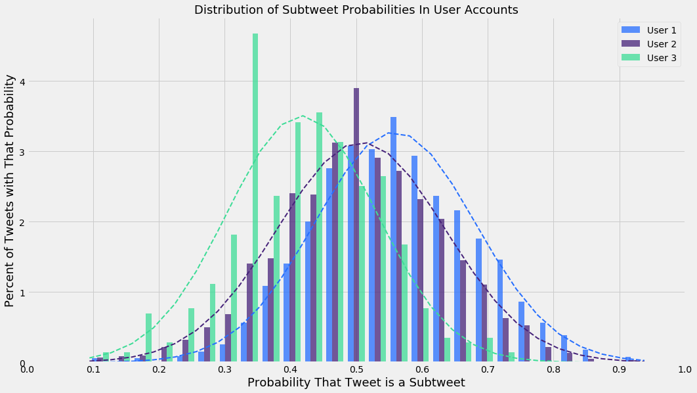
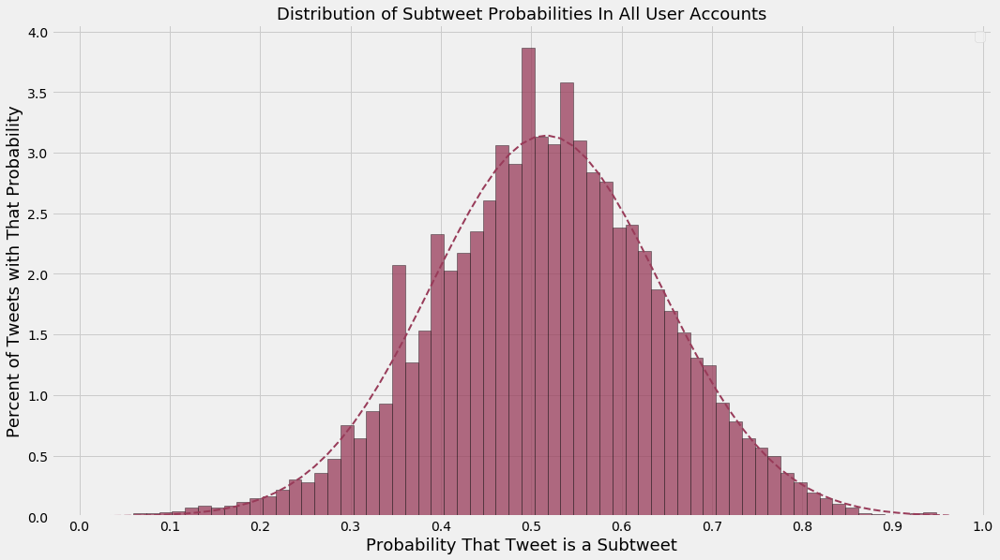
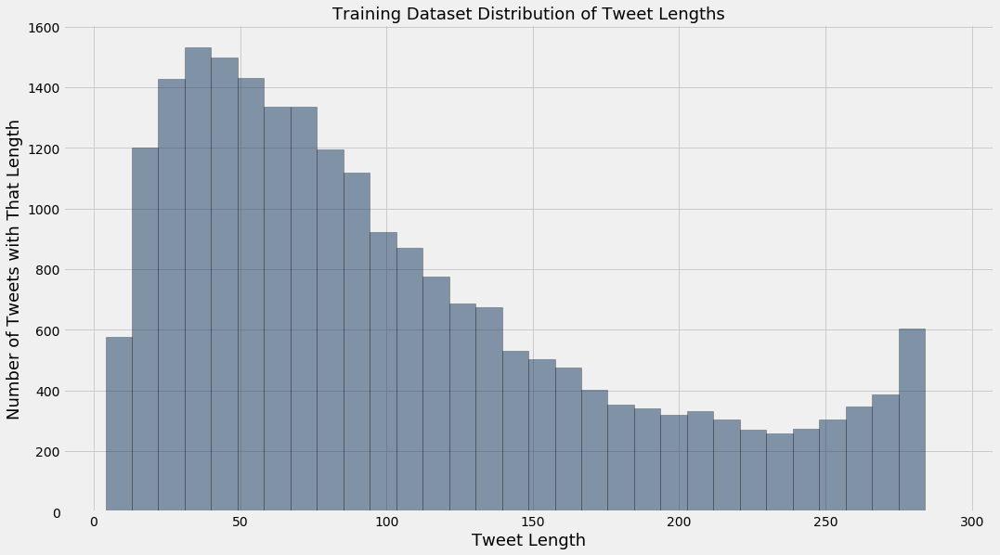

## Using Scikit-Learn and NLTK to build a Naive Bayes Classifier that identifies subtweets

#### In all tables, assume:
* "➊" represents a single URL
* "➋" represents a single mention of a username (e.g. "@noah")
* "➌" represents a single mention of an English first name

#### Import libraries


```python
%matplotlib inline
```


```python
from sklearn.metrics import classification_report, confusion_matrix, accuracy_score
from sklearn.feature_extraction.text import TfidfVectorizer
from sklearn.feature_extraction import text
from sklearn.naive_bayes import MultinomialNB
from sklearn.model_selection import KFold
from sklearn.pipeline import Pipeline
from sklearn.externals import joblib
from os.path import basename, splitext
from random import choice, sample
from nltk.corpus import stopwords
from string import punctuation
from pprint import pprint
from glob import glob

import matplotlib.pyplot as plt
import pandas as pd
import numpy as np

import scipy.stats
import itertools
import enchant
import nltk
import json
import re
```

#### Set up some regex patterns


```python
urls_pattern = re.compile(r'(?i)\b((?:https?://|www\d{0,3}[.]|[a-z0-9.\-]+[.][a-z]{2,4}/)(?:[^\s()<>]|\(([^\s()<>]+|(\([^\s()<>]+\)))*\))+(?:\(([^\s()<>]+|(\([^\s()<>]+\)))*\)|[^\s`!()\[\]{};:\'".,<>?\xab\xbb\u201c\u201d\u2018\u2019]))')
```


```python
at_mentions_pattern = re.compile(r'(?<=^|(?<=[^a-zA-Z0-9-\.]))@([A-Za-z0-9_]+)')
```


```python
names = open("../data/other_data/first_names.txt").read().split("\n")
names_pattern = re.compile(r'\b(?:{})\b'.format('|'.join(names)))
```

#### Prepare English dictionary for language detection


```python
english_dict = enchant.Dict("en_US")
```

#### Use NLTK's tokenizer instead of Scikit's


```python
tokenizer = nltk.casual.TweetTokenizer()
```

#### Prepare for viewing long text in CSVs and ones with really big and small numbers


```python
pd.set_option("display.height", 1000)
pd.set_option("display.max_rows", 500)
pd.set_option("display.max_columns", 500)
pd.set_option("display.width", 1000)
pd.set_option("max_colwidth", 1000)
```


```python
pd.options.display.float_format = "{:.4f}".format
```

#### Load the two data files
#### Only use tweets with at least 10% English words
#### Also, make the mentions of usernames, names, and URLs generic


```python
def load_data(filename, threshold=0.1):
    data = [(urls_pattern.sub("➊",
             at_mentions_pattern.sub("➋",
             names_pattern.sub("➌",
             t["tweet_data"]["full_text"])))
             .replace("\u2018", "'")
             .replace("\u2019", "'")
             .replace("\u201c", "\"")
             .replace("\u201d", "\"")
             .replace("&quot;", "\"")
             .replace("&amp;", "&")
             .replace("&gt;", ">")
             .replace("&lt;", "<"))
            for t in json.load(open(filename))
            if t["tweet_data"]["lang"] == "en"
            and t["reply"]["lang"] == "en"
            and t["tweet_data"]["user"]["lang"] == "en"
            and t["reply"]["user"]["lang"] == "en"]
    new_data = []
    for tweet in data:
        tokens = tokenizer.tokenize(tweet)
        english_tokens = [english_dict.check(token) for token in tokens]
        percent_english_words = sum(english_tokens)/len(english_tokens)
        if percent_english_words >= threshold:
            new_data.append(tweet)
    return new_data
```


```python
subtweets_data = load_data("../data/other_data/subtweets.json")
```


```python
non_subtweets_data = load_data("../data/other_data/non_subtweets.json")
```

#### Remove tweets which are present in both datasets


```python
%%time
subtweets_data = [tweet for tweet in subtweets_data if tweet not in non_subtweets_data]
```

    CPU times: user 7.32 s, sys: 32.3 ms, total: 7.35 s
    Wall time: 7.37 s


```python
%%time
non_subtweets_data = [tweet for tweet in non_subtweets_data if tweet not in subtweets_data]
```

    CPU times: user 4.79 s, sys: 19.6 ms, total: 4.81 s
    Wall time: 4.82 s


#### Show examples


```python
print("Subtweets dataset example:")
print(choice(subtweets_data))
```

    Subtweets dataset example:
    i feel evil ➊


```python
print("Non-subtweets dataset example:")
print(choice(non_subtweets_data))
```

    Non-subtweets dataset example:
    Join us at 6pm where we'll be discussing our favourite #sights on #TRLT. Looking forward to chatting :) ➊


#### Find the length of the smaller dataset


```python
smallest_length = len(min([subtweets_data, non_subtweets_data], key=len))
```

#### Cut both down to be the same length


```python
subtweets_data = sample(subtweets_data, smallest_length)
```


```python
non_subtweets_data = sample(non_subtweets_data, smallest_length)
```


```python
print("Smallest dataset length: {}".format(len(subtweets_data)))
```

    Smallest dataset length: 11288


#### Prepare data for training


```python
subtweets_data = [(tweet, "subtweet") for tweet in subtweets_data]
```


```python
non_subtweets_data = [(tweet, "non-subtweet") for tweet in non_subtweets_data]
```

#### Combine them


```python
training_data = subtweets_data + non_subtweets_data
```

#### Build the pipeline


```python
sentiment_pipeline = Pipeline([
    ("vectorizer", TfidfVectorizer(tokenizer=tokenizer.tokenize,
                                   ngram_range=(1, 3),
                                   stop_words="english")),
    ("classifier", MultinomialNB())
])
```

#### K-Folds splits up and separates out 10 training and test sets from the data, from which the classifier is trained and the confusion matrix and classification reports are updated


```python
def confusion_matrices(training_data, num_folds=10):
    text_training_data = np.array([row[0] for row in training_data])
    class_training_data = np.array([row[1] for row in training_data])
    kf = KFold(n_splits=num_folds, random_state=42, shuffle=True)

    cnf_matrix_test = np.zeros((2, 2), dtype=int)
    cnf_matrix_train = np.zeros((2, 2), dtype=int)

    test_reports = []
    train_reports = []

    test_accuracies = []
    train_accuracies = []
    for i, (train_index, test_index) in enumerate(kf.split(text_training_data)):

        text_train, text_test = text_training_data[train_index], text_training_data[test_index]
        class_train, class_test = class_training_data[train_index], class_training_data[test_index]

        sentiment_pipeline.fit(text_train, class_train)

        predictions_test = sentiment_pipeline.predict(text_test)
        predictions_train = sentiment_pipeline.predict(text_train)

        cnf_matrix_test += confusion_matrix(class_test, predictions_test)
        cnf_matrix_train += confusion_matrix(class_train, predictions_train)

        print("Test Data Iteration {}:".format(i+1))

        test_report = classification_report(class_test, predictions_test, digits=4)
        test_reports.append(test_report)
        print(test_report)

        test_accuracy = accuracy_score(class_test, predictions_test)
        test_accuracies.append(test_accuracy)
        print("Test Data Accuracy: {:.4f}\n".format(test_accuracy))
        print("="*53)

        print("Train Data Iteration {}:".format(i+1))

        train_report = classification_report(class_train, predictions_train, digits=4)
        train_reports.append(train_report)
        print(train_report)

        train_accuracy = accuracy_score(class_train, predictions_train)
        train_accuracies.append(train_accuracy)
        print("Train Data Accuracy: {:.4f}\n".format(train_accuracy))
        print("="*53)

    def reports_mean(reports):
        reports_lists_of_strings = [report.split("\n") for report in reports]
        reports = [[[float(e) for e in report_string[2][16:].split()],
                    [float(e) for e in report_string[3][16:].split()],
                    [float(e) for e in report_string[5][16:].split()]]
                   for report_string in reports_lists_of_strings]
        mean_list = np.mean(np.array(reports), axis=0).tolist()
        print("              precision    recall  f1-score   support")
        print()
        print("non-subtweet     {0:.4f}    {1:.4f}    {2:.4f}      {3:d}".format(mean_list[0][0],
                                                                                 mean_list[0][1],
                                                                                 mean_list[0][2],
                                                                                 int(mean_list[0][3])))
        print("    subtweet     {0:.4f}    {1:.4f}    {2:.4f}      {3:d}".format(mean_list[1][0],
                                                                                 mean_list[1][1],
                                                                                 mean_list[1][2],
                                                                                 int(mean_list[1][3])))
        print()
        print(" avg / total     {0:.4f}    {1:.4f}    {2:.4f}      {3:d}".format(mean_list[2][0],
                                                                                 mean_list[2][1],
                                                                                 mean_list[2][2],
                                                                                 int(mean_list[2][3])))
        print()
        print("="*53)

    print("Test Data Averages Across All Folds:")
    reports_mean(test_reports)

    print("Train Data Averages Across All Folds:")
    reports_mean(train_reports)

    return {"Test": cnf_matrix_test, "Train": cnf_matrix_train}
```


```python
%%time
cnf_matrices = confusion_matrices(training_data)
cnf_matrix_test = cnf_matrices["Test"]
cnf_matrix_train = cnf_matrices["Train"]
```

    Test Data Iteration 1:
                  precision    recall  f1-score   support

    non-subtweet     0.7055    0.7185    0.7119      1087
        subtweet     0.7341    0.7216    0.7278      1171

     avg / total     0.7204    0.7201    0.7202      2258

    Test Data Accuracy: 0.7201

    =====================================================
    Train Data Iteration 1:
                  precision    recall  f1-score   support

    non-subtweet     0.9804    0.9876    0.9840     10201
        subtweet     0.9875    0.9801    0.9838     10117

     avg / total     0.9839    0.9839    0.9839     20318

    Train Data Accuracy: 0.9839

    =====================================================
    Test Data Iteration 2:
                  precision    recall  f1-score   support

    non-subtweet     0.7231    0.7126    0.7178      1103
        subtweet     0.7293    0.7394    0.7343      1155

     avg / total     0.7263    0.7263    0.7262      2258

    Test Data Accuracy: 0.7263

    =====================================================
    Train Data Iteration 2:
                  precision    recall  f1-score   support

    non-subtweet     0.9800    0.9875    0.9838     10185
        subtweet     0.9874    0.9798    0.9836     10133

     avg / total     0.9837    0.9837    0.9837     20318

    Train Data Accuracy: 0.9837

    =====================================================
    Test Data Iteration 3:
                  precision    recall  f1-score   support

    non-subtweet     0.7637    0.6800    0.7194      1150
        subtweet     0.7018    0.7816    0.7395      1108

     avg / total     0.7333    0.7298    0.7293      2258

    Test Data Accuracy: 0.7298

    =====================================================
    Train Data Iteration 3:
                  precision    recall  f1-score   support

    non-subtweet     0.9815    0.9860    0.9838     10138
        subtweet     0.9860    0.9815    0.9838     10180

     avg / total     0.9838    0.9838    0.9838     20318

    Train Data Accuracy: 0.9838

    =====================================================
    Test Data Iteration 4:
                  precision    recall  f1-score   support

    non-subtweet     0.7557    0.7046    0.7293      1124
        subtweet     0.7256    0.7743    0.7491      1134

     avg / total     0.7406    0.7396    0.7393      2258

    Test Data Accuracy: 0.7396

    =====================================================
    Train Data Iteration 4:
                  precision    recall  f1-score   support

    non-subtweet     0.9808    0.9861    0.9835     10164
        subtweet     0.9860    0.9807    0.9834     10154

     avg / total     0.9834    0.9834    0.9834     20318

    Train Data Accuracy: 0.9834

    =====================================================
    Test Data Iteration 5:
                  precision    recall  f1-score   support

    non-subtweet     0.7381    0.6897    0.7131      1128
        subtweet     0.7093    0.7558    0.7318      1130

     avg / total     0.7237    0.7228    0.7225      2258

    Test Data Accuracy: 0.7228

    =====================================================
    Train Data Iteration 5:
                  precision    recall  f1-score   support

    non-subtweet     0.9804    0.9868    0.9836     10160
        subtweet     0.9867    0.9803    0.9835     10158

     avg / total     0.9836    0.9836    0.9836     20318

    Train Data Accuracy: 0.9836

    =====================================================
    Test Data Iteration 6:
                  precision    recall  f1-score   support

    non-subtweet     0.7317    0.7144    0.7229      1145
        subtweet     0.7132    0.7305    0.7217      1113

     avg / total     0.7225    0.7223    0.7223      2258

    Test Data Accuracy: 0.7223

    =====================================================
    Train Data Iteration 6:
                  precision    recall  f1-score   support

    non-subtweet     0.9816    0.9861    0.9838     10143
        subtweet     0.9861    0.9815    0.9838     10175

     avg / total     0.9838    0.9838    0.9838     20318

    Train Data Accuracy: 0.9838

    =====================================================
    Test Data Iteration 7:
                  precision    recall  f1-score   support

    non-subtweet     0.7307    0.6606    0.6939      1158
        subtweet     0.6752    0.7434    0.7077      1099

     avg / total     0.7037    0.7009    0.7006      2257

    Test Data Accuracy: 0.7009

    =====================================================
    Train Data Iteration 7:
                  precision    recall  f1-score   support

    non-subtweet     0.9822    0.9859    0.9840     10130
        subtweet     0.9859    0.9822    0.9841     10189

     avg / total     0.9841    0.9841    0.9841     20319

    Train Data Accuracy: 0.9841

    =====================================================
    Test Data Iteration 8:
                  precision    recall  f1-score   support

    non-subtweet     0.7182    0.6888    0.7032      1099
        subtweet     0.7157    0.7435    0.7294      1158

     avg / total     0.7169    0.7169    0.7166      2257

    Test Data Accuracy: 0.7169

    =====================================================
    Train Data Iteration 8:
                  precision    recall  f1-score   support

    non-subtweet     0.9808    0.9870    0.9839     10189
        subtweet     0.9869    0.9806    0.9837     10130

     avg / total     0.9838    0.9838    0.9838     20319

    Train Data Accuracy: 0.9838

    =====================================================
    Test Data Iteration 9:
                  precision    recall  f1-score   support

    non-subtweet     0.7276    0.6856    0.7060      1161
        subtweet     0.6862    0.7281    0.7065      1096

     avg / total     0.7075    0.7062    0.7062      2257

    Test Data Accuracy: 0.7062

    =====================================================
    Train Data Iteration 9:
                  precision    recall  f1-score   support

    non-subtweet     0.9822    0.9853    0.9837     10127
        subtweet     0.9853    0.9822    0.9838     10192

     avg / total     0.9838    0.9838    0.9838     20319

    Train Data Accuracy: 0.9838

    =====================================================
    Test Data Iteration 10:
                  precision    recall  f1-score   support

    non-subtweet     0.7485    0.7538    0.7511      1133
        subtweet     0.7500    0.7447    0.7473      1124

     avg / total     0.7492    0.7492    0.7492      2257

    Test Data Accuracy: 0.7492

    =====================================================
    Train Data Iteration 10:
                  precision    recall  f1-score   support

    non-subtweet     0.9822    0.9862    0.9842     10155
        subtweet     0.9862    0.9822    0.9842     10164

     avg / total     0.9842    0.9842    0.9842     20319

    Train Data Accuracy: 0.9842

    =====================================================
    Test Data Averages Across All Folds:
                  precision    recall  f1-score   support

    non-subtweet     0.7343    0.7009    0.7169      1128
        subtweet     0.7140    0.7463    0.7295      1128

     avg / total     0.7244    0.7234    0.7232      2257

    =====================================================
    Train Data Averages Across All Folds:
                  precision    recall  f1-score   support

    non-subtweet     0.9812    0.9864    0.9838      10159
        subtweet     0.9864    0.9811    0.9838      10159

     avg / total     0.9838    0.9838    0.9838      20318

    =====================================================
    CPU times: user 1min 28s, sys: 2.37 s, total: 1min 30s
    Wall time: 1min 38s


#### See the most informative features
[How does "MultinomialNB.coef_" work?](https://stackoverflow.com/a/29915740/6147528)


```python
def most_informative_features(pipeline, n=15000):
    vectorizer = pipeline.named_steps["vectorizer"]
    classifier = pipeline.named_steps["classifier"]

    class_labels = classifier.classes_

    feature_names = vectorizer.get_feature_names()

    top_n_class_1 = sorted(zip(classifier.coef_[0], feature_names))[:n]
    top_n_class_2 = sorted(zip(classifier.coef_[0], feature_names))[-n:]

    return {class_labels[0]: pd.DataFrame({"Log Probability": [tup[0] for tup in top_n_class_1],
                                           "Feature": [tup[1] for tup in top_n_class_1]}),
            class_labels[1]: pd.DataFrame({"Log Probability": [tup[0] for tup in reversed(top_n_class_2)],
                                           "Feature": [tup[1] for tup in reversed(top_n_class_2)]})}
```


```python
%%time
most_informative_features_all = most_informative_features(sentiment_pipeline)
```

    CPU times: user 2.23 s, sys: 44.8 ms, total: 2.27 s
    Wall time: 2.33 s


```python
most_informative_features_non_subtweet = most_informative_features_all["non-subtweet"]
```


```python
most_informative_features_subtweet = most_informative_features_all["subtweet"]
```


```python
final_features = most_informative_features_non_subtweet.join(most_informative_features_subtweet,
                                                             lsuffix=" (Non-subtweet)",
                                                             rsuffix=" (Subtweet)")
final_features.to_csv("../data/other_data/most_informative_features.csv")
final_features.head(50)
```


<div>

<table border="1" class="dataframe">
  <thead>
    <tr style="text-align: right;">
      <th></th>
      <th>Feature (Non-subtweet)</th>
      <th>Log Probability (Non-subtweet)</th>
      <th>Feature (Subtweet)</th>
      <th>Log Probability (Subtweet)</th>
    </tr>
  </thead>
  <tbody>
    <tr>
      <th>0</th>
      <td>! ! #b2b</td>
      <td>-13.0606</td>
      <td>.</td>
      <td>-7.6538</td>
    </tr>
    <tr>
      <th>1</th>
      <td>! ! #bbnaija</td>
      <td>-13.0606</td>
      <td>,</td>
      <td>-8.0190</td>
    </tr>
    <tr>
      <th>2</th>
      <td>! ! #dwts26</td>
      <td>-13.0606</td>
      <td>➊</td>
      <td>-8.0607</td>
    </tr>
    <tr>
      <th>3</th>
      <td>! ! #fbr</td>
      <td>-13.0606</td>
      <td>"</td>
      <td>-8.1688</td>
    </tr>
    <tr>
      <th>4</th>
      <td>! ! #free</td>
      <td>-13.0606</td>
      <td>people</td>
      <td>-8.4512</td>
    </tr>
    <tr>
      <th>5</th>
      <td>! ! #frustrated</td>
      <td>-13.0606</td>
      <td>?</td>
      <td>-8.5484</td>
    </tr>
    <tr>
      <th>6</th>
      <td>! ! #goblue</td>
      <td>-13.0606</td>
      <td>like</td>
      <td>-8.6806</td>
    </tr>
    <tr>
      <th>7</th>
      <td>! ! #goldenkamuy</td>
      <td>-13.0606</td>
      <td>don't</td>
      <td>-8.6983</td>
    </tr>
    <tr>
      <th>8</th>
      <td>! ! #ipl2018</td>
      <td>-13.0606</td>
      <td>just</td>
      <td>-8.7501</td>
    </tr>
    <tr>
      <th>9</th>
      <td>! ! #keepittight</td>
      <td>-13.0606</td>
      <td>i'm</td>
      <td>-8.8153</td>
    </tr>
    <tr>
      <th>10</th>
      <td>! ! #letsgoflyers</td>
      <td>-13.0606</td>
      <td>!</td>
      <td>-8.8335</td>
    </tr>
    <tr>
      <th>11</th>
      <td>! ! #meekotw</td>
      <td>-13.0606</td>
      <td>it's</td>
      <td>-9.0702</td>
    </tr>
    <tr>
      <th>12</th>
      <td>! ! #miz</td>
      <td>-13.0606</td>
      <td>. ➊</td>
      <td>-9.1040</td>
    </tr>
    <tr>
      <th>13</th>
      <td>! ! #nadolax</td>
      <td>-13.0606</td>
      <td>:</td>
      <td>-9.1108</td>
    </tr>
    <tr>
      <th>14</th>
      <td>! ! #nintendoswitch</td>
      <td>-13.0606</td>
      <td>know</td>
      <td>-9.1704</td>
    </tr>
    <tr>
      <th>15</th>
      <td>! ! #noveladdicted</td>
      <td>-13.0606</td>
      <td>...</td>
      <td>-9.1725</td>
    </tr>
    <tr>
      <th>16</th>
      <td>! ! #prebook</td>
      <td>-13.0606</td>
      <td>you're</td>
      <td>-9.1945</td>
    </tr>
    <tr>
      <th>17</th>
      <td>! ! #ps4share</td>
      <td>-13.0606</td>
      <td>twitter</td>
      <td>-9.2531</td>
    </tr>
    <tr>
      <th>18</th>
      <td>! ! #repost</td>
      <td>-13.0606</td>
      <td>love</td>
      <td>-9.3220</td>
    </tr>
    <tr>
      <th>19</th>
      <td>! ! #saveourchildren</td>
      <td>-13.0606</td>
      <td>friends</td>
      <td>-9.3740</td>
    </tr>
    <tr>
      <th>20</th>
      <td>! ! #sdlive</td>
      <td>-13.0606</td>
      <td>➋</td>
      <td>-9.3992</td>
    </tr>
    <tr>
      <th>21</th>
      <td>! ! #shotmakers</td>
      <td>-13.0606</td>
      <td>*</td>
      <td>-9.4195</td>
    </tr>
    <tr>
      <th>22</th>
      <td>! ! #spreadyourlight</td>
      <td>-13.0606</td>
      <td>time</td>
      <td>-9.4283</td>
    </tr>
    <tr>
      <th>23</th>
      <td>! ! #stopsoros</td>
      <td>-13.0606</td>
      <td>really</td>
      <td>-9.4321</td>
    </tr>
    <tr>
      <th>24</th>
      <td>! ! #suckabee</td>
      <td>-13.0606</td>
      <td>😂</td>
      <td>-9.4530</td>
    </tr>
    <tr>
      <th>25</th>
      <td>! ! #the100</td>
      <td>-13.0606</td>
      <td>u</td>
      <td>-9.4694</td>
    </tr>
    <tr>
      <th>26</th>
      <td>! ! #thevoice</td>
      <td>-13.0606</td>
      <td>good</td>
      <td>-9.4921</td>
    </tr>
    <tr>
      <th>27</th>
      <td>! ! #traceybarbie</td>
      <td>-13.0606</td>
      <td>think</td>
      <td>-9.4930</td>
    </tr>
    <tr>
      <th>28</th>
      <td>! ! #tucker</td>
      <td>-13.0606</td>
      <td>shit</td>
      <td>-9.4970</td>
    </tr>
    <tr>
      <th>29</th>
      <td>! ! #tuesdaythoughts</td>
      <td>-13.0606</td>
      <td>want</td>
      <td>-9.5038</td>
    </tr>
    <tr>
      <th>30</th>
      <td>! ! #wwie</td>
      <td>-13.0606</td>
      <td>can't</td>
      <td>-9.5209</td>
    </tr>
    <tr>
      <th>31</th>
      <td>! ! $</td>
      <td>-13.0606</td>
      <td>make</td>
      <td>-9.5451</td>
    </tr>
    <tr>
      <th>32</th>
      <td>! ! &amp;</td>
      <td>-13.0606</td>
      <td>tweet</td>
      <td>-9.5960</td>
    </tr>
    <tr>
      <th>33</th>
      <td>! ! )</td>
      <td>-13.0606</td>
      <td>need</td>
      <td>-9.6414</td>
    </tr>
    <tr>
      <th>34</th>
      <td>! ! -</td>
      <td>-13.0606</td>
      <td>say</td>
      <td>-9.6950</td>
    </tr>
    <tr>
      <th>35</th>
      <td>! ! ...</td>
      <td>-13.0606</td>
      <td>fuck</td>
      <td>-9.7029</td>
    </tr>
    <tr>
      <th>36</th>
      <td>! ! /</td>
      <td>-13.0606</td>
      <td>! !</td>
      <td>-9.7128</td>
    </tr>
    <tr>
      <th>37</th>
      <td>! ! 1</td>
      <td>-13.0606</td>
      <td>lol</td>
      <td>-9.7253</td>
    </tr>
    <tr>
      <th>38</th>
      <td>! ! 11</td>
      <td>-13.0606</td>
      <td>stop</td>
      <td>-9.7333</td>
    </tr>
    <tr>
      <th>39</th>
      <td>! ! 15</td>
      <td>-13.0606</td>
      <td>/</td>
      <td>-9.7369</td>
    </tr>
    <tr>
      <th>40</th>
      <td>! ! 23</td>
      <td>-13.0606</td>
      <td>person</td>
      <td>-9.7698</td>
    </tr>
    <tr>
      <th>41</th>
      <td>! ! 3</td>
      <td>-13.0606</td>
      <td>)</td>
      <td>-9.7909</td>
    </tr>
    <tr>
      <th>42</th>
      <td>! ! 5/10</td>
      <td>-13.0606</td>
      <td>thing</td>
      <td>-9.8020</td>
    </tr>
    <tr>
      <th>43</th>
      <td>! ! 8am</td>
      <td>-13.0606</td>
      <td>hate</td>
      <td>-9.8145</td>
    </tr>
    <tr>
      <th>44</th>
      <td>! ! :)</td>
      <td>-13.0606</td>
      <td>? ?</td>
      <td>-9.8175</td>
    </tr>
    <tr>
      <th>45</th>
      <td>! ! aahhh</td>
      <td>-13.0606</td>
      <td>y'all</td>
      <td>-9.8332</td>
    </tr>
    <tr>
      <th>46</th>
      <td>! ! absolutely</td>
      <td>-13.0606</td>
      <td>life</td>
      <td>-9.8534</td>
    </tr>
    <tr>
      <th>47</th>
      <td>! ! agree</td>
      <td>-13.0606</td>
      <td>got</td>
      <td>-9.8714</td>
    </tr>
    <tr>
      <th>48</th>
      <td>! ! ask</td>
      <td>-13.0606</td>
      <td>-</td>
      <td>-9.8749</td>
    </tr>
    <tr>
      <th>49</th>
      <td>! ! aug</td>
      <td>-13.0606</td>
      <td>'</td>
      <td>-9.8853</td>
    </tr>
  </tbody>
</table>
</div>


#### Define function for visualizing confusion matrices


```python
def plot_confusion_matrix(cm, classes=["non-subtweet", "subtweet"],
                          title="Confusion Matrix", cmap=plt.cm.Purples):

    cm_normalized = cm.astype("float") / cm.sum(axis=1)[:, np.newaxis]

    plt.imshow(cm, interpolation="nearest", cmap=cmap)
    plt.colorbar()

    plt.title(title, size=18)

    tick_marks = np.arange(len(classes))
    plt.xticks(tick_marks, classes, rotation=45, fontsize=14)
    plt.yticks(tick_marks, classes, fontsize=14)

    thresh = cm.max() / 2.
    for i, j in itertools.product(range(cm.shape[0]), range(cm.shape[1])):
        plt.text(j, i, "{} ({:.0%})".format(cm[i, j], cm_normalized[i, j]),
                horizontalalignment="center", size=16,
                color="white" if cm[i, j] > thresh else "black")

    plt.tight_layout()

    plt.ylabel("True label", fontsize=14)
    plt.xlabel("Predicted Label", fontsize=14)
```

#### Show the matrices


```python
np.set_printoptions(precision=2)

plt.figure(figsize=(6, 6))
plot_confusion_matrix(cnf_matrix_test, title="Test Data Confusion Matrix")

plt.figure(figsize=(6, 6))
plot_confusion_matrix(cnf_matrix_train, title="Train Data Confusion Matrix")

plt.show()
```


#### Update matplotlib style


```python
plt.style.use("fivethirtyeight")
```

#### Save the classifier for another time


```python
joblib.dump(sentiment_pipeline, "../data/other_data/subtweets_classifier.pkl");
```

#### Print tests for the classifier


```python
def process_tweets_for_testing(filenames):
    dataframes = {}
    for filename in filenames:
        username = splitext(basename(filename))[0][:-7]
        dataframes[username] = {}

        user_df = pd.read_csv(filename).dropna()
        user_df["Text"] = user_df["Text"].str.replace(urls_pattern, "➊")
        user_df["Text"] = user_df["Text"].str.replace(at_mentions_pattern, "➋")
        user_df["Text"] = user_df["Text"].str.replace(names_pattern, "➌")
        user_df["Text"] = user_df["Text"].str.replace("\u2018", "'")
        user_df["Text"] = user_df["Text"].str.replace("\u2019", "'")
        user_df["Text"] = user_df["Text"].str.replace("\u201c", "\"")
        user_df["Text"] = user_df["Text"].str.replace("\u201d", "\"")
        user_df["Text"] = user_df["Text"].str.replace("&quot;", "\"")
        user_df["Text"] = user_df["Text"].str.replace("&amp;", "&")
        user_df["Text"] = user_df["Text"].str.replace("&gt;", ">")
        user_df["Text"] = user_df["Text"].str.replace("&lt;", "<")

        predictions = sentiment_pipeline.predict_proba(user_df["Text"])[:, 1].tolist()
        user_df["SubtweetProbability"] = predictions

        dataframes[username]["all"] = user_df

        scores = user_df[["SubtweetProbability"]].rename(columns={"SubtweetProbability": username})

        dataframes[username]["scores"] = scores
        dataframes[username]["stats"] = scores.describe()

    return dataframes
```

#### Load the CSV files


```python
filenames = glob("../data/data_for_testing/friends_data/*.csv")
```


```python
%%time
dataframes = process_tweets_for_testing(filenames)
```

    CPU times: user 10.4 s, sys: 172 ms, total: 10.5 s
    Wall time: 11.2 s


#### Show a random table


```python
chosen_username = choice(list(dataframes.keys()))
dataframes[chosen_username]["all"].sort_values(by="SubtweetProbability", ascending=False).head(5)
```


<div>

<table border="1" class="dataframe">
  <thead>
    <tr style="text-align: right;">
      <th></th>
      <th>Text</th>
      <th>Date</th>
      <th>Favorites</th>
      <th>Retweets</th>
      <th>Tweet ID</th>
      <th>SubtweetProbability</th>
    </tr>
  </thead>
  <tbody>
    <tr>
      <th>204</th>
      <td>i don't understand why people feel the need to compare injustices to one another.....</td>
      <td>2015-06-03 09:02:32</td>
      <td>4</td>
      <td>0</td>
      <td>606083544469880832</td>
      <td>0.9082</td>
    </tr>
    <tr>
      <th>805</th>
      <td>i want to complain about all the basic bitches at the ACT but i'm one of them</td>
      <td>2013-02-09 08:57:04</td>
      <td>4</td>
      <td>0</td>
      <td>300241911686520832</td>
      <td>0.8809</td>
    </tr>
    <tr>
      <th>774</th>
      <td>Wait I can't tell if you're a bitch and pretending to be nice or a nice person who comes off as bitchy.</td>
      <td>2013-03-07 13:10:22</td>
      <td>1</td>
      <td>0</td>
      <td>309727741035548672</td>
      <td>0.8690</td>
    </tr>
    <tr>
      <th>379</th>
      <td>These hoop earrings make me feel like a bad bitch.  So bad I might listen to Taylor Swift.  In ➊</td>
      <td>2014-03-17 19:23:14</td>
      <td>4</td>
      <td>0</td>
      <td>445701924621275137</td>
      <td>0.8652</td>
    </tr>
    <tr>
      <th>988</th>
      <td>annoying peopLOUDER MUSIC</td>
      <td>2012-11-06 12:22:42</td>
      <td>1</td>
      <td>0</td>
      <td>265866813613670400</td>
      <td>0.8564</td>
    </tr>
  </tbody>
</table>
</div>


#### Prepare statistics on tweets


```python
tests_df = pd.concat([df_dict["scores"] for df_dict in dataframes.values()], ignore_index=True)
```


```python
test_df_stats = tests_df.describe()
```


```python
test_df_stats.columns = ["User {}".format(i + 1) for i, column in enumerate(test_df_stats.columns)]
```


```python
test_df_stats
```


<div>

<table border="1" class="dataframe">
  <thead>
    <tr style="text-align: right;">
      <th></th>
      <th>User 1</th>
      <th>User 2</th>
      <th>User 3</th>
      <th>User 4</th>
      <th>User 5</th>
      <th>User 6</th>
      <th>User 7</th>
      <th>User 8</th>
      <th>User 9</th>
      <th>User 10</th>
      <th>User 11</th>
      <th>User 12</th>
      <th>User 13</th>
      <th>User 14</th>
    </tr>
  </thead>
  <tbody>
    <tr>
      <th>count</th>
      <td>621.0000</td>
      <td>2640.0000</td>
      <td>2066.0000</td>
      <td>3488.0000</td>
      <td>4356.0000</td>
      <td>1939.0000</td>
      <td>1169.0000</td>
      <td>638.0000</td>
      <td>2814.0000</td>
      <td>445.0000</td>
      <td>772.0000</td>
      <td>5364.0000</td>
      <td>853.0000</td>
      <td>1467.0000</td>
    </tr>
    <tr>
      <th>mean</th>
      <td>0.5177</td>
      <td>0.5088</td>
      <td>0.5590</td>
      <td>0.5212</td>
      <td>0.5282</td>
      <td>0.4918</td>
      <td>0.4289</td>
      <td>0.5440</td>
      <td>0.5160</td>
      <td>0.4175</td>
      <td>0.5457</td>
      <td>0.5075</td>
      <td>0.5532</td>
      <td>0.5397</td>
    </tr>
    <tr>
      <th>std</th>
      <td>0.1153</td>
      <td>0.1356</td>
      <td>0.1219</td>
      <td>0.1285</td>
      <td>0.1082</td>
      <td>0.1284</td>
      <td>0.1148</td>
      <td>0.1278</td>
      <td>0.1248</td>
      <td>0.1138</td>
      <td>0.1242</td>
      <td>0.1275</td>
      <td>0.1262</td>
      <td>0.1240</td>
    </tr>
    <tr>
      <th>min</th>
      <td>0.1248</td>
      <td>0.0551</td>
      <td>0.0945</td>
      <td>0.0918</td>
      <td>0.0604</td>
      <td>0.0315</td>
      <td>0.0166</td>
      <td>0.1058</td>
      <td>0.0270</td>
      <td>0.0485</td>
      <td>0.1032</td>
      <td>0.0437</td>
      <td>0.1247</td>
      <td>0.0618</td>
    </tr>
    <tr>
      <th>25%</th>
      <td>0.4436</td>
      <td>0.4158</td>
      <td>0.4776</td>
      <td>0.4300</td>
      <td>0.4583</td>
      <td>0.4118</td>
      <td>0.3515</td>
      <td>0.4640</td>
      <td>0.4305</td>
      <td>0.3515</td>
      <td>0.4686</td>
      <td>0.4238</td>
      <td>0.4743</td>
      <td>0.4688</td>
    </tr>
    <tr>
      <th>50%</th>
      <td>0.5183</td>
      <td>0.5119</td>
      <td>0.5567</td>
      <td>0.5274</td>
      <td>0.5268</td>
      <td>0.4995</td>
      <td>0.4310</td>
      <td>0.5437</td>
      <td>0.5204</td>
      <td>0.4172</td>
      <td>0.5457</td>
      <td>0.5032</td>
      <td>0.5539</td>
      <td>0.5388</td>
    </tr>
    <tr>
      <th>75%</th>
      <td>0.5932</td>
      <td>0.5999</td>
      <td>0.6417</td>
      <td>0.6128</td>
      <td>0.5958</td>
      <td>0.5742</td>
      <td>0.5046</td>
      <td>0.6312</td>
      <td>0.5999</td>
      <td>0.4938</td>
      <td>0.6311</td>
      <td>0.5929</td>
      <td>0.6416</td>
      <td>0.6224</td>
    </tr>
    <tr>
      <th>max</th>
      <td>0.8340</td>
      <td>0.9624</td>
      <td>0.9382</td>
      <td>0.8885</td>
      <td>0.9313</td>
      <td>0.9082</td>
      <td>0.8189</td>
      <td>0.8884</td>
      <td>0.9272</td>
      <td>0.7216</td>
      <td>0.8664</td>
      <td>0.9508</td>
      <td>0.8394</td>
      <td>0.9178</td>
    </tr>
  </tbody>
</table>
</div>


#### Plot a histogram with three random users


```python
random_choices = sample(list(dataframes.values()), 3)
scores = [df_dict["scores"][df_dict["scores"].columns[0]].tolist()
          for df_dict in random_choices]

fig = plt.figure(figsize=(16, 9))
ax = fig.add_subplot(111)

n, bins, patches = ax.hist(scores,
                           bins="scott",
                           color=["#256EFF", "#46237A", "#3DDC97"],
                           density=True,
                           label=["User 1", "User 2", "User 3"],
                           alpha=0.75)

stats = [df_dict["stats"][df_dict["stats"].columns[0]].tolist()
         for df_dict in random_choices]

line_1 = scipy.stats.norm.pdf(bins, stats[0][1], stats[0][2])
ax.plot(bins, line_1, "--", color="#256EFF", linewidth=2)

line_2 = scipy.stats.norm.pdf(bins, stats[1][1], stats[1][2])
ax.plot(bins, line_2, "--", color="#46237A", linewidth=2)

line_3 = scipy.stats.norm.pdf(bins, stats[2][1], stats[2][2])
ax.plot(bins, line_3, "--", color="#3DDC97", linewidth=2)

ax.set_xticks([float(x/10) for x in range(11)], minor=False)
ax.set_title("Distribution of Subtweet Probabilities In User Accounts", fontsize=18)
ax.set_xlabel("Probability That Tweet is a Subtweet", fontsize=18)
ax.set_ylabel("Percent of Tweets with That Probability", fontsize=18)

ax.legend()

plt.show()
```





#### Plot a histogram with all of them
#### First, get some statistics


```python
new_tests_df = pd.concat([df_dict["scores"].rename(columns={df_dict["scores"].columns[0]:"SubtweetProbability"})
                          for df_dict in dataframes.values()], ignore_index=True)

new_tests_df_stats = new_tests_df.describe()
```

#### Then view them


```python
new_tests_df_stats
```


<div>

<table border="1" class="dataframe">
  <thead>
    <tr style="text-align: right;">
      <th></th>
      <th>SubtweetProbability</th>
    </tr>
  </thead>
  <tbody>
    <tr>
      <th>count</th>
      <td>28632.0000</td>
    </tr>
    <tr>
      <th>mean</th>
      <td>0.5164</td>
    </tr>
    <tr>
      <th>std</th>
      <td>0.1269</td>
    </tr>
    <tr>
      <th>min</th>
      <td>0.0166</td>
    </tr>
    <tr>
      <th>25%</th>
      <td>0.4336</td>
    </tr>
    <tr>
      <th>50%</th>
      <td>0.5172</td>
    </tr>
    <tr>
      <th>75%</th>
      <td>0.6013</td>
    </tr>
    <tr>
      <th>max</th>
      <td>0.9624</td>
    </tr>
  </tbody>
</table>
</div>


#### Now plot


```python
fig = plt.figure(figsize=(16, 9))
ax = fig.add_subplot(111)

n, bins, patches = ax.hist(new_tests_df["SubtweetProbability"].tolist(),
                           bins="scott",
                           color="#983B59",
                           edgecolor="black",
                           density=True,
                           alpha=0.75)

line = scipy.stats.norm.pdf(bins, new_tests_df_stats["SubtweetProbability"][1],
                              new_tests_df_stats["SubtweetProbability"][2])

ax.plot(bins, line, "--", color="#983B59", linewidth=2)


ax.set_xticks([float(x/10) for x in range(11)], minor=False)
ax.set_title("Distribution of Subtweet Probabilities In All User Accounts", fontsize=18)
ax.set_xlabel("Probability That Tweet is a Subtweet", fontsize=18)
ax.set_ylabel("Percent of Tweets with That Probability", fontsize=18)

ax.legend()

plt.show()
```

    No handles with labels found to put in legend.





#### Statisitics on training data

#### Remove mentions of usernames for these statistics


```python
training_data = [(tweet[0]
                  .replace("➊", "")
                  .replace("➋", "")
                  .replace("➌", "")) for tweet in training_data]
```

#### Lengths


```python
length_data = [len(tweet) for tweet in training_data]
```


```python
length_data_for_stats = pd.DataFrame({"Length": length_data, "Tweet": training_data})
```


```python
# length_data_for_stats = length_data_for_stats[length_data_for_stats["Length"] <= 280]  
```


```python
# length_data_for_stats = length_data_for_stats[length_data_for_stats["Length"] >= 5]
```


```python
length_data = length_data_for_stats.Length.tolist()
```

#### Top 5 longest tweets


```python
length_data_for_stats.sort_values(by="Length", ascending=False).head()
```


<div>

<table border="1" class="dataframe">
  <thead>
    <tr style="text-align: right;">
      <th></th>
      <th>Length</th>
      <th>Tweet</th>
    </tr>
  </thead>
  <tbody>
    <tr>
      <th>19158</th>
      <td>293</td>
      <td>That's what gets me WHY low Brow him ?? Why By all that's right he should be impeachedhe is still involves himself in business foreignCabinet heads are just as slimy with using planes etc his disregard for bills Pres o put in 4 protecting us!!</td>
    </tr>
    <tr>
      <th>17598</th>
      <td>293</td>
      <td>Again.. you worship a xenophobic God and a Bible that promotes hate as long as you don't ignore all those parts.. a God that sends people to burn in Hell forever for not believing in him....you don't get to call those talking with you haters!</td>
    </tr>
    <tr>
      <th>21617</th>
      <td>281</td>
      <td>It's my birthday weekend. Trying to max it out and max out my holiday before going back home. \n\nThat means moarrr hotsprings (went to a hotspring theme park).  Soaked in water full of herbs, i feel pretty relaxed.  And danced in the sauna. Gazed at the moon while soaking outdoors</td>
    </tr>
    <tr>
      <th>13366</th>
      <td>281</td>
      <td>ARMY this is a serious issue and we are going address it including turning to the local police. We know it's not all of you, but a small group of haters. We need to make sure not to encourage that behavior, it against everything BTS, BigHit and ARMY stands for. Bully is not cool.</td>
    </tr>
    <tr>
      <th>15612</th>
      <td>281</td>
      <td>Meet Majibur Rahman of #Assam....In Darrang districts Sipajhar creating "One Family One Village". He is father of 20 children, eldest is 48 Yrs &amp; youngest is just 3 yr old. His nearest competitor is his elder son having 10 Children. Now see how they r enjoying all Govt facilities</td>
    </tr>
  </tbody>
</table>
</div>


#### Top 5 shortest tweets


```python
length_data_for_stats.sort_values(by="Length", ascending=True).head()
```


<div>

<table border="1" class="dataframe">
  <thead>
    <tr style="text-align: right;">
      <th></th>
      <th>Length</th>
      <th>Tweet</th>
    </tr>
  </thead>
  <tbody>
    <tr>
      <th>10037</th>
      <td>4</td>
      <td>soft</td>
    </tr>
    <tr>
      <th>9588</th>
      <td>4</td>
      <td>Fake</td>
    </tr>
    <tr>
      <th>1718</th>
      <td>4</td>
      <td>Ugly</td>
    </tr>
    <tr>
      <th>5554</th>
      <td>4</td>
      <td>Lame</td>
    </tr>
    <tr>
      <th>19783</th>
      <td>4</td>
      <td>fear</td>
    </tr>
  </tbody>
</table>
</div>


#### Tweet length statistics


```python
length_data_for_stats.describe()
```


<div>

<table border="1" class="dataframe">
  <thead>
    <tr style="text-align: right;">
      <th></th>
      <th>Length</th>
    </tr>
  </thead>
  <tbody>
    <tr>
      <th>count</th>
      <td>22576.0000</td>
    </tr>
    <tr>
      <th>mean</th>
      <td>104.0671</td>
    </tr>
    <tr>
      <th>std</th>
      <td>73.4973</td>
    </tr>
    <tr>
      <th>min</th>
      <td>4.0000</td>
    </tr>
    <tr>
      <th>25%</th>
      <td>46.0000</td>
    </tr>
    <tr>
      <th>50%</th>
      <td>84.0000</td>
    </tr>
    <tr>
      <th>75%</th>
      <td>146.0000</td>
    </tr>
    <tr>
      <th>max</th>
      <td>293.0000</td>
    </tr>
  </tbody>
</table>
</div>


#### Punctuation


```python
punctuation_data = [len(set(punctuation).intersection(set(tweet))) for tweet in training_data]
```


```python
punctuation_data_for_stats = pd.DataFrame({"Punctuation": punctuation_data, "Tweet": training_data})
```

#### Top 5 most punctuated tweets


```python
punctuation_data_for_stats.sort_values(by="Punctuation", ascending=False).head()
```


<div>

<table border="1" class="dataframe">
  <thead>
    <tr style="text-align: right;">
      <th></th>
      <th>Punctuation</th>
      <th>Tweet</th>
    </tr>
  </thead>
  <tbody>
    <tr>
      <th>6400</th>
      <td>13</td>
      <td>IF U WERE KILLED TOMORROW, I WOULDNT GO 2 UR FUNERAL CUZ ID B N JAIL 4 KILLIN DA PERSON THAT KILLED U!\n......__________________ \n...../_==o;;;;;;;;______[]\n.....), —-.(_(__) / \n....// (..) ), —--" \n...//___// \n..//___// \nWE TRUE HOMIES WE RIDE TOGETHER WE DIE TOGETHER</td>
    </tr>
    <tr>
      <th>17741</th>
      <td>11</td>
      <td>Going to go ahead and crown myself the absolute emperor of finding things on menus that sound interesting, deciding I would like to try them, then being told "I'm sorry sir, that's actually not available..."\n\n[ then why the @#$% is it ON YOUR MENUUUUUUUU-- ]</td>
    </tr>
    <tr>
      <th>19322</th>
      <td>11</td>
      <td>(•_•)\n&lt;)   )\      I am no Wonder Woman\n /    \\n\n\(•_•)\n (   (&gt;      I am not Supergirl\n /    \\n\n\(-_•)/\n  OO      I am Power Girl!\n   ) ( \n  /   \\n\n  (•_•)\n &lt;OO&gt;   #Bitchez \n    ) (\n    |  |</td>
    </tr>
    <tr>
      <th>21768</th>
      <td>11</td>
      <td>[BanG Dream Girls Band Party Seiyuu Profiles Arpil 2018 Edition]\nOrder of Posting:\n- Hello, Happy World (4/8)\n- Roselia (4/8)\n- Pastel*Palettes (4/9)\n- Afterglow (4/9)\n- Poppin'Party (4/10)\n\nLet's go!</td>
    </tr>
    <tr>
      <th>20819</th>
      <td>10</td>
      <td>I created an equation to find the largest meaningful number in the observable universe.\n\nVolume Quantitative Infinity [vQ(inf)]= (4/3)(pi)ct^3\n\nI'll explain it in a thread. (1/?)</td>
    </tr>
  </tbody>
</table>
</div>


#### Tweets punctuation statistics


```python
punctuation_data_for_stats.describe()
```


<div>

<table border="1" class="dataframe">
  <thead>
    <tr style="text-align: right;">
      <th></th>
      <th>Punctuation</th>
    </tr>
  </thead>
  <tbody>
    <tr>
      <th>count</th>
      <td>22576.0000</td>
    </tr>
    <tr>
      <th>mean</th>
      <td>1.9845</td>
    </tr>
    <tr>
      <th>std</th>
      <td>1.6396</td>
    </tr>
    <tr>
      <th>min</th>
      <td>0.0000</td>
    </tr>
    <tr>
      <th>25%</th>
      <td>1.0000</td>
    </tr>
    <tr>
      <th>50%</th>
      <td>2.0000</td>
    </tr>
    <tr>
      <th>75%</th>
      <td>3.0000</td>
    </tr>
    <tr>
      <th>max</th>
      <td>13.0000</td>
    </tr>
  </tbody>
</table>
</div>


#### Stop words


```python
stop_words_data = [len(set(stopwords.words("english")).intersection(set(tweet.lower())))
                   for tweet in training_data]
```


```python
stop_words_data_for_stats = pd.DataFrame({"Stop words": stop_words_data, "Tweet": training_data})
```

#### Top 5 tweets with most stop words


```python
stop_words_data_for_stats.sort_values(by="Stop words", ascending=False).head()
```


<div>

<table border="1" class="dataframe">
  <thead>
    <tr style="text-align: right;">
      <th></th>
      <th>Stop words</th>
      <th>Tweet</th>
    </tr>
  </thead>
  <tbody>
    <tr>
      <th>0</th>
      <td>8</td>
      <td>tall scruffy men walking big fluffy dogs in manhattan &gt;&gt;&gt;&gt;&gt;&gt;&gt;</td>
    </tr>
    <tr>
      <th>12785</th>
      <td>8</td>
      <td>I'm good &amp; sleep in my room getting one of the best naps of my entire life then my mom comes in and goes hey take  to Best Buy. I looked at her like she was crazy and she told me "he needs it for school" so I get my ass up and take him to Best Buy</td>
    </tr>
    <tr>
      <th>12759</th>
      <td>8</td>
      <td>why send me a code that I can't read? #Useless #FixIt</td>
    </tr>
    <tr>
      <th>12760</th>
      <td>8</td>
      <td>#Citrix Receiver auto-update is broken due to expired certificate &lt; manually install certificate from article, or manually update to 4.12 when released</td>
    </tr>
    <tr>
      <th>12761</th>
      <td>8</td>
      <td>Look, whatever else you want to say  Stallone he wrote the best song ever to appear to over the opening credits to an unwatchable Saturday Night Live sequel and you'll never take that away from him</td>
    </tr>
  </tbody>
</table>
</div>


#### Top 5 tweets with fewest stop words


```python
stop_words_data_for_stats.sort_values(by="Stop words", ascending=True).head()
```


<div>

<table border="1" class="dataframe">
  <thead>
    <tr style="text-align: right;">
      <th></th>
      <th>Stop words</th>
      <th>Tweet</th>
    </tr>
  </thead>
  <tbody>
    <tr>
      <th>13207</th>
      <td>0</td>
      <td>When</td>
    </tr>
    <tr>
      <th>7104</th>
      <td>0</td>
      <td>Clever.</td>
    </tr>
    <tr>
      <th>324</th>
      <td>0</td>
      <td>luv u</td>
    </tr>
    <tr>
      <th>20624</th>
      <td>0</td>
      <td>When ?</td>
    </tr>
    <tr>
      <th>4047</th>
      <td>0</td>
      <td>fuck</td>
    </tr>
  </tbody>
</table>
</div>


#### Tweets stop words statistics


```python
stop_words_data_for_stats.describe()
```


<div>

<table border="1" class="dataframe">
  <thead>
    <tr style="text-align: right;">
      <th></th>
      <th>Stop words</th>
    </tr>
  </thead>
  <tbody>
    <tr>
      <th>count</th>
      <td>22576.0000</td>
    </tr>
    <tr>
      <th>mean</th>
      <td>7.0955</td>
    </tr>
    <tr>
      <th>std</th>
      <td>1.3553</td>
    </tr>
    <tr>
      <th>min</th>
      <td>0.0000</td>
    </tr>
    <tr>
      <th>25%</th>
      <td>7.0000</td>
    </tr>
    <tr>
      <th>50%</th>
      <td>8.0000</td>
    </tr>
    <tr>
      <th>75%</th>
      <td>8.0000</td>
    </tr>
    <tr>
      <th>max</th>
      <td>8.0000</td>
    </tr>
  </tbody>
</table>
</div>


#### Unique words


```python
unique_words_data = [len(set(tokenizer.tokenize(tweet))) for tweet in training_data]
```


```python
unique_words_data_for_stats = pd.DataFrame({"Unique words": unique_words_data, "Tweet": training_data})
```


```python
# unique_words_data_for_stats = unique_words_data_for_stats[unique_words_data_for_stats["Unique words"] >= 2]
```


```python
unique_words_data = unique_words_data_for_stats["Unique words"].tolist()
```

#### Top 5 tweets with most unique words


```python
unique_words_data_for_stats.sort_values(by="Unique words", ascending=False).head()
```


<div>

<table border="1" class="dataframe">
  <thead>
    <tr style="text-align: right;">
      <th></th>
      <th>Tweet</th>
      <th>Unique words</th>
    </tr>
  </thead>
  <tbody>
    <tr>
      <th>11365</th>
      <td>-Many👮‍♂️suffer in silence, not always by choice but by design! #PTSD can be a career killer &amp; worse many PD's DO NOT see P.T.S.D as an insured disability; This has to change🆘- Hiding mine for 3 years made my #Fight unbearable!\n\nPlease help us #UnmaskPTSD &amp; #SaveOurLives ⚖️</td>
      <td>60</td>
    </tr>
    <tr>
      <th>3409</th>
      <td>I'm starting to get a couple questions about it since May is coming up so I might as well let you guys know: there will not be a MIAMAFV 2 this year (at least not that exact event).\n\nWho knows what's to come in the future, but right now I've got to take care of other stuff first.</td>
      <td>59</td>
    </tr>
    <tr>
      <th>21261</th>
      <td>Nat had a 104.5° fever so we took her to the doctor. He said she has fifth disease, and we posted about it on Facebook. This girl was like "this is why my child isn't in daycare. Doctor said not to put mine in until she's 4." Ok great that's YOUR baby's doctor. Not ours.🤷🏼‍♀️</td>
      <td>59</td>
    </tr>
    <tr>
      <th>14362</th>
      <td>GIVE AWAY!\n\nThe rules are really easy, all you have to do is :\n1. Must be following me (i check) \n2. RT and fav this tweet\n3. tag your mutuals/anyone\n4. only 1 winner! \n5. i ship worldwide;) \n\nit ends in 8th May 2018 or when this tweet hit 2k RT and like!\n\nGood luck! ❤</td>
      <td>59</td>
    </tr>
    <tr>
      <th>20115</th>
      <td>ur bday 21/8 u50. Fancy a kick about the park where we used to play.?Jumpers down- shots.Then 3 holes of golf.we hit any windows we run!What do u say- will be a laugh.I am 50 a week later.hey, we're still kind of fit:))give me a shout if up 4 it 07532203285 Liam</td>
      <td>58</td>
    </tr>
  </tbody>
</table>
</div>


#### Top 5 tweets with fewest unique words


```python
unique_words_data_for_stats.sort_values(by="Unique words", ascending=True).head()
```


<div>

<table border="1" class="dataframe">
  <thead>
    <tr style="text-align: right;">
      <th></th>
      <th>Tweet</th>
      <th>Unique words</th>
    </tr>
  </thead>
  <tbody>
    <tr>
      <th>4047</th>
      <td>fuck</td>
      <td>1</td>
    </tr>
    <tr>
      <th>7234</th>
      <td>weak</td>
      <td>1</td>
    </tr>
    <tr>
      <th>10037</th>
      <td>soft</td>
      <td>1</td>
    </tr>
    <tr>
      <th>16369</th>
      <td>enjoy</td>
      <td>1</td>
    </tr>
    <tr>
      <th>10103</th>
      <td>Bitch</td>
      <td>1</td>
    </tr>
  </tbody>
</table>
</div>


#### Tweets unique words statistics


```python
unique_words_data_for_stats.describe()
```


<div>

<table border="1" class="dataframe">
  <thead>
    <tr style="text-align: right;">
      <th></th>
      <th>Unique words</th>
    </tr>
  </thead>
  <tbody>
    <tr>
      <th>count</th>
      <td>22576.0000</td>
    </tr>
    <tr>
      <th>mean</th>
      <td>18.8482</td>
    </tr>
    <tr>
      <th>std</th>
      <td>12.0551</td>
    </tr>
    <tr>
      <th>min</th>
      <td>1.0000</td>
    </tr>
    <tr>
      <th>25%</th>
      <td>9.0000</td>
    </tr>
    <tr>
      <th>50%</th>
      <td>16.0000</td>
    </tr>
    <tr>
      <th>75%</th>
      <td>26.0000</td>
    </tr>
    <tr>
      <th>max</th>
      <td>60.0000</td>
    </tr>
  </tbody>
</table>
</div>


#### Plot them


```python
length_mean = length_data_for_stats.describe().Length[1]
length_std = length_data_for_stats.describe().Length[2]

fig = plt.figure(figsize=(16, 9))
ax = fig.add_subplot(111)

n, bins, patches = ax.hist(length_data,
                           bins="scott",
                           edgecolor="black",
                           # density=True,
                           color="#12355b",
                           alpha=0.5)

# length_line = scipy.stats.norm.pdf(bins, length_mean, length_std)
# ax.plot(bins, length_line, "--", linewidth=3, color="#415d7b")

ax.set_title("Training Dataset Distribution of Tweet Lengths", fontsize=18)
ax.set_xlabel("Tweet Length", fontsize=18);
ax.set_ylabel("Number of Tweets with That Length", fontsize=18);

plt.show()
```





```python
punctuation_mean = punctuation_data_for_stats.describe().Punctuation[1]
punctuation_std = punctuation_data_for_stats.describe().Punctuation[2]

fig = plt.figure(figsize=(16, 9))
ax = fig.add_subplot(111)

n, bins, patches = ax.hist(punctuation_data,
                           bins="scott",
                           edgecolor="black",
                           # density=True,
                           color="#420039",
                           alpha=0.5)

# punctution_line = scipy.stats.norm.pdf(bins, punctuation_mean, punctuation_std)
# ax.plot(bins, punctution_line, "--", linewidth=3, color="#673260")

ax.set_title("Training Dataset Distribution of Punctuation", fontsize=18)
ax.set_xlabel("Punctuating Characters in Tweet", fontsize=18)
ax.set_ylabel("Number of Tweets with That Number of Punctuating Characters", fontsize=18)

plt.show()
```


```python
stop_words_mean = stop_words_data_for_stats.describe()["Stop words"][1]
stop_words_std = stop_words_data_for_stats.describe()["Stop words"][2]

fig = plt.figure(figsize=(16, 9))
ax = fig.add_subplot(111)

n, bins, patches = ax.hist(stop_words_data,
                           bins="scott",
                           edgecolor="black",
                           # density=True,
                           color="#698f3f",
                           alpha=0.5)

# stop_words_line = scipy.stats.norm.pdf(bins, stop_words_mean, stop_words_std)
# ax.plot(bins, stop_words_line, "--", linewidth=3, color="#87a565")

ax.set_title("Training Dataset Distribution of Stop Words", fontsize=18)
ax.set_xlabel("Stop Words in Tweet", fontsize=18)
ax.set_ylabel("Number of Tweets with That Number of Stop Words", fontsize=18)

plt.show()
```


```python
unique_words_mean = unique_words_data_for_stats.describe()["Unique words"][1]
unique_words_std = unique_words_data_for_stats.describe()["Unique words"][2]

fig = plt.figure(figsize=(16, 9))
ax = fig.add_subplot(111)

n, bins, patches = ax.hist(unique_words_data,
                           bins="scott",
                           edgecolor="black",
                           # density=True,
                           color="#ca2e55",
                           alpha=0.5)

# unique_words_line = scipy.stats.norm.pdf(bins, unique_words_mean, unique_words_std)
# ax.plot(bins, unique_words_line, "--", linewidth=3, color="#d45776")

ax.set_title("Training Dataset Distribution of Unique Words", fontsize=18)
ax.set_xlabel("Unique Words in Tweet", fontsize=18)
ax.set_ylabel("Number of Tweets with That Number of Unique Words", fontsize=18)

plt.show()
```


